# Apache Seata 源码深度解析

> 基于 Seata 2.x 分支源码分析，涵盖整体架构、四种事务模式（AT/TCC/XA/SAGA）实现原理、TC 服务端实现、分布式事务理论基础。

---

## 目录

- [一、Seata 项目概述](#一seata-项目概述)
- [二、整体架构与模块划分](#二整体架构与模块划分)
- [三、为什么能实现分布式事务](#三为什么能实现分布式事务)
- [四、核心工作流程](#四核心工作流程)
- [五、AT 模式实现原理](#五at-模式实现原理)
- [六、TCC 模式实现原理](#六tcc-模式实现原理)
- [七、XA 模式实现原理](#七xa-模式实现原理)
- [八、SAGA 模式实现原理](#八saga-模式实现原理)
- [九、TC 服务端实现](#九tc-服务端实现)
- [十、四种事务模式对比](#十四种事务模式对比)
- [十一、关键源码索引](#十一关键源码索引)

---

## 一、Seata 项目概述

Apache Seata（incubating）是阿里巴巴开源的分布式事务解决方案，全称 **S**imple **E**xtensible **A**utonomous **T**ransaction **A**rchitecture。其设计目标是为微服务架构提供高性能、易用的分布式事务能力。

Seata 通过引入一个独立的 **事务协调器 TC（Transaction Coordinator）**，将一个分布式事务拆分为：

- 一个 **全局事务（Global Transaction）**
- 多个 **分支事务（Branch Transaction）**

每个分支事务对应一个本地事务（数据库本地事务、TCC 业务动作、XA 分支等），由 TC 协调所有分支要么全部提交、要么全部回滚，从而在分布式环境下保证数据最终一致性。

Seata 内置支持四种事务模式：

| 模式 | 全称 | 一阶段 | 二阶段 | 侵入性 |
|------|------|--------|--------|--------|
| **AT** | Automatic Transaction | 业务 SQL + 自动记录 undo log | 异步提交 / 按 undo_log 反向回滚 | 无（基于代理数据源） |
| **TCC** | Try-Confirm-Cancel | Try 资源预留 | Confirm 确认 / Cancel 回滚 | 高（需手写三阶段） |
| **XA** | X/Open DTP 模型 | XA Start + 业务 SQL + XA End + XA Prepare | XA Commit / XA Rollback | 低 |
| **SAGA** | 长事务补偿模式 | 业务正向执行 | 反向补偿 / 重试 | 中（基于状态机编排） |

---

## 二、整体架构与模块划分

### 2.1 三大核心角色

Seata 经典的「三角色」架构：

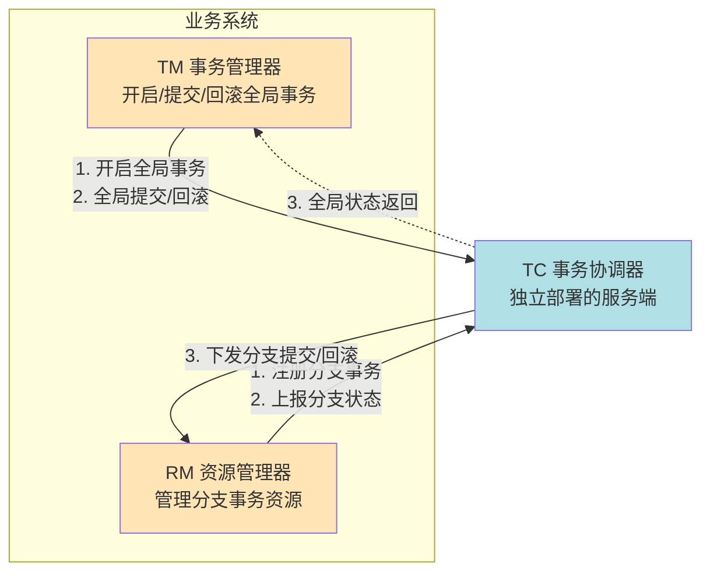
```mermaid
graph TB
    subgraph 业务系统
        TM[TM 事务管理器<br/>开启/提交/回滚全局事务]
        RM[RM 资源管理器<br/>管理分支事务资源]
    end

    TC[TC 事务协调器<br/>独立部署的服务端]

    TM -->|1. 开启全局事务<br/>2. 全局提交/回滚| TC
    RM -->|1. 注册分支事务<br/>2. 上报分支状态| TC
    TC -->|3. 下发分支提交/回滚| RM
    TC -.->|3. 全局状态返回| TM

    style TM fill:#FFE4B5
    style RM fill:#FFE4B5
    style TC fill:#B0E0E6
```

**TM（Transaction Manager）**：事务管理器，定义全局事务的边界 —— 负责开启一个全局事务，最终向 TC 发起全局提交或回滚。对应 `tm` 模块。

**RM（Resource Manager）**：资源管理器，管理分支事务上的资源（数据源、TCC 服务等），向 TC 注册分支事务并上报状态；接收 TC 下发的二阶段提交/回滚指令并执行。对应 `rm`、`rm-datasource`、`tcc` 模块。

**TC（Transaction Coordinator）**：事务协调器，独立部署的服务端。维护全局事务和分支事务的状态机，驱动二阶段提交/回滚，并管理全局锁。对应 `server` 模块。

### 2.2 源码模块划分

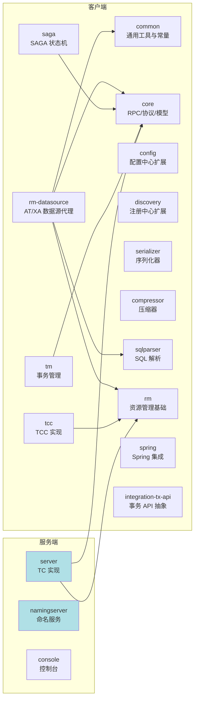
```mermaid
graph LR
    subgraph 客户端
        common[common<br/>通用工具与常量]
        core[core<br/>RPC/协议/模型]
        config[config<br/>配置中心扩展]
        discovery[discovery<br/>注册中心扩展]
        serializer[serializer<br/>序列化器]
        compressor[compressor<br/>压缩器]
        sqlparser[sqlparser<br/>SQL 解析]
        rm[rm<br/>资源管理基础]
        rmDs[rm-datasource<br/>AT/XA 数据源代理]
        tcc[tcc<br/>TCC 实现]
        saga[saga<br/>SAGA 状态机]
        tm[tm<br/>事务管理]
        spring[spring<br/>Spring 集成]
        inttx[integration-tx-api<br/>事务 API 抽象]
    end

    subgraph 服务端
        server[server<br/>TC 实现]
        namingserver[namingserver<br/>命名服务]
        console[console<br/>控制台]
    end

    rmDs --> common
    rmDs --> core
    rmDs --> sqlparser
    rmDs --> rm
    tcc --> rm
    saga --> core
    tm --> core
    server --> core
    server --> rm

    style server fill:#B0E0E6
    style namingserver fill:#B0E0E6
```

各模块职责：

| 模块 | 职责 |
|------|------|
| `common` | 通用工具类、常量、配置键 |
| `core` | RPC 通信（Netty）、协议消息、核心模型（BranchType、GlobalStatus 等） |
| `config` | 配置中心扩展（Nacos、Apollo、ZK、Consul、Etcd3 等） |
| `discovery` | 注册中心扩展（服务发现 TC 地址） |
| `serializer` | 多种序列化器（Protobuf、Kryo、Fastjson2、Hessian、Jackson 等） |
| `compressor` | 通信压缩器（gzip、zip、lz4、bzip2、zstd） |
| `sqlparser` | SQL 解析抽象（基于 Druid、Antlr） |
| `rm` | 资源管理器基础抽象、DefaultResourceManager |
| `rm-datasource` | AT、XA 模式核心实现（DataSourceProxy、ConnectionProxy、UndoLogManager 等） |
| `tcc` | TCC 模式核心实现 |
| `saga` | SAGA 状态机引擎 + 流程编排 |
| `tm` | 全局事务管理（DefaultGlobalTransaction、RootContext、GlobalTransactionContext） |
| `spring` | SpringBoot 自动装配、注解扫描、AOP 拦截 |
| `integration-tx-api` | 事务 API 抽象层（与具体框架解耦） |
| `server` | TC 服务端实现（DefaultCoordinator、SessionHolder、LockManager、存储模式） |
| `namingserver` | 独立命名服务（替代 Seata-Server 内置注册中心） |
| `console` | Web 控制台 |

### 2.3 通信架构

Seata 客户端与服务端之间基于 Netty 实现自定义 RPC 协议（`org.apache.seata.core.rpc.netty`）：

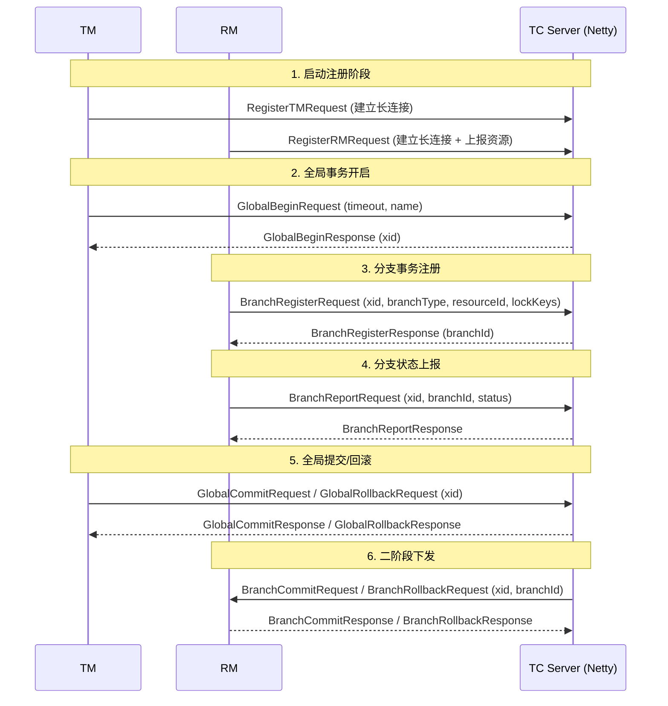
```mermaid
sequenceDiagram
    participant TM
    participant RM
    participant TC as TC Server (Netty)

    Note over TM,TC: 1. 启动注册阶段
    TM->>TC: RegisterTMRequest (建立长连接)
    RM->>TC: RegisterRMRequest (建立长连接 + 上报资源)

    Note over TM,TC: 2. 全局事务开启
    TM->>TC: GlobalBeginRequest (timeout, name)
    TC-->>TM: GlobalBeginResponse (xid)

    Note over RM,TC: 3. 分支事务注册
    RM->>TC: BranchRegisterRequest (xid, branchType, resourceId, lockKeys)
    TC-->>RM: BranchRegisterResponse (branchId)

    Note over RM,TC: 4. 分支状态上报
    RM->>TC: BranchReportRequest (xid, branchId, status)
    TC-->>RM: BranchReportResponse

    Note over TM,TC: 5. 全局提交/回滚
    TM->>TC: GlobalCommitRequest / GlobalRollbackRequest (xid)
    TC-->>TM: GlobalCommitResponse / GlobalRollbackResponse

    Note over TC,RM: 6. 二阶段下发
    TC->>RM: BranchCommitRequest / BranchRollbackRequest (xid, branchId)
    RM-->>TC: BranchCommitResponse / BranchRollbackResponse
```

协议消息统一继承自 `AbstractMessage`，通过 `MessageCodecProvider` 注册编解码器。消息类型涵盖：

- **TM 相关**：`GlobalBeginRequest/Response`、`GlobalCommitRequest/Response`、`GlobalRollbackRequest/Response`、`GlobalStatusRequest/Response`、`GlobalReportRequest/Response`
- **RM 相关**：`BranchRegisterRequest/Response`、`BranchReportRequest/Response`、`BranchCommitRequest/Response`、`BranchRollbackRequest/Response`
- **心跳**：`HeartbeatMessage`
- **注册**：`RegisterTMRequest/Response`、`RegisterRMRequest/Response`

### 2.4 核心枚举与模型

| 枚举/类 | 路径 | 说明 |
|---------|------|------|
| `BranchType` | `core/.../model/BranchType.java` | 分支事务类型：`AT`、`TCC`、`XA`、`SAGA` |
| `GlobalStatus` | `core/.../model/GlobalStatus.java` | 全局事务状态：Begin、Committing、CommitRetrying、Rollbacking、RollbackRetrying、Committed、Rollbacked、TimeoutRollbacking、TimeoutRollbacked 等 |
| `BranchStatus` | `core/.../model/BranchStatus.java` | 分支事务状态：PhaseOne_xxx、PhaseTwo_xxx |
| `RootContext` | `core/.../context/RootContext.java` | 线程上下文，持有 xid、branchType、globalLockRequire 等 |
| `XID` | `core/.../context/XID.java` | 全局事务 ID（IP:PORT:TRANSACTION_ID） |

---

## 三、为什么能实现分布式事务

Seata 之所以能实现分布式事务，本质上是将 **CAP 定理** 与 **BASE 理论** 结合，并通过 **两阶段提交（2PC）** 的思想落地。

### 3.1 理论基础

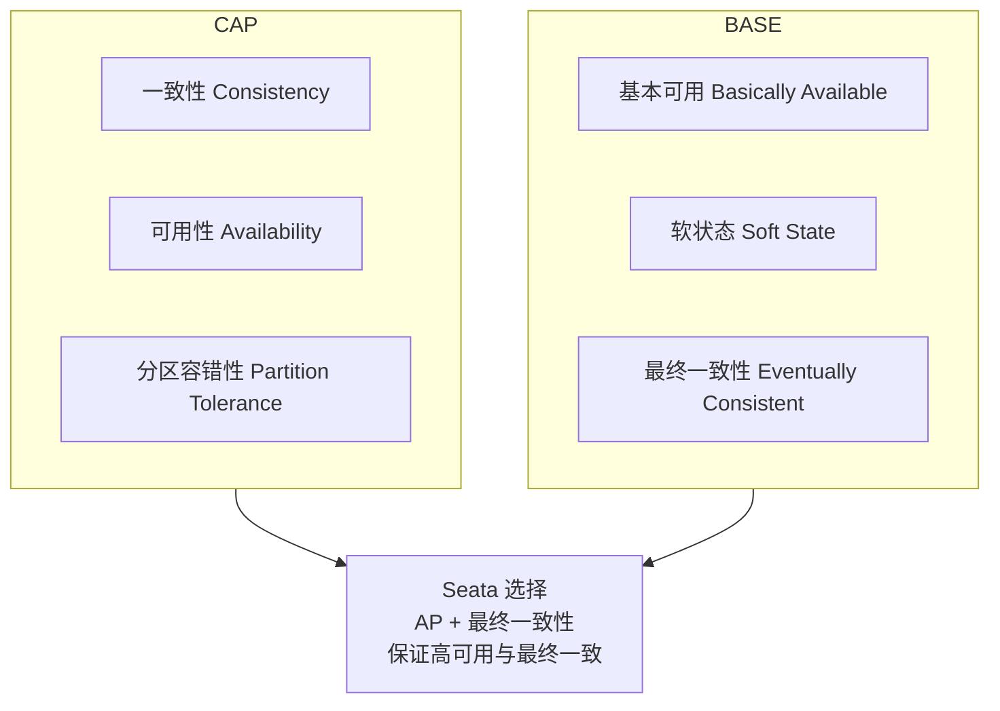
```mermaid
graph TB
    subgraph CAP
        C[一致性 Consistency]
        A[可用性 Availability]
        P[分区容错性 Partition Tolerance]
    end

    subgraph BASE
        BA[基本可用 Basically Available]
        S[软状态 Soft State]
        E[最终一致性 Eventually Consistent]
    end

    Seata[Seata 选择<br/>AP + 最终一致性<br/>保证高可用与最终一致]

    CAP --> Seata
    BASE --> Seata
```

Seata 选择 **AP + 最终一致性**：

- **不是强一致**：分布式环境下追求强一致会牺牲可用性（XA 强一致模式除外）
- **保证最终一致**：通过两阶段提交 + 重试机制，最终所有分支要么都提交要么都回滚
- **TC 短暂故障不致命**：客户端会重试，TC 恢复后继续驱动未完成的事务

### 3.2 两阶段提交模型

Seata 把传统 XA 的两阶段提交进行了优化：

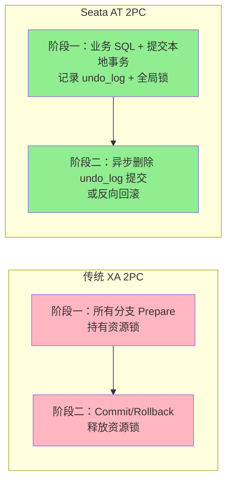
```mermaid
graph LR
    subgraph 传统 XA 2PC
        XA1[阶段一：所有分支 Prepare<br/>持有资源锁]
        XA2[阶段二：Commit/Rollback<br/>释放资源锁]
        XA1 --> XA2
    end

    subgraph Seata AT 2PC
        S1[阶段一：业务 SQL + 提交本地事务<br/>记录 undo_log + 全局锁]
        S2[阶段二：异步删除 undo_log 提交<br/>或反向回滚]
        S1 --> S2
    end

    style XA1 fill:#FFB6C1
    style XA2 fill:#FFB6C1
    style S1 fill:#90EE90
    style S2 fill:#90EE90
```

**Seata 与传统 XA 最大的差异**：

| 维度 | 传统 XA | Seata AT |
|------|---------|----------|
| 阶段一 | 仅 Prepare，不提交，**持续持有数据库锁** | 业务 SQL + undo_log 一并提交本地事务，**释放数据库锁** |
| 资源锁定粒度 | 数据库行锁 / 表锁 | Seata 维护的全局锁（轻量、应用层） |
| 阶段二 | 同步 Commit/Rollback，继续持有锁 | 异步 Commit（仅删 undo_log）/ 反向回滚 |
| 并发性能 | 差（长事务锁资源） | 好（一阶段即释放数据库锁） |

### 3.3 全局事务 XID 传播

Seata 通过 **XID 跨服务传播** 实现链路串联：

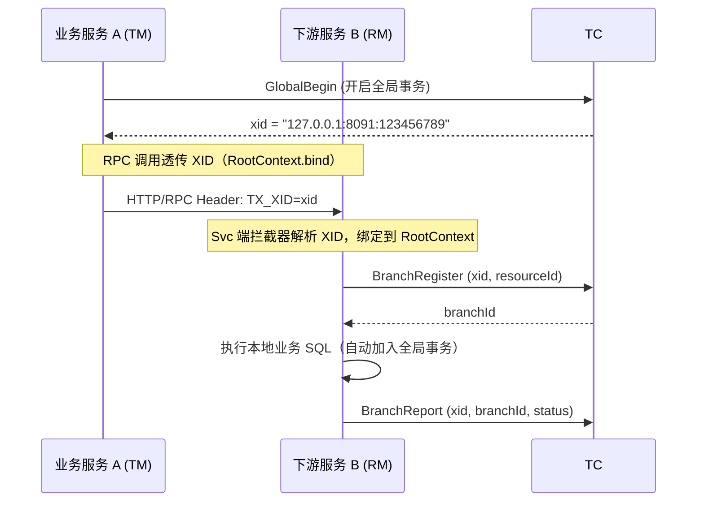
```mermaid
sequenceDiagram
    participant Biz as 业务服务 A (TM)
    participant Svc as 下游服务 B (RM)
    participant TC

    Biz->>TC: GlobalBegin (开启全局事务)
    TC-->>Biz: xid = "127.0.0.1:8091:123456789"

    Note over Biz,Svc: RPC 调用透传 XID（RootContext.bind）
    Biz->>Svc: HTTP/RPC Header: TX_XID=xid

    Note over Svc: Svc 端拦截器解析 XID，绑定到 RootContext
    Svc->>TC: BranchRegister (xid, resourceId)
    TC-->>Svc: branchId

    Svc->>Svc: 执行本地业务 SQL（自动加入全局事务）
    Svc->>TC: BranchReport (xid, branchId, status)
```

XID 是全局唯一标识，格式 `IP:PORT:TRANSACTION_ID`，由 TC 生成。`RootContext` 通过 ThreadLocal 在业务线程内传递 XID，RPC 拦截器（如 `SeataRestTemplateInterceptor`、`SeataFeignClient`、`TransactionPropagationFilter`）在跨服务调用时透传。

---

## 四、核心工作流程

### 4.1 全局事务生命周期

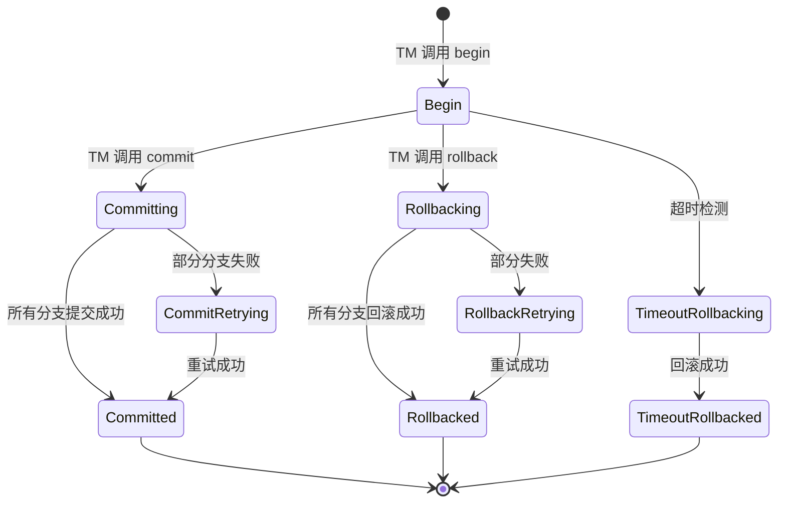
```mermaid
stateDiagram-v2
    [*] --> Begin: TM 调用 begin
    Begin --> Committing: TM 调用 commit
    Begin --> Rollbacking: TM 调用 rollback
    Begin --> TimeoutRollbacking: 超时检测

    Committing --> Committed: 所有分支提交成功
    Committing --> CommitRetrying: 部分分支失败
    CommitRetrying --> Committed: 重试成功

    Rollbacking --> Rollbacked: 所有分支回滚成功
    Rollbacking --> RollbackRetrying: 部分失败
    RollbackRetrying --> Rollbacked: 重试成功

    TimeoutRollbacking --> TimeoutRollbacked: 回滚成功

    Committed --> [*]
    Rollbacked --> [*]
    TimeoutRollbacked --> [*]
```

### 4.2 TM 全局事务控制流

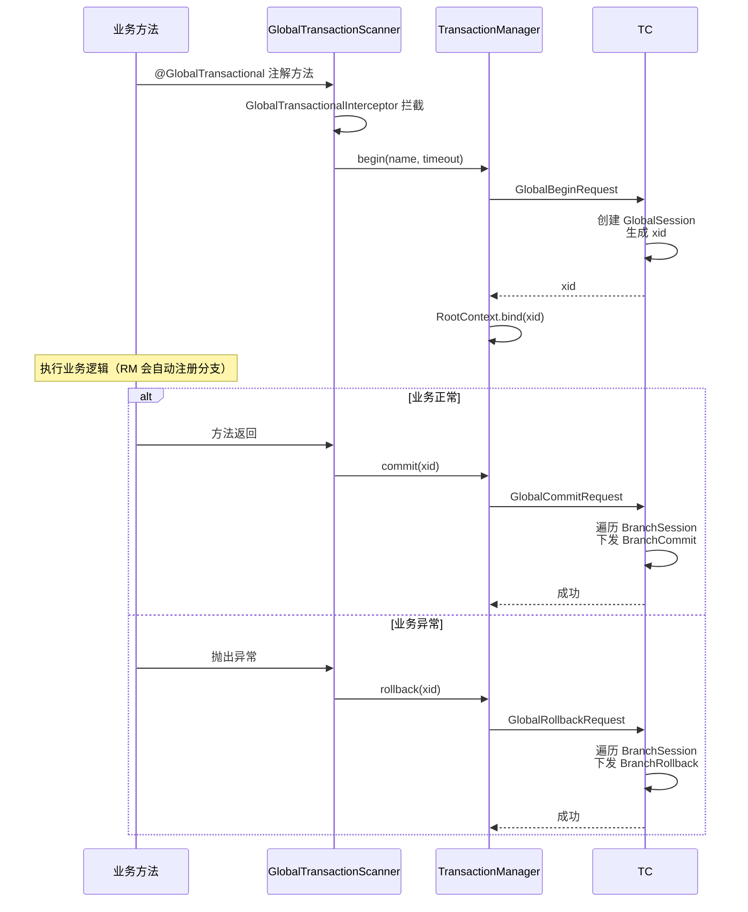
```mermaid
sequenceDiagram
    participant Biz as 业务方法
    participant Tx as GlobalTransactionScanner
    participant TM as TransactionManager
    participant TC

    Biz->>Tx: @GlobalTransactional 注解方法
    Tx->>Tx: GlobalTransactionalInterceptor 拦截
    Tx->>TM: begin(name, timeout)
    TM->>TC: GlobalBeginRequest
    TC->>TC: 创建 GlobalSession<br/>生成 xid
    TC-->>TM: xid
    TM->>TM: RootContext.bind(xid)

    Note over Biz: 执行业务逻辑（RM 会自动注册分支）

    alt 业务正常
        Biz->>Tx: 方法返回
        Tx->>TM: commit(xid)
        TM->>TC: GlobalCommitRequest
        TC->>TC: 遍历 BranchSession<br/>下发 BranchCommit
        TC-->>TM: 成功
    else 业务异常
        Biz->>Tx: 抛出异常
        Tx->>TM: rollback(xid)
        TM->>TC: GlobalRollbackRequest
        TC->>TC: 遍历 BranchSession<br/>下发 BranchRollback
        TC-->>TM: 成功
    end
```

**核心类**：

- `org.apache.seata.spring.annotation.GlobalTransactionScanner` (`spring/seata-spring/...`)：扫描 `@GlobalTransactional`、`@GlobalLock` 注解，AOP 织入。
- `org.apache.seata.tm.api.DefaultGlobalTransaction`：`begin/commit/rollback` 实际实现。
- `org.apache.seata.tm.api.GlobalTransactionContext`：从当前 ThreadLocal 获取或创建 `GlobalTransaction`。
- `org.apache.seata.tm.TransactionManager` 接口 + `DefaultTransactionManager` 实现：与 TC 通信。
- `org.apache.seata.core.context.RootContext`：线程上下文，持有 xid。

### 4.3 分支事务一阶段流程（以 AT 为例）

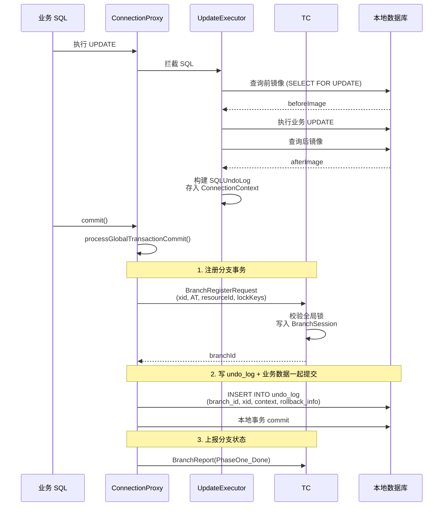
```mermaid
sequenceDiagram
    participant Biz as 业务 SQL
    participant Conn as ConnectionProxy
    participant Exec as UpdateExecutor
    participant TC
    participant DB as 本地数据库

    Biz->>Conn: 执行 UPDATE
    Conn->>Exec: 拦截 SQL
    Exec->>DB: 查询前镜像 (SELECT FOR UPDATE)
    DB-->>Exec: beforeImage
    Exec->>DB: 执行业务 UPDATE
    Exec->>DB: 查询后镜像
    DB-->>Exec: afterImage
    Exec->>Exec: 构建 SQLUndoLog<br/>存入 ConnectionContext

    Biz->>Conn: commit()
    Conn->>Conn: processGlobalTransactionCommit()

    Note over Conn,TC: 1. 注册分支事务
    Conn->>TC: BranchRegisterRequest<br/>(xid, AT, resourceId, lockKeys)
    TC->>TC: 校验全局锁<br/>写入 BranchSession
    TC-->>Conn: branchId

    Note over Conn,DB: 2. 写 undo_log + 业务数据一起提交
    Conn->>DB: INSERT INTO undo_log<br/>(branch_id, xid, context, rollback_info)
    Conn->>DB: 本地事务 commit

    Note over Conn,TC: 3. 上报分支状态
    Conn->>TC: BranchReport(PhaseOne_Done)
```

### 4.4 分支事务二阶段流程

**全局提交（异步）**：

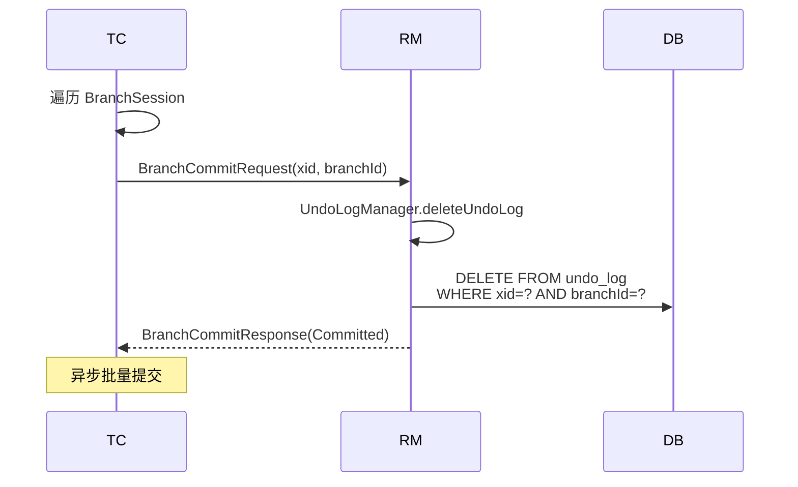
```mermaid
sequenceDiagram
    participant TC
    participant RM
    participant DB

    TC->>TC: 遍历 BranchSession
    TC->>RM: BranchCommitRequest(xid, branchId)
    RM->>RM: UndoLogManager.deleteUndoLog
    RM->>DB: DELETE FROM undo_log<br/>WHERE xid=? AND branchId=?
    RM-->>TC: BranchCommitResponse(Committed)
    Note over TC: 异步批量提交
```

**全局回滚**：

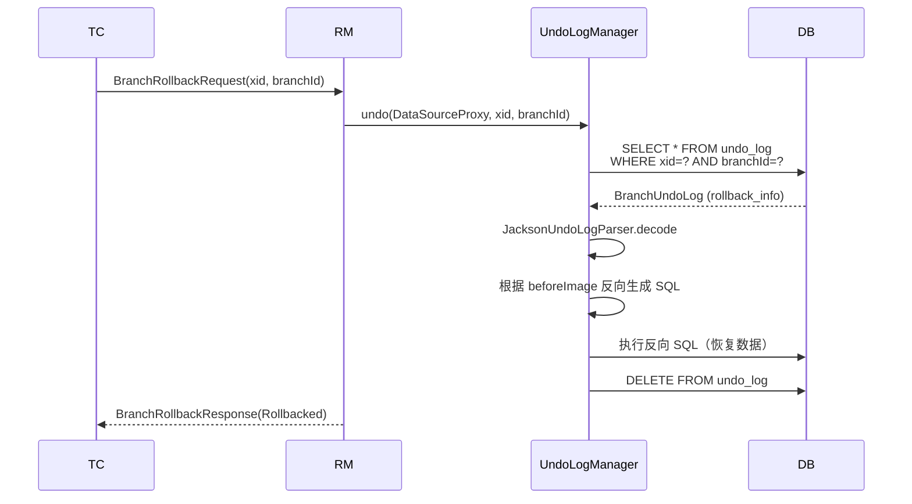
```mermaid
sequenceDiagram
    participant TC
    participant RM
    participant ULog as UndoLogManager
    participant DB

    TC->>RM: BranchRollbackRequest(xid, branchId)
    RM->>ULog: undo(DataSourceProxy, xid, branchId)
    ULog->>DB: SELECT * FROM undo_log<br/>WHERE xid=? AND branchId=?
    DB-->>ULog: BranchUndoLog (rollback_info)
    ULog->>ULog: JacksonUndoLogParser.decode
    ULog->>ULog: 根据 beforeImage 反向生成 SQL
    ULog->>DB: 执行反向 SQL（恢复数据）
    ULog->>DB: DELETE FROM undo_log
    RM-->>TC: BranchRollbackResponse(Rollbacked)
```

---

## 五、AT 模式实现原理

AT（Automatic Transaction）是 Seata 最具创新性的模式，业务无侵入，**通过代理数据源自动完成** undo_log 记录和回滚。

### 5.1 核心实现类

| 类 | 路径 | 职责 |
|----|------|------|
| `DataSourceProxy` | `rm-datasource/.../DataSourceProxy.java` | 代理数据源，拦截 getConnection |
| `ConnectionProxy` | `rm-datasource/.../ConnectionProxy.java` | 代理 Connection，commit 时注册分支+写 undo_log |
| `StatementProxy` / `PreparedStatementProxy` | `rm-datasource/.../` | 代理 Statement，拦截 execute |
| `ExecuteTemplate` | `rm-datasource/.../exec/ExecuteTemplate.java` | SQL 执行模板，分发到具体 Executor |
| `UpdateExecutor` / `InsertExecutor` / `DeleteExecutor` / `SelectForUpdateExecutor` | `rm-datasource/.../exec/` | 各类 SQL 执行器，负责前后镜像 |
| `UndoLogManager` | `rm-datasource/.../undo/UndoLogManager.java` | undo_log 表操作 |
| `UndoLogManagerFactory` | `rm-datasource/.../undo/UndoLogManagerFactory.java` | 按数据库类型获取 UndoLogManager |
| `JacksonUndoLogParser` 等 | `rm-datasource/.../undo/parser/` | undo_log 序列化器 |
| `LockManagerImpl` | `rm-datasource/.../lock/LockManagerImpl.java` | 客户端全局锁管理 |
| `TableMetaCacheFactory` | `rm-datasource/.../sql/struct/TableMetaCacheFactory.java` | 表元数据缓存 |

### 5.2 工作流程总览

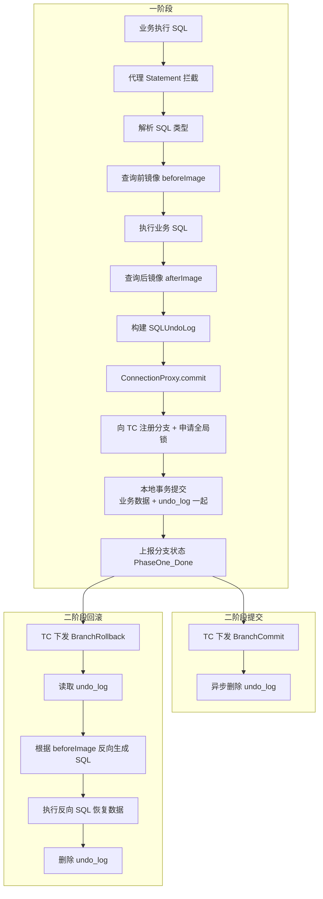
```mermaid
graph TB
    subgraph 一阶段
        A[业务执行 SQL] --> B[代理 Statement 拦截]
        B --> C[解析 SQL 类型]
        C --> D[查询前镜像 beforeImage]
        D --> E[执行业务 SQL]
        E --> F[查询后镜像 afterImage]
        F --> G[构建 SQLUndoLog]
        G --> H[ConnectionProxy.commit]
        H --> I[向 TC 注册分支 + 申请全局锁]
        I --> J[本地事务提交<br/>业务数据 + undo_log 一起]
        J --> K[上报分支状态 PhaseOne_Done]
    end

    subgraph 二阶段提交
        L[TC 下发 BranchCommit] --> M[异步删除 undo_log]
    end

    subgraph 二阶段回滚
        N[TC 下发 BranchRollback] --> O[读取 undo_log]
        O --> P[根据 beforeImage 反向生成 SQL]
        P --> Q[执行反向 SQL 恢复数据]
        Q --> R[删除 undo_log]
    end

    K --> L
    K --> N
```

### 5.3 ConnectionProxy 关键源码

`rm-datasource/src/main/java/org/apache/seata/rm/datasource/ConnectionProxy.java`：

```java
// L47: ConnectionProxy 类定义
public class ConnectionProxy extends AbstractConnectionProxy {
    private final ConnectionContext context = new ConnectionContext();
    private final LockRetryPolicy lockRetryPolicy = new LockRetryPolicy(this);

    // L185: commit 方法 - 核心入口
    @Override
    public void commit() throws SQLException {
        try {
            lockRetryPolicy.execute(() -> {
                doCommit();   // L188
                return null;
            });
        } catch (SQLException e) {
            // 异常时回滚
        }
    }

    // L227: 真正的 commit 逻辑
    private void doCommit() throws SQLException {
        if (context.inGlobalTransaction()) {
            processGlobalTransactionCommit();   // L229 - 进入 AT 一阶段提交
        } else if (context.isGlobalLockRequire()) {
            processLocalCommitWithGlobalLocks(); // 全局锁场景
        } else {
            targetConnection.commit();          // 普通本地事务
        }
    }

    // L247: 全局事务提交
    private void processGlobalTransactionCommit() throws SQLException {
        try {
            register();   // L249 - 向 TC 注册分支 + 申请全局锁
        } catch (TransactionException e) {
            recognizeLockKeyConflictException(e, context.buildLockKeys());
        }
        try {
            // L254: 写入 undo_log（与业务 SQL 在同一本地事务）
            UndoLogManagerFactory.getUndoLogManager(this.getDbType()).flushUndoLogs(this);
            targetConnection.commit();   // L255: 本地事务提交
        } catch (Throwable ex) {
            report(false);
            throw new SQLException(ex);
        }
        if (IS_REPORT_SUCCESS_ENABLE) {
            report(true);
        }
        context.reset();
    }

    // L267: 注册分支事务
    private void register() throws TransactionException {
        if (!context.hasUndoLog() || !context.hasLockKey()) {
            return;
        }
        Long branchId = DefaultResourceManager.get()
                .branchRegister(
                        BranchType.AT,
                        getDataSourceProxy().getResourceId(),
                        null,
                        context.getXid(),
                        context.getApplicationData(),
                        context.buildLockKeys());   // 携带 lockKeys 申请全局锁
        context.setBranchId(branchId);
    }
}
```

### 5.4 SQL 执行器与前后镜像

以 `UpdateExecutor` 为例，关键步骤：

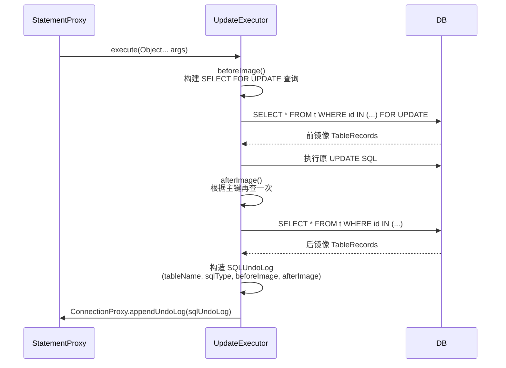
```mermaid
sequenceDiagram
    participant Stmt as StatementProxy
    participant Exec as UpdateExecutor
    participant DB

    Stmt->>Exec: execute(Object... args)
    Exec->>Exec: beforeImage()<br/>构建 SELECT FOR UPDATE 查询
    Exec->>DB: SELECT * FROM t WHERE id IN (...) FOR UPDATE
    DB-->>Exec: 前镜像 TableRecords
    Exec->>DB: 执行原 UPDATE SQL
    Exec->>Exec: afterImage()<br/>根据主键再查一次
    Exec->>DB: SELECT * FROM t WHERE id IN (...)
    DB-->>Exec: 后镜像 TableRecords
    Exec->>Exec: 构造 SQLUndoLog<br/>(tableName, sqlType, beforeImage, afterImage)
    Exec->>Stmt: ConnectionProxy.appendUndoLog(sqlUndoLog)
```

`SQLUndoLog` 数据结构：

```java
public class SQLUndoLog implements Serializable {
    private String tableName;
    private SQLType sqlType;          // INSERT/UPDATE/DELETE
    private TableRecords beforeImage; // 前镜像
    private TableRecords afterImage;  // 后镜像
}
```

`TableRecords` 包含表元数据 + 多行 `Row` 数据，每个 `Row` 含多个 `Column`（含主键标记）。序列化后存入 `undo_log` 表的 `rollback_info` 字段。

### 5.5 UndoLog 表结构与序列化

`undo_log` 表 DDL（MySQL）：

```sql
CREATE TABLE `undo_log` (
  `branch_id`     BIGINT       NOT NULL COMMENT 'branch transaction id',
  `xid`           VARCHAR(128) NOT NULL COMMENT 'global transaction id',
  `context`       VARCHAR(128) NOT NULL COMMENT 'undo_log context, such as serialization',
  `rollback_info` LONGBLOB     NOT NULL COMMENT 'rollback info',
  `log_status`    INT          NOT NULL COMMENT '0:normal status,1:defense status',
  `log_created`   DATETIME(6)  NOT NULL COMMENT 'create datetime',
  `log_modified`  DATETIME(6)  NOT NULL COMMENT 'modify datetime',
  UNIQUE KEY `ux_undo_log` (`xid`, `branch_id`)
);
```

`UndoLogManager.flushUndoLogs` 把 `BranchUndoLog` 序列化为字节流，存入 `rollback_info`。支持多种序列化器：

- `JacksonUndoLogParser`（默认）
- `FastjsonUndoLogParser`
- `KryoUndoLogParser`
- `ProtobufUndoLogParser`

### 5.6 全局锁机制

**为什么需要全局锁？**

AT 模式一阶段已经提交本地事务，**数据库锁已释放**。若另一全局事务修改了同一行，会导致**脏写**问题——TC 回滚时根据 undo_log 反向恢复，但数据已被覆盖。

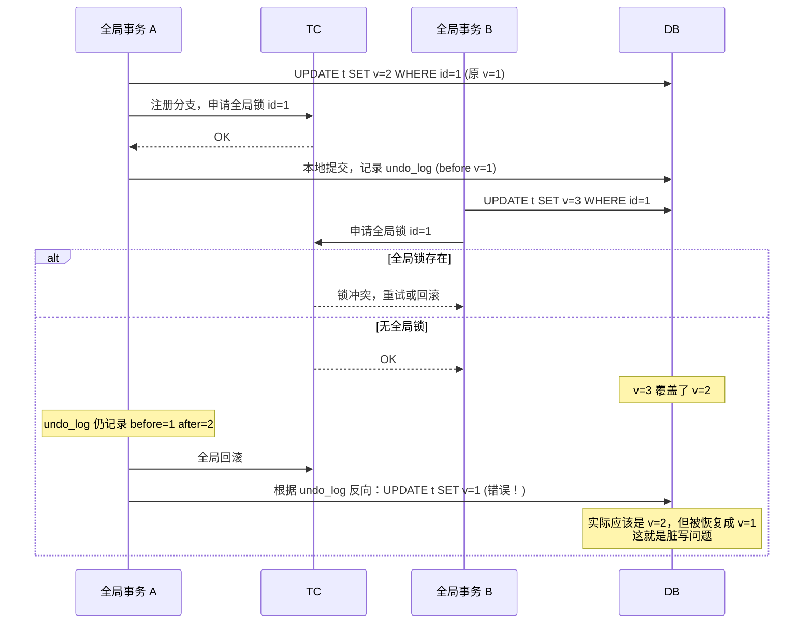
```mermaid
sequenceDiagram
    participant TA as 全局事务 A
    participant TC
    participant TB as 全局事务 B
    participant DB

    TA->>DB: UPDATE t SET v=2 WHERE id=1 (原 v=1)
    TA->>TC: 注册分支，申请全局锁 id=1
    TC-->>TA: OK
    TA->>DB: 本地提交，记录 undo_log (before v=1)

    TB->>DB: UPDATE t SET v=3 WHERE id=1
    TB->>TC: 申请全局锁 id=1
    alt 全局锁存在
        TC-->>TB: 锁冲突，重试或回滚
    else 无全局锁
        TC-->>TB: OK
        Note over DB: v=3 覆盖了 v=2
        Note over TA: undo_log 仍记录 before=1 after=2
        TA->>TC: 全局回滚
        TA->>DB: 根据 undo_log 反向：UPDATE t SET v=1 (错误！)
        Note over DB: 实际应该是 v=2，但被恢复成 v=1<br/>这就是脏写问题
    end
```

**全局锁解决了脏写**：Seata 通过 TC 维护一张 `lock_table`，分支事务一阶段必须先拿到锁才能提交，确保同一行数据同一时刻只被一个全局事务修改。

**锁表结构**（服务端）：

| 字段 | 说明 |
|------|------|
| `xid` | 全局事务 ID |
| `transaction_id` | 全局事务 ID（数字） |
| `branch_id` | 分支事务 ID |
| `resource_id` | 资源 ID（数据库 resourceId） |
| `table_name` | 表名 |
| `pk` | 主键值 |
| `status` | 锁状态 |
| `row_key` | 资源ID + 表名 + 主键 组合键 |

`LockManagerImpl` 客户端实现位于 `rm-datasource/.../lock/LockManagerImpl.java`，与 TC 通信申请/释放锁。

### 5.7 AT 模式完整时序图

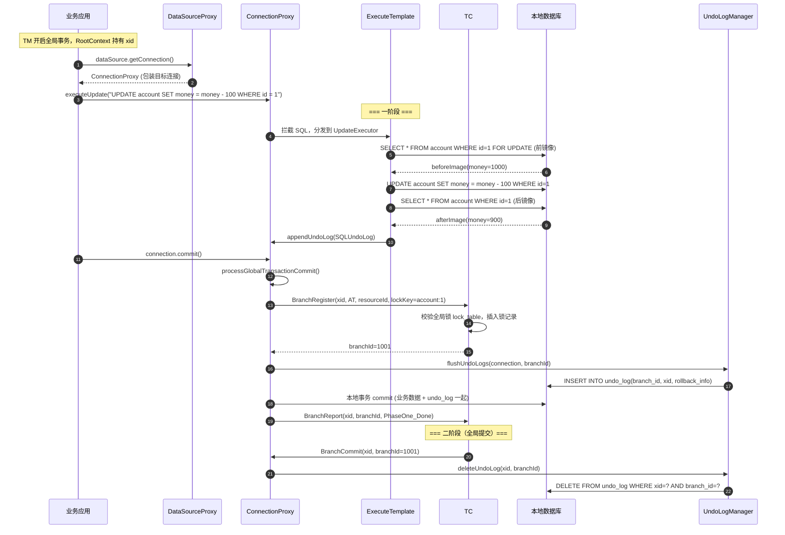
```mermaid
sequenceDiagram
    autonumber
    participant App as 业务应用
    participant DP as DataSourceProxy
    participant CP as ConnectionProxy
    participant Exec as ExecuteTemplate
    participant TC
    participant DB as 本地数据库
    participant UM as UndoLogManager

    Note over App: TM 开启全局事务，RootContext 持有 xid
    App->>DP: dataSource.getConnection()
    DP-->>App: ConnectionProxy (包装目标连接)
    App->>CP: executeUpdate("UPDATE account SET money = money - 100 WHERE id = 1")

    Note over Exec: === 一阶段 ===
    CP->>Exec: 拦截 SQL，分发到 UpdateExecutor
    Exec->>DB: SELECT * FROM account WHERE id=1 FOR UPDATE (前镜像)
    DB-->>Exec: beforeImage(money=1000)
    Exec->>DB: UPDATE account SET money = money - 100 WHERE id=1
    Exec->>DB: SELECT * FROM account WHERE id=1 (后镜像)
    DB-->>Exec: afterImage(money=900)
    Exec->>CP: appendUndoLog(SQLUndoLog)

    App->>CP: connection.commit()
    CP->>CP: processGlobalTransactionCommit()
    CP->>TC: BranchRegister(xid, AT, resourceId, lockKey=account:1)
    TC->>TC: 校验全局锁 lock_table，插入锁记录
    TC-->>CP: branchId=1001
    CP->>UM: flushUndoLogs(connection, branchId)
    UM->>DB: INSERT INTO undo_log(branch_id, xid, rollback_info)
    CP->>DB: 本地事务 commit (业务数据 + undo_log 一起)
    CP->>TC: BranchReport(xid, branchId, PhaseOne_Done)

    Note over TC: === 二阶段（全局提交）===
    TC->>CP: BranchCommit(xid, branchId=1001)
    CP->>UM: deleteUndoLog(xid, branchId)
    UM->>DB: DELETE FROM undo_log WHERE xid=? AND branch_id=?
```

---

## 六、TCC 模式实现原理

TCC（Try-Confirm-Cancel）是业务层的两阶段提交，需要业务自定义 Try（资源预留）、Confirm（确认）、Cancel（回滚）三个方法。Seata 通过 AOP 拦截 `@TwoPhaseBusinessAction` 注解的方法，自动完成分支注册和二阶段调度。

### 6.1 核心实现类

| 类 | 路径 | 职责 |
|----|------|------|
| `@TwoPhaseBusinessAction` | `tcc/.../api/TwoPhaseBusinessAction.java` | 注解在 Try 方法上，声明 commitMethod/rollbackMethod |
| `@LocalTCC` | `tcc/.../api/LocalTCC.java` | 标注 TCC 接口 |
| `BusinessActionContext` | `tcc/.../api/BusinessActionContext.java` | TCC 上下文（xid、branchId、actionName、参数） |
| `BusinessActionContextUtil` | `tcc/.../api/BusinessActionContextUtil.java` | 上下文工具 |
| `TccActionInterceptorHandler` | `tcc/.../interceptor/TccActionInterceptorHandler.java` | 拦截 Try 方法 |
| `TCCResourceManager` | `tcc/.../TCCResourceManager.java` | TCC 资源管理器，反射调用 commitMethod/rollbackMethod |
| `TCCResource` | `tcc/.../TCCResource.java` | TCC 资源封装 |
| `SpringFenceHandler` | `spring/.../rm/fence/SpringFenceHandler.java` | TCC 围栏（幂等/空回滚/防悬挂） |
| `TccAnnotationActionScanner` | `spring/.../tcc/` | Spring Bean 扫描注册 TCC 资源 |

### 6.2 工作流程

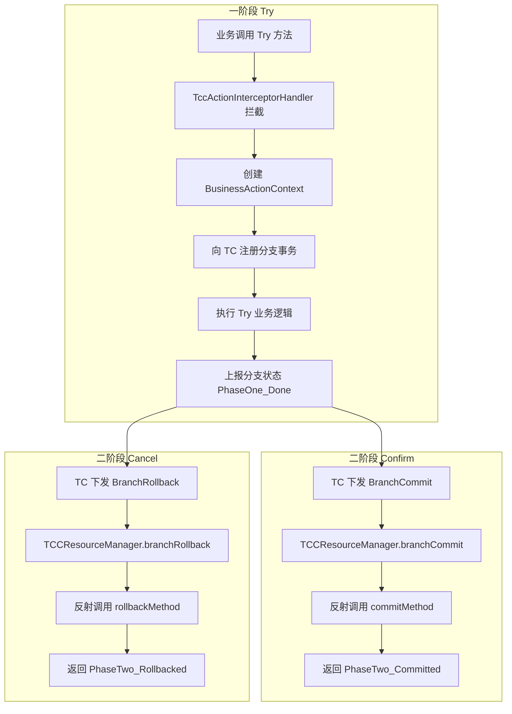
```mermaid
graph TB
    subgraph 一阶段 Try
        T1[业务调用 Try 方法] --> T2[TccActionInterceptorHandler 拦截]
        T2 --> T3[创建 BusinessActionContext]
        T3 --> T4[向 TC 注册分支事务]
        T4 --> T5[执行 Try 业务逻辑]
        T5 --> T6[上报分支状态 PhaseOne_Done]
    end

    subgraph 二阶段 Confirm
        C1[TC 下发 BranchCommit] --> C2[TCCResourceManager.branchCommit]
        C2 --> C3[反射调用 commitMethod]
        C3 --> C4[返回 PhaseTwo_Committed]
    end

    subgraph 二阶段 Cancel
        R1[TC 下发 BranchRollback] --> R2[TCCResourceManager.branchRollback]
        R2 --> R3[反射调用 rollbackMethod]
        R3 --> R4[返回 PhaseTwo_Rollbacked]
    end

    T6 --> C1
    T6 --> R1
```

### 6.3 TccActionInterceptorHandler 关键源码

`tcc/src/main/java/org/apache/seata/rm/tcc/interceptor/TccActionInterceptorHandler.java`：

```java
// L48: 拦截器处理器
public class TccActionInterceptorHandler extends AbstractProxyInvocationHandler {

    // L85: 处理 Try 方法调用
    // 关键步骤：
    // 1. 解析 @TwoPhaseBusinessAction 注解
    // 2. 创建 TwoPhaseBusinessActionParam（包含 commitMethod/rollbackMethod 名）
    // 3. 委托给 ActionInterceptorHandler.proceed 完成：
    //    - 向 TC 注册分支
    //    - 调用业务 Try 方法
    //    - 上报分支状态
    TwoPhaseBusinessActionParam businessActionParam =
            createTwoPhaseBusinessActionParam(businessAction);
    return actionInterceptorHandler.proceed(
            method, invocation.getArguments(), xid, businessActionParam, invocation::proceed);

    // L149: 构建参数对象
    protected TwoPhaseBusinessActionParam createTwoPhaseBusinessActionParam(Annotation annotation) {
        TwoPhaseBusinessAction businessAction = (TwoPhaseBusinessAction) annotation;
        TwoPhaseBusinessActionParam businessActionParam = new TwoPhaseBusinessActionParam();
        businessActionParam.setActionName(businessAction.name());
        businessActionParam.setDelayReport(businessAction.isDelayReport());
        businessActionParam.setUseCommonFence(businessAction.useTCCFence());
        businessActionParam.setBranchType(getBranchType());
        Map<String, Object> businessActionContextMap = new HashMap<>(4);
        businessActionContextMap.put(Constants.COMMIT_METHOD, businessAction.commitMethod());
        businessActionContextMap.put(Constants.ROLLBACK_METHOD, businessAction.rollbackMethod());
        businessActionContextMap.put(Constants.ACTION_NAME, businessAction.name());
        businessActionContextMap.put(Constants.USE_COMMON_FENCE, businessAction.useTCCFence());
        businessActionParam.setBusinessActionContext(businessActionContextMap);
        return businessActionParam;
    }
}
```

### 6.4 TCCResourceManager 二阶段调度

`tcc/src/main/java/org/apache/seata/rm/tcc/TCCResourceManager.java`：

```java
// 二阶段提交：反射调用 commitMethod
@Override
public BranchStatus branchCommit(BranchType branchType, String xid, long branchId,
                                  String resourceId, String applicationData) throws TransactionException {
    TCCResource resource = (TCCResource) tccResourceCache.get(resourceId);
    Object targetBean = resource.getTargetBean();
    Method commitMethod = resource.getCommitMethod();
    // 反射调用业务 Confirm 方法
    Object ret = commitMethod.invoke(targetBean, businessActionContext);
    // 根据返回值决定 BranchStatus
    return (boolean) ret ? BranchStatus.PhaseTwo_Committed
                         : BranchStatus.PhaseTwo_RollbackFailed_Unretryable;
}
```

### 6.5 TCC 三大异常问题与围栏机制

TCC 模式存在三个经典异常场景，Seata 通过 `SpringFenceHandler`（围栏）解决：

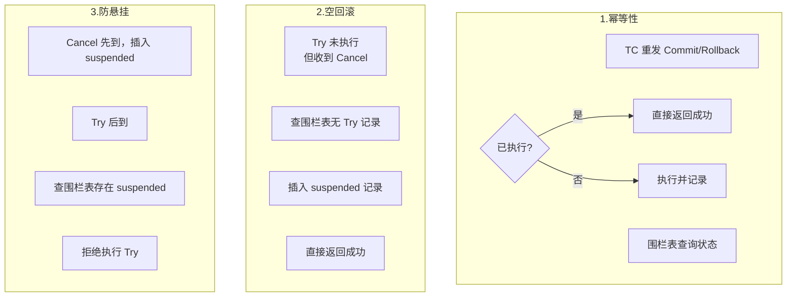
```mermaid
graph TB
    subgraph 1.幂等性
        I1[TC 重发 Commit/Rollback]
        I2[围栏表查询状态]
        I3{已执行?}
        I3 -->|是| I4[直接返回成功]
        I3 -->|否| I5[执行并记录]
    end

    subgraph 2.空回滚
        N1[Try 未执行<br/>但收到 Cancel]
        N2[查围栏表无 Try 记录]
        N3[插入 suspended 记录]
        N4[直接返回成功]
    end

    subgraph 3.防悬挂
        S1[Cancel 先到，插入 suspended]
        S2[Try 后到]
        S3[查围栏表存在 suspended]
        S4[拒绝执行 Try]
    end
```

**围栏表 DDL**（`tcc_fence_log`）：

```sql
CREATE TABLE `tcc_fence_log` (
  `xid`           VARCHAR(128)  NOT NULL,
  `branch_id`     BIGINT        NOT NULL,
  `action_name`   VARCHAR(64)   NOT NULL,
  `status`        TINYINT       NOT NULL COMMENT '0:tried,1:committed,2:rollbacked,3:suspended',
  `gmt_create`    DATETIME(3)   NOT NULL,
  `gmt_modified`  DATETIME(3)   NOT NULL,
  PRIMARY KEY (`xid`, `branch_id`)
);
```

围栏机制核心方法（`SpringFenceHandler`）：

| 方法 | 作用 |
|------|------|
| `prepareFence` | Try 阶段插入 `tried` 记录（带唯一约束） |
| `commitFence` | Confirm 阶段更新为 `committed`，若已 committed 则幂等返回 |
| `rollbackFence` | Cancel 阶段更新为 `rollbacked`；若无 tried 记录则插入 `suspended` |
| `insertFence` | 唯一索引保证幂等 |

### 6.6 TCC 完整时序图

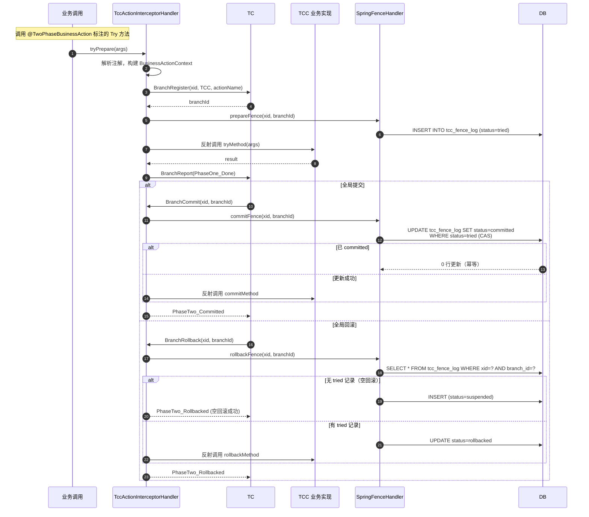
```mermaid
sequenceDiagram
    autonumber
    participant Biz as 业务调用
    participant AOP as TccActionInterceptorHandler
    participant TC
    participant Service as TCC 业务实现
    participant Fence as SpringFenceHandler
    participant DB

    Note over Biz: 调用 @TwoPhaseBusinessAction 标注的 Try 方法
    Biz->>AOP: tryPrepare(args)
    AOP->>AOP: 解析注解，构建 BusinessActionContext
    AOP->>TC: BranchRegister(xid, TCC, actionName)
    TC-->>AOP: branchId
    AOP->>Fence: prepareFence(xid, branchId)
    Fence->>DB: INSERT INTO tcc_fence_log (status=tried)
    AOP->>Service: 反射调用 tryMethod(args)
    Service-->>AOP: result
    AOP->>TC: BranchReport(PhaseOne_Done)

    alt 全局提交
        TC->>AOP: BranchCommit(xid, branchId)
        AOP->>Fence: commitFence(xid, branchId)
        Fence->>DB: UPDATE tcc_fence_log SET status=committed<br/>WHERE status=tried (CAS)
        alt 已 committed
            DB-->>Fence: 0 行更新（幂等）
        else 更新成功
            AOP->>Service: 反射调用 commitMethod
        end
        AOP-->>TC: PhaseTwo_Committed
    else 全局回滚
        TC->>AOP: BranchRollback(xid, branchId)
        AOP->>Fence: rollbackFence(xid, branchId)
        Fence->>DB: SELECT * FROM tcc_fence_log WHERE xid=? AND branch_id=?
        alt 无 tried 记录（空回滚）
            Fence->>DB: INSERT (status=suspended)
            AOP-->>TC: PhaseTwo_Rollbacked (空回滚成功)
        else 有 tried 记录
            Fence->>DB: UPDATE status=rollbacked
            AOP->>Service: 反射调用 rollbackMethod
        end
        AOP-->>TC: PhaseTwo_Rollbacked
    end
```

---

## 七、XA 模式实现原理

XA 模式基于数据库原生 XA 协议，依赖数据库的 XA Start/End/Prepare/Commit/Rollback 命令实现强一致性事务。Seata 通过代理 XA 数据源，将数据库 XA 协议接入到 Seata 体系。

### 7.1 核心实现类

| 类 | 路径 | 职责 |
|----|------|------|
| `DataSourceProxyXA` | `rm-datasource/.../xa/DataSourceProxyXA.java` | 代理 XA 数据源 |
| `ConnectionProxyXA` | `rm-datasource/.../xa/ConnectionProxyXA.java` | 代理 XA 连接，对接 XAResource |
| `AbstractConnectionProxyXA` | `rm-datasource/.../xa/AbstractConnectionProxyXA.java` | XA 连接抽象基类 |
| `ResourceManagerXA` | `rm-datasource/.../xa/ResourceManagerXA.java` | XA 资源管理器 |
| `XAXid` / `XABranchXid` | `rm-datasource/.../xa/` | XA XID 实现 |
| `XAXidBuilder` | `rm-datasource/.../xa/` | XID 构造器 |
| `ExecuteTemplateXA` | `rm-datasource/.../xa/` | XA SQL 执行模板 |

### 7.2 XA 协议对接流程

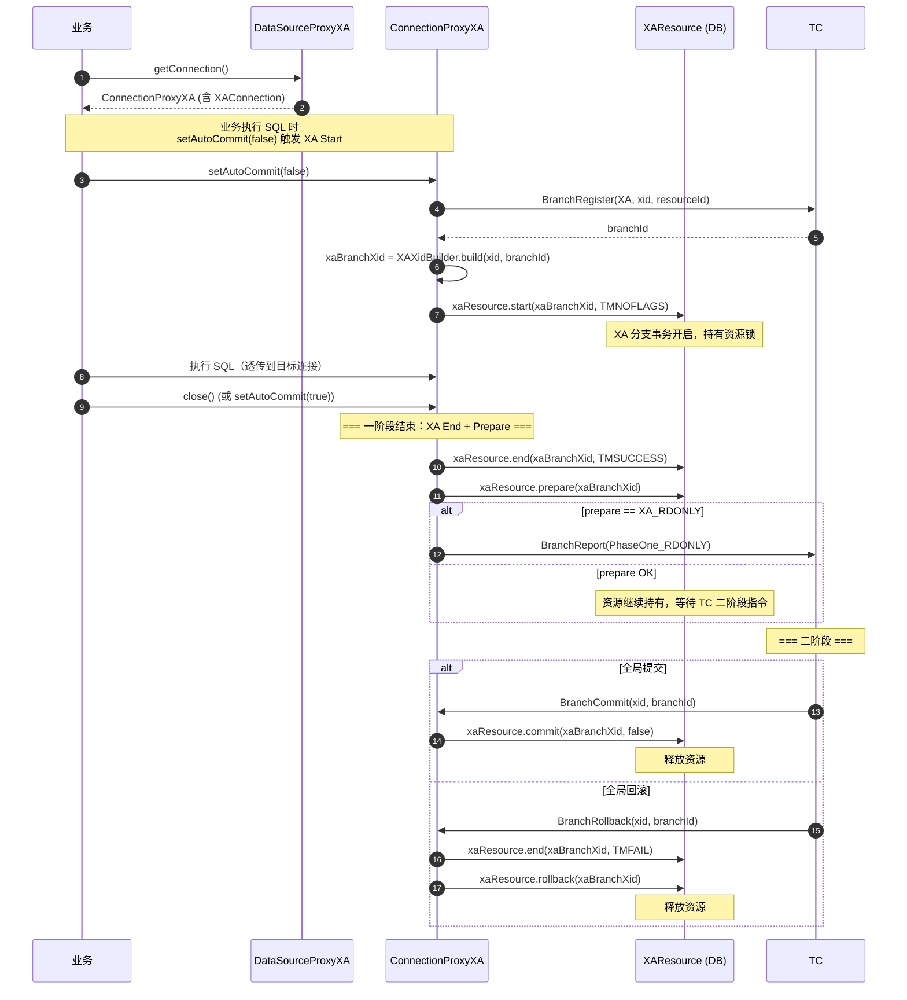
```mermaid
sequenceDiagram
    autonumber
    participant Biz as 业务
    participant DCP as DataSourceProxyXA
    participant CPX as ConnectionProxyXA
    participant XAR as XAResource (DB)
    participant TC

    Biz->>DCP: getConnection()
    DCP-->>Biz: ConnectionProxyXA (含 XAConnection)

    Note over Biz,CPX: 业务执行 SQL 时<br/>setAutoCommit(false) 触发 XA Start
    Biz->>CPX: setAutoCommit(false)
    CPX->>TC: BranchRegister(XA, xid, resourceId)
    TC-->>CPX: branchId
    CPX->>CPX: xaBranchXid = XAXidBuilder.build(xid, branchId)
    CPX->>XAR: xaResource.start(xaBranchXid, TMNOFLAGS)
    Note over XAR: XA 分支事务开启，持有资源锁

    Biz->>CPX: 执行 SQL（透传到目标连接）
    Biz->>CPX: close() (或 setAutoCommit(true))

    Note over CPX: === 一阶段结束：XA End + Prepare ===
    CPX->>XAR: xaResource.end(xaBranchXid, TMSUCCESS)
    CPX->>XAR: xaResource.prepare(xaBranchXid)
    alt prepare == XA_RDONLY
        CPX->>TC: BranchReport(PhaseOne_RDONLY)
    else prepare OK
        Note over XAR: 资源继续持有，等待 TC 二阶段指令
    end

    Note over TC: === 二阶段 ===
    alt 全局提交
        TC->>CPX: BranchCommit(xid, branchId)
        CPX->>XAR: xaResource.commit(xaBranchXid, false)
        Note over XAR: 释放资源
    else 全局回滚
        TC->>CPX: BranchRollback(xid, branchId)
        CPX->>XAR: xaResource.end(xaBranchXid, TMFAIL)
        CPX->>XAR: xaResource.rollback(xaBranchXid)
        Note over XAR: 释放资源
    end
```

### 7.3 ConnectionProxyXA 关键源码

`rm-datasource/src/main/java/org/apache/seata/rm/datasource/xa/ConnectionProxyXA.java`：

```java
// L46: XA 连接代理类
public class ConnectionProxyXA extends AbstractConnectionProxyXA implements Holdable {
    private volatile boolean currentAutoCommitStatus = true;
    private volatile XAXid xaBranchXid;
    private volatile boolean xaActive = false;
    private volatile boolean kept = false;
    private volatile Long prepareTime = null;

    // L170: 关键方法 —— setAutoCommit 触发 XA 分支开启
    @Override
    public void setAutoCommit(boolean autoCommit) throws SQLException {
        if (currentAutoCommitStatus == autoCommit) {
            return;
        }
        if (isReadOnly()) {
            currentAutoCommitStatus = autoCommit;
            return;
        }
        if (autoCommit) {
            if (xaActive) {
                commit();  // JDBC 规范：从 false 转 true 自动提交
            }
        } else {
            // === 启动 XA 分支 ===
            // 1. 注册分支到 TC
            branchRegisterTime = System.currentTimeMillis();
            long branchId = DefaultResourceManager.get()
                    .branchRegister(BranchType.XA, resource.getResourceId(), null, xid, null, null);
            // 2. 构建 XA-XID
            this.xaBranchXid = XAXidBuilder.build(xid, branchId);
            // 3. 必要时持有连接
            keepIfNecessary();
            // 4. 启动 XA 事务
            start();   // 调用 xaResource.start(xaBranchXid, TMNOFLAGS)
            this.xaActive = true;
        }
        currentAutoCommitStatus = autoCommit;
    }

    // L322: close 时执行 XA End + Prepare
    @Override
    public void close() throws SQLException {
        if (xaActive && this.xaBranchXid != null) {
            // XA End: TMSUCCESS
            end(XAResource.TMSUCCESS);
            long now = System.currentTimeMillis();
            checkTimeout(now);
            setPrepareTime(now);
            // XA Prepare
            int prepare = xaResource.prepare(xaBranchXid);
            if (prepare == XAResource.XA_RDONLY) {
                reportStatusToTC(BranchStatus.PhaseOne_RDONLY);
            }
        }
    }

    // L133: 二阶段提交
    public void xaCommit(String xid, long branchId, String applicationData) throws XAException {
        XAXid xaXid = XAXidBuilder.build(xid, branchId);
        xaResource.commit(xaXid, false);   // false = 非 onePhase
        releaseIfNecessary();
    }

    // L147: 二阶段回滚
    public void xaRollback(String xid, long branchId, String applicationData) throws XAException {
        XAXid xaBranchXid = XAXidBuilder.build(xid, branchId);
        xaRollback(xaBranchXid);
    }
}
```

### 7.4 XA 与 AT 模式对比

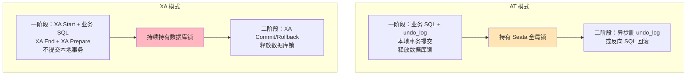
```mermaid
graph TB
    subgraph AT 模式
        AT1[一阶段：业务 SQL + undo_log<br/>本地事务提交<br/>释放数据库锁]
        AT2[持有 Seata 全局锁]
        AT3[二阶段：异步删 undo_log<br/>或反向 SQL 回滚]
        AT1 --> AT2 --> AT3
    end

    subgraph XA 模式
        XA1[一阶段：XA Start + 业务 SQL<br/>XA End + XA Prepare<br/>不提交本地事务]
        XA2[持续持有数据库锁]
        XA3[二阶段：XA Commit/Rollback<br/>释放数据库锁]
        XA1 --> XA2 --> XA3
    end

    style AT2 fill:#FFE4B5
    style XA2 fill:#FFB6C1
```

| 维度 | AT | XA |
|------|----|----|
| 一阶段是否提交本地事务 | **提交**（释放 DB 锁） | **不提交**（持续持有 DB 锁） |
| 锁机制 | Seata 应用层全局锁 | 数据库底层 XA 锁 |
| 是否需要 undo_log | 需要 | 不需要 |
| 隔离性 | 默认读已提交（依赖全局锁） | 强一致（依赖数据库） |
| 性能 | 高 | 中等（锁持有时间长） |
| 死锁风险 | 应用层重试解决 | 由数据库 XA 协议处理 |
| 兼容性 | 支持主流关系型数据库 | 需数据库支持 XA 协议 |

### 7.5 XA 长事务死锁处理

XA 模式可能因 prepare 后客户端崩溃导致数据库资源长期持有，`ResourceManagerXA` 提供超时检查器：

```java
public void initXaTwoPhaseTimeoutChecker() {
    xaTwoPhaseTimeoutChecker = ThreadPoolExecutorFactory.newScheduledThreadPoolExecutor(
            "xaTwoPhaseTimeoutChecker", 1, true);
    xaTwoPhaseTimeoutChecker.scheduleAtFixedRate(() -> {
        for (Map.Entry<String, Resource> entry : dataSourceCache.entrySet()) {
            BaseDataSourceResource resource = (BaseDataSourceResource) entry.getValue();
            if (resource instanceof DataSourceProxyXA) {
                Map<String, ConnectionProxyXA> keeper = resource.getKeeper();
                for (ConnectionProxyXA connection : keeper.values()) {
                    long now = System.currentTimeMillis();
                    if (connection.getPrepareTime() != null
                            && now - connection.getPrepareTime() > TWO_PHASE_HOLD_TIMEOUT) {
                        connection.closeForce();   // 强制关闭超时的 XA 连接
                    }
                }
            }
        }
    }, 60 * 1000L, 1000L, TimeUnit.MILLISECONDS);
}
```

### 7.6 XA 模式启动

```java
// 编程式：使用 XA 数据源代理
DataSource originalDs = ...;  // 原始 XADataSource
DataSourceProxyXA xaDataSource = new DataSourceProxyXA(originalDs);

// 或在 Spring Boot 配置中切换分支类型
// application.yml
// seata:
//   data-source-proxy-mode: XA
```

---

## 八、SAGA 模式实现原理

SAGA 模式用于长事务编排，基于**状态机引擎**驱动一系列业务步骤正向执行，失败时按反向补偿链恢复。它把每个业务步骤定义为状态（State），通过 JSON/DSL 编排流程，引擎自动调度与补偿。

### 8.1 核心组件

```mermaid
graph TB
    subgraph 引擎层
        SME[StateMachineEngine<br/>状态机引擎接口]
        PCSME[ProcessCtrlStateMachineEngine<br/>流程控制实现]
        DSMC[DefaultStateMachineConfig<br/>配置加载]
    end

    subgraph 状态定义
        SM[StateMachine<br/>状态机]
        State[State<br/>状态抽象]
        ST[StateType<br/>状态类型枚举]
        Parser[StateMachineParser<br/>JSON 解析]
    end

    subgraph 执行器
        SH[StateHandler<br/>状态处理器接口]
        STH[ServiceTaskStateHandler]
        CTH[CompensationTriggerStateHandler]
        CH[ChoiceStateHandler]
    end

    subgraph 持久化
        SLR[StateLogRepository<br/>状态日志仓储]
        SIR[StateInstanceRepository<br/>状态实例仓储]
    end

    subgraph 集成
        SSTM[SeataStateMachineTransactionManager<br/>接入 Seata 事务体系]
    end

    SME --> PCSME
    PCSME --> SM
    SM --> State
    State --> ST
    Parser --> SM
    PCSME --> SH
    SH --> STH
    SH --> CTH
    SH --> CH
    PCSME --> SLR
    SLR --> SIR
    PCSME --> SSTM
```

### 8.2 状态类型（StateType）

`saga/seata-saga-statelang/src/main/java/org/apache/seata/saga/statelang/domain/StateType.java`：

| 状态类型 | 说明 |
|---------|------|
| `ServiceTask` | 服务任务，调用具体业务方法 |
| `Choice` | 路由选择（类似 switch） |
| `CompensationTrigger` | 补偿触发器，触发反向补偿 |
| `Fail` | 失败终止 |
| `Succeed` | 成功终止 |
| `SubStateMachine` | 子状态机（嵌套） |
| `Script` | 脚本任务 |
| `LoopStart` / `LoopEnd` | 循环 |

### 8.3 流程定义示例

```json
{
  "Name": "OrderCreationSaga",
  "Comment": "订单创建 SAGA 流程",
  "StartState": "CreateOrder",
  "States": {
    "CreateOrder": {
      "Type": "ServiceTask",
      "ServiceName": "orderService",
      "ServiceMethod": "create",
      "CompensateState": "CancelOrder",
      "Input": ["$.order"],
      "Output": { "$.orderId": "$.#root" },
      "Next": "DeductInventory"
    },
    "CancelOrder": {
      "Type": "ServiceTask",
      "ServiceName": "orderService",
      "ServiceMethod": "cancel",
      "Input": ["$.orderId"]
    },
    "DeductInventory": {
      "Type": "ServiceTask",
      "ServiceName": "inventoryService",
      "ServiceMethod": "deduct",
      "CompensateState": "RestoreInventory",
      "Input": ["$.order.items"],
      "Next": "DeductBalance"
    },
    "RestoreInventory": {
      "Type": "ServiceTask",
      "ServiceName": "inventoryService",
      "ServiceMethod": "restore",
      "Input": ["$.order.items"]
    },
    "DeductBalance": {
      "Type": "ServiceTask",
      "ServiceName": "accountService",
      "ServiceMethod": "deduct",
      "CompensateState": "RefundBalance",
      "Input": ["$.orderId"],
      "Next": "Succeed"
    },
    "RefundBalance": {
      "Type": "ServiceTask",
      "ServiceName": "accountService",
      "ServiceMethod": "refund",
      "Input": ["$.orderId"]
    },
    "Succeed": { "Type": "Succeed" },
    "Fail":    { "Type": "Fail", "ErrorCode": "ORDER_FAIL", "Message": "订单创建失败" }
  }
}
```

### 8.4 状态机执行流程

`ProcessCtrlStateMachineEngine.startInternal()` 流程：

```mermaid
sequenceDiagram
    autonumber
    participant Biz as 业务调用方
    participant Engine as ProcessCtrlStateMachineEngine
    participant Repo as StateMachineRepository
    participant Pub as ProcessCtrlEventPublisher
    participant H1 as ServiceTaskStateHandler
    participant H2 as ChoiceStateHandler
    participant Svc as 业务服务
    participant TC

    Biz->>Engine: start("OrderCreationSaga", params)
    Engine->>Repo: getStateMachine(name, tenantId)
    Repo-->>Engine: StateMachine
    Engine->>Engine: 创建 StateMachineInstance<br/>记录启动上下文
    Engine->>Engine: 构建 ProcessContext
    Engine->>Pub: publish(processContext)

    Note over Pub: 异步或同步发布事件<br/>驱动状态机执行

    Pub->>H1: 处理 CreateOrder 状态
    H1->>TC: BranchRegister(SAGA, xid)
    TC-->>H1: branchId
    H1->>Svc: orderService.create(order)
    Svc-->>H1: orderId
    H1->>Engine: 记录 StateInstance (status=success)<br/>路由到下一状态 DeductInventory

    Pub->>H1: 处理 DeductInventory
    H1->>Svc: inventoryService.deduct(items)
    Svc-->>H1: result
    H1->>Engine: 路由到 DeductBalance

    alt 某步骤失败
        H1->>Engine: 异常捕获
        Engine->>Engine: 路由到 CompensationTrigger
        Engine->>Engine: 查找已执行状态的 CompensateState
        Note over Engine: 反向遍历执行补偿
        Engine->>Svc: accountService.refund
        Engine->>Svc: inventoryService.restore
        Engine->>Svc: orderService.cancel
        Engine-->>Biz: 状态机执行失败
    else 全部成功
        Pub->>H2: 处理 Succeed 状态
        H2-->>Engine: 状态机结束
        Engine-->>Biz: StateMachineInstance(success)
    end
```

### 8.5 补偿机制

`CompensationHolder.findStateInstListToBeCompensated()` 自动查找需补偿的状态实例：

```mermaid
graph LR
    A[ServiceTask 状态执行成功] -->|记录 StateInstance| B[状态栈]
    C[某状态失败] --> D[触发 CompensationTrigger]
    D --> E[CompensationHolder 反向遍历]
    E --> F[为每个已执行状态<br/>查找其 CompensateState]
    F --> G[反向执行补偿方法]
    G --> H[DefaultStatusDecisionStrategy<br/>决策最终状态]
```

### 8.6 状态持久化与恢复

| 组件 | 作用 |
|------|------|
| `StateLogRepository` | 状态机执行日志持久化 |
| `StateInstanceRepository` | 状态实例仓储 |
| `StateMachineInstance` | 状态机运行实例（含状态列表、参数、状态） |
| `StateInstance` | 单个状态执行实例 |

SAGA 把每次状态机执行和每个状态执行都持久化，**支持服务崩溃后从断点恢复**：

```java
// 恢复入口
public StateMachineInstance reloadStateMachineInstance(String instId) {
    // 1. 加载状态机实例
    // 2. 加载所有 StateInstance
    // 3. 找到最后一个未完成状态
    // 4. 从该状态继续 forward 或触发 compensate
}
```

### 8.7 与 Seata 全局事务集成

SAGA 既可作为独立编排引擎使用，也可作为 Seata 的分支事务类型：

- **独立模式**：状态机自身管理事务边界，内部业务步骤直接调用各服务
- **集成模式**：通过 `SeataStateMachineTransactionManager`，把整个状态机实例作为 Seata 全局事务的一个分支（BranchType=SAGA），由 TC 统一协调

---

## 九、TC 服务端实现

### 9.1 启动与入口

```mermaid
graph TB
    A[Server.main 启动] --> B[ParameterParser 解析参数]
    B --> C[SessionHolder.init 初始化存储模式]
    C --> D[DefaultCoordinator 初始化]
    D --> E[NettyRemotingServer 启动<br/>监听端口]
    E --> F[定时任务启动<br/>超时检查/重试/异步提交]
    F --> G[CoordinatorStatus.STARTED]
```

**核心类**：

| 类 | 路径 | 职责 |
|----|------|------|
| `Server` | `server/.../Server.java` | main 入口 |
| `ParameterParser` | `server/.../ParameterParser.java` | 启动参数解析（storeMode、host、port 等） |
| `DefaultCoordinator` | `server/.../coordinator/DefaultCoordinator.java` | TC 核心，消息处理入口 |
| `DefaultCore` | `server/.../coordinator/DefaultCore.java` | 核心事务逻辑 |
| `AbstractCore` | `server/.../coordinator/AbstractCore.java` | 抽象基类（按 BranchType 分发） |
| `SessionHolder` | `server/.../session/SessionHolder.java` | 会话持有者，管理存储模式 |
| `GlobalSession` | `server/.../session/GlobalSession.java` | 全局会话 |
| `BranchSession` | `server/.../session/BranchSession.java` | 分支会话 |
| `LockManager` | `server/.../lock/LockManager.java` | 锁管理器 |

### 9.2 DefaultCoordinator 核心方法

`server/src/main/java/org/apache/seata/server/coordinator/DefaultCoordinator.java`：

```java
// L104: TC 核心类
public class DefaultCoordinator extends AbstractTCInboundHandler
        implements TransactionMessageHandler, Disposable {

    // L191: 超时检查定时线程池
    private final ScheduledThreadPoolExecutor timeoutCheck = ...;

    // L321: 全局事务开启入口
    protected void doGlobalBegin(GlobalBeginRequest request, GlobalBeginResponse response,
                                  RpcContext rpcContext) {
        response.setXid(core.begin(request.getTimeout(), request.getTransactionName()));
    }

    // L340: 全局提交
    protected void doGlobalCommit(GlobalCommitRequest request, GlobalCommitResponse response,
                                   RpcContext rpcContext) {
        response.setGlobalStatus(core.commit(response.getXid()));
    }

    // L347: 全局回滚
    protected void doGlobalRollback(GlobalRollbackRequest request, GlobalRollbackResponse response,
                                     RpcContext rpcContext) {
        response.setGlobalStatus(core.rollback(response.getXid()));
    }

    // L369: 分支事务注册
    protected void doBranchRegister(BranchRegisterRequest request, BranchRegisterResponse response,
                                     RpcContext rpcContext) {
        response.setBranchId(
            core.branchRegister(request.getBranchType(), request.getResourceId(),
                                request.getClientId(), request.getXid(),
                                request.getApplicationData(), request.getLockKey()));
    }

    // L406: 超时检查
    protected void timeoutCheck() {
        // 遍历所有 Begin 状态的 GlobalSession
        // 超时则触发 Rollback
    }

    // L451: 回滚重试
    protected void handleRetryRollbacking() {
        // 找出 RollbackRetrying 状态的会话
        // 继续调用 core.doGlobalRollback(session, true)
    }

    // L487: 提交重试
    protected void handleRetryCommitting() {
        // 找出 CommitRetrying 状态的会话
        // 继续调用 core.doGlobalCommit(session, true)
    }

    // L760: 启动后注册定时任务
    SessionHolder.distributedLockAndExecute(RETRY_ROLLBACKING, this::handleRetryRollbacking);
    SessionHolder.distributedLockAndExecute(RETRY_COMMITTING, this::handleRetryCommitting);
    timeoutCheck.scheduleAtFixedRate(
        () -> SessionHolder.distributedLockAndExecute(TX_TIMEOUT_CHECK, this::timeoutCheck),
        ...);
}
```

### 9.3 会话管理

`GlobalSession` 与 `BranchSession` 是 TC 内存中的核心数据结构：

```mermaid
graph TB
    GS[GlobalSession<br/>全局会话]
    BS[BranchSession<br/>分支会话]

    GS -->|1:N| BS

    GS --> G1[xid 全局事务 ID]
    GS --> G2[transactionId]
    GS --> G3[status: GlobalStatus]
    GS --> G4[applicationId]
    GS --> G5[transactionServiceGroup]
    GS --> G6[beginTime/timeout]
    GS --> G7[clientId]

    BS --> B1[branchId]
    BS --> B2[branchType: AT/TCC/XA/SAGA]
    BS --> B3[resourceId]
    BS --> B4[status: BranchStatus]
    BS --> B5[lockKey]
    BS --> B6[applicationData]
```

### 9.4 存储模式

```mermaid
graph TB
    SH[SessionHolder]
    SH --> Mode{storeMode}

    Mode -->|file| File[FileSessionManager<br/>单机文件存储]
    Mode -->|db| DB[DbSessionManager<br/>数据库存储]
    Mode -->|redis| Redis[RedisSessionManager<br/>Redis 存储]
    Mode -->|raft| Raft[Raft 集群存储]

    File --> File1[WriteStoreFile<br/>磁盘文件写入]
    File --> File2[ReloadOnStart<br/>启动重载]

    DB --> DB1[global_table<br/>全局事务表]
    DB --> DB2[branch_table<br/>分支事务表]
    DB --> DB3[lock_table<br/>全局锁表]
    DB --> DB4[distributed_lock<br/>分布式锁表]

    Redis --> R1[Hash 结构存储<br/>全局会话/分支会话/锁]
    Redis --> R2[Lua 脚本保证原子性]

    Raft --> Raft1[基于 SOFA JRaft<br/>多节点强一致复制]
    Raft --> Raft2[Leader/Follower 模式]
```

#### 9.4.1 global_table（全局事务表）

```sql
CREATE TABLE `global_table` (
  `xid`                       VARCHAR(128) NOT NULL,
  `transaction_id`           BIGINT,
  `status`                    TINYINT      NOT NULL,
  `application_id`           VARCHAR(32),
  `transaction_service_group` VARCHAR(32),
  `transaction_name`         VARCHAR(128),
  `timeout`                   INT,
  `begin_time`                BIGINT,
  `application_data`          VARCHAR(2000),
  `gmt_create`                DATETIME,
  `gmt_modified`              DATETIME,
  PRIMARY KEY (`xid`),
  KEY `idx_gmt_modified_status` (`gmt_modified`, `status`),
  KEY `idx_transaction_id` (`transaction_id`)
);
```

#### 9.4.2 branch_table（分支事务表）

```sql
CREATE TABLE `branch_table` (
  `branch_id`         BIGINT       NOT NULL,
  `xid`               VARCHAR(128) NOT NULL,
  `transaction_id`    BIGINT,
  `resource_group_id` VARCHAR(32),
  `resource_id`       VARCHAR(256),
  `branch_type`       VARCHAR(8),
  `status`            TINYINT,
  `client_id`         VARCHAR(64),
  `application_data`  VARCHAR(2000),
  `gmt_create`        DATETIME(6),
  `gmt_modified`      DATETIME(6),
  PRIMARY KEY (`branch_id`)
);
```

#### 9.4.3 lock_table（全局锁表）

```sql
CREATE TABLE `lock_table` (
  `row_key`        VARCHAR(128) NOT NULL,
  `xid`            VARCHAR(128),
  `transaction_id` BIGINT,
  `branch_id`      BIGINT       NOT NULL,
  `resource_id`    VARCHAR(256),
  `table_name`     VARCHAR(32),
  `pk`             VARCHAR(36),
  `status`         TINYINT      NOT NULL DEFAULT 0,
  `gmt_create`     DATETIME,
  `gmt_modified`   DATETIME,
  PRIMARY KEY (`row_key`),
  KEY `idx_branch_id` (`branch_id`),
  KEY `idx_xid` (`xid`)
);
```

### 9.5 锁管理

```mermaid
sequenceDiagram
    participant RM
    participant TC
    participant LM as LockManager
    participant Store

    RM->>TC: BranchRegister(AT, resourceId, lockKeys)
    TC->>LM: acquireLock(branchSession, lockKeys)
    LM->>Store: 查询 lock_table 是否存在 row_key
    alt 锁不存在
        LM->>Store: INSERT lock_table (xid, branchId, row_key)
        LM-->>TC: true
        TC-->>RM: branchId (注册成功)
    else 锁被当前 xid 持有
        LM-->>TC: true (重入)
        TC-->>RM: branchId
    else 锁被其他 xid 持有
        LM-->>TC: false (锁冲突)
        TC-->>RM: 抛出 LockConflictException
        Note over RM: 重试或回滚
    end

    Note over TC: 二阶段后释放锁
    TC->>LM: releaseLock(xid, branchId)
    LM->>Store: DELETE FROM lock_table WHERE xid=? AND branch_id=?
```

不同存储模式对应不同 Locker 实现：

- `MemoryLockManager`：基于 ConcurrentHashMap
- `DbLockManager`：基于 `lock_table` 表
- `RedisLockManager`：基于 Redis + Lua
- `RaftLockManager`：基于 Raft 日志同步

### 9.6 DefaultCore 事务核心逻辑

`server/src/main/java/org/apache/seata/server/coordinator/DefaultCore.java`：

```java
// 全局事务开启
public String begin(long timeout, String name) {
    GlobalSession session = GlobalSession.createGlobalSession(...);
    session.begin();
    SessionHolder.getRootSessionManager().addGlobalSession(session);
    return session.getXid();
}

// 全局提交
public GlobalStatus commit(String xid) {
    GlobalSession globalSession = SessionHolder.findGlobalSession(xid);
    if (globalSession == null) return GlobalStatus.Finished;
    globalSession.closeAndClean();   // 关闭会话
    if (globalSession.isAsyncCommit()) {
        // 异步提交：仅删 undo_log
        asyncCommit(globalSession);
        return GlobalStatus.Committed;
    }
    doGlobalCommit(globalSession, false);
    return globalSession.getStatus();
}

// 全局回滚
public GlobalStatus rollback(String xid) {
    GlobalSession globalSession = SessionHolder.findGlobalSession(xid);
    doGlobalRollback(globalSession, false);
    return globalSession.getStatus();
}

// 真正的全局提交
public boolean doGlobalCommit(GlobalSession globalSession, boolean retrying) {
    for (BranchSession branchSession : globalSession.getSortedBranches()) {
        // 按 BranchType 路由到不同 Core
        AbstractCore core = core.getCore(branchSession.getBranchType());
        BranchStatus branchStatus = core.branchCommit(globalSession, branchSession);
        // 根据状态决定继续/重试/标记失败
    }
    // 全部分支提交成功 -> Committed
}
```

### 9.7 按 BranchType 分发

`AbstractCore` 是抽象基类，子类按模式实现：

| BranchType | Core 实现 | branchCommit | branchRollback |
|------------|----------|--------------|----------------|
| AT | `org.apache.seata.server.transaction.at.ATCore` | 异步删除 undo_log | 调用 RM 反向回滚 |
| TCC | `org.apache.seata.server.transaction.tcc.TccCore` | 调用 RM Confirm | 调用 RM Cancel |
| XA | `org.apache.seata.server.transaction.xa.XACore` | 调用 RM xaCommit | 调用 RM xaRollback |
| SAGA | `org.apache.seata.server.transaction.saga.SagaCore` | 状态机 forward | 状态机 compensate |

### 9.8 事务恢复与重试

```mermaid
graph TB
    subgraph 定时任务
        T1[timeoutCheck<br/>每秒扫描超时全局事务]
        T2[handleRetryRollbacking<br/>每秒重试回滚失败]
        T3[handleRetryCommitting<br/>每秒重试提交失败]
        T4[handleAsyncCommitting<br/>异步提交]
    end

    T1 --> R1[超时 Begin 状态<br/>触发 Rollback]
    T2 --> R2[RollbackRetrying 状态<br/>继续 Rollback 分支]
    T3 --> R3[CommitRetrying 状态<br/>继续 Commit 分支]
    T4 --> R4[AsyncCommitting 状态<br/>下发 BranchCommit]
```

通过 `ScheduledThreadPoolExecutor` 周期性调度，结合 `SessionHolder.distributedLockAndExecute` 保证集群环境下任务不被重复执行。

### 9.9 集群与高可用

```mermaid
graph TB
    subgraph Client["客户端"]
        C1["TM/RM 客户端"]
    end

    subgraph NS["NamingServer 命名服务"]
        NS1["namingserver<br/>独立部署"]
    end

    subgraph Cluster["TC 集群"]
        TC1["TC Node 1<br/>Leader"]
        TC2["TC Node 2<br/>Follower"]
        TC3["TC Node 3<br/>Follower"]
    end

    subgraph Raft["Raft 强一致存储"]
        L["Leader 处理写"]
        F1["Follower 同步日志"]
        L --> F1
    end

    C1 -->|订阅 TC 地址| NS1
    NS1 -->|推送可用 TC| C1
    C1 -->|长连接| TC1

    TC1 -.->|Raft 复制| TC2
    TC2 -.->|Raft 复制| TC3
```

- **Raft 模式**：基于 SOFA JRaft，多节点强一致复制，Leader 处理所有写请求
- **NamingServer**：独立部署的命名服务，替代旧版的 Seata-Server 内置注册中心，负责服务发现与负载均衡
- **分布式锁**：通过 `SessionHolder.distributedLockAndExecute` 保证集群环境下定时任务不重复

---

## 十、四种事务模式对比

### 10.1 综合对比表

| 维度 | AT | TCC | XA | SAGA |
|------|----|----|----|------|
| **侵入性** | 无 | 高（需手写三阶段） | 低 | 中（需编写状态机） |
| **一致性** | 最终一致 | 最终一致 | 强一致 | 最终一致 |
| **性能** | 高 | 极高 | 中等 | 中等 |
| **隔离性** | 全局锁保证读已提交 | 业务层保证 | 数据库保证 | 业务层保证 |
| **适用场景** | 关系型数据库 CRUD | 资源预留类业务 | 强一致需求 | 长流程业务编排 |
| **依赖** | 支持 ACID 的数据库 | 业务接口 | XA 协议数据库 | 状态机定义 |
| **学习成本** | 低 | 中 | 低 | 高 |
| **回滚机制** | 自动反向 SQL | 业务 Cancel 方法 | XA Rollback | 反向补偿链 |
| **是否需要 undo_log** | 是 | 否 | 否 | 否（用状态日志） |

### 10.2 选型决策树

```mermaid
graph TB
    Start{是否强一致需求?}
    Start -->|是| XA[使用 XA 模式]
    Start -->|否| Q1{业务能否改造为<br/>Try-Confirm-Cancel?}

    Q1 -->|能| Q2{性能要求极高<br/>且资源可预留?}
    Q2 -->|是| TCC[使用 TCC 模式]
    Q2 -->|否| Q3{是否长流程事务<br/>跨多个服务编排?}

    Q3 -->|是| SAGA[使用 SAGA 模式]
    Q3 -->|否| AT[使用 AT 模式]
```

### 10.3 各模式核心源码位置

| 模式 | 关键源码路径 |
|------|------------|
| **AT** | `rm-datasource/src/main/java/org/apache/seata/rm/datasource/`（`ConnectionProxy.java`、`DataSourceProxy.java`、`undo/`、`exec/`、`lock/`） |
| **TCC** | `tcc/src/main/java/org/apache/seata/rm/tcc/`、`spring/seata-spring/src/main/java/org/apache/seata/rm/fence/SpringFenceHandler.java` |
| **XA** | `rm-datasource/src/main/java/org/apache/seata/rm/datasource/xa/` |
| **SAGA** | `saga/seata-saga-engine/`、`saga/seata-saga-statelang/`、`saga/seata-saga-tm/` |
| **TM** | `tm/src/main/java/org/apache/seata/tm/` |
| **TC** | `server/src/main/java/org/apache/seata/server/` |

---

## 十一、关键源码索引

### 11.1 客户端核心类

| 类名 | 文件路径 | 关键方法/行号 |
|------|---------|--------------|
| `GlobalTransactionScanner` | `spring/seata-spring/src/main/java/org/apache/seata/spring/annotation/GlobalTransactionScanner.java` | `wrapBean`、`afterPropertiesSet` |
| `GlobalTransactionalInterceptor` | `spring/seata-spring/src/main/java/org/apache/seata/spring/annotation/GlobalTransactionalInterceptor.java` | `invoke`、`handleGlobalTransaction` |
| `RootContext` | `core/src/main/java/org/apache/seata/core/context/RootContext.java` | `bind`、`unbind`、`getXID` |
| `DefaultGlobalTransaction` | `tm/src/main/java/org/apache/seata/tm/api/DefaultGlobalTransaction.java` | `begin`、`commit`、`rollback` |
| `DefaultTransactionManager` | `tm/src/main/java/org/apache/seata/tm/DefaultTransactionManager.java | `begin`、`commit`、`rollback`、`getStatus` |
| `DefaultResourceManager` | `rm/src/main/java/org/apache/seata/rm/DefaultResourceManager.java` | `branchRegister`、`branchReport`、`branchCommit`、`branchRollback` |
| `DataSourceProxy` | `rm-datasource/src/main/java/org/apache/seata/rm/datasource/DataSourceProxy.java` | `init`、`getConnection` |
| `ConnectionProxy` | `rm-datasource/src/main/java/org/apache/seata/rm/datasource/ConnectionProxy.java` | `commit` (L185)、`register` (L267)、`processGlobalTransactionCommit` (L247) |
| `ExecuteTemplate` | `rm-datasource/src/main/java/org/apache/seata/rm/datasource/exec/ExecuteTemplate.java` | `execute` |
| `UpdateExecutor` | `rm-datasource/src/main/java/org/apache/seata/rm/datasource/exec/UpdateExecutor.java` | `beforeImage`、`afterImage` |
| `UndoLogManager` | `rm-datasource/src/main/java/org/apache/seata/rm/datasource/undo/UndoLogManager.java` | `flushUndoLogs`、`undo`、`deleteUndoLog` |
| `JacksonUndoLogParser` | `rm-datasource/src/main/java/org/apache/seata/rm/datasource/undo/parser/JacksonUndoLogParser.java` | `encode`、`decode` |
| `LockManagerImpl` | `rm-datasource/src/main/java/org/apache/seata/rm/datasource/lock/LockManagerImpl.java` | `acquireLock`、`releaseLock` |
| `DataSourceProxyXA` | `rm-datasource/src/main/java/org/apache/seata/rm/datasource/xa/DataSourceProxyXA.java` | `getConnection` |
| `ConnectionProxyXA` | `rm-datasource/src/main/java/org/apache/seata/rm/datasource/xa/ConnectionProxyXA.java` | `setAutoCommit` (L170)、`close` (L322)、`xaCommit` (L133) |
| `ResourceManagerXA` | `rm-datasource/src/main/java/org/apache/seata/rm/datasource/xa/ResourceManagerXA.java` | `branchCommit`、`branchRollback`、`initXaTwoPhaseTimeoutChecker` |
| `TwoPhaseBusinessAction` | `tcc/src/main/java/org/apache/seata/rm/tcc/api/TwoPhaseBusinessAction.java` | 注解定义 |
| `TccActionInterceptorHandler` | `tcc/src/main/java/org/apache/seata/rm/tcc/interceptor/TccActionInterceptorHandler.java` | `invoke`、`createTwoPhaseBusinessActionParam` (L149) |
| `TCCResourceManager` | `tcc/src/main/java/org/apache/seata/rm/tcc/TCCResourceManager.java` | `branchCommit`、`branchRollback` |
| `SpringFenceHandler` | `spring/seata-spring/src/main/java/org/apache/seata/rm/fence/SpringFenceHandler.java` | `prepareFence`、`commitFence`、`rollbackFence` |
| `ProcessCtrlStateMachineEngine` | `saga/seata-saga-engine/src/main/java/org/apache/seata/saga/engine/impl/ProcessCtrlStateMachineEngine.java` | `start` (L75)、`startInternal` (L109)、`forward` (L223)、`compensate` (L495) |

### 11.2 服务端核心类

| 类名 | 文件路径 | 关键方法/行号 |
|------|---------|--------------|
| `Server` | `server/src/main/java/org/apache/seata/server/Server.java` | `main` |
| `ParameterParser` | `server/src/main/java/org/apache/seata/server/ParameterParser.java` | 启动参数解析 |
| `DefaultCoordinator` | `server/src/main/java/org/apache/seata/server/coordinator/DefaultCoordinator.java` | `doGlobalBegin` (L321)、`doGlobalCommit` (L340)、`doGlobalRollback` (L347)、`doBranchRegister` (L369)、`timeoutCheck` (L406)、`handleRetryRollbacking` (L451)、`handleRetryCommitting` (L487) |
| `DefaultCore` | `server/src/main/java/org/apache/seata/server/coordinator/DefaultCore.java` | `begin`、`commit`、`rollback`、`doGlobalCommit`、`doGlobalRollback`、`branchRegister` |
| `AbstractCore` | `server/src/main/java/org/apache/seata/server/coordinator/AbstractCore.java` | `branchCommit`、`branchRollback` |
| `ATCore` | `server/src/main/java/org/apache/seata/server/transaction/at/ATCore.java` | AT 分支处理 |
| `TccCore` | `server/src/main/java/org/apache/seata/server/transaction/tcc/TccCore.java` | TCC 分支处理 |
| `XACore` | `server/src/main/java/org/apache/seata/server/transaction/xa/XACore.java` | XA 分支处理 |
| `SagaCore` | `server/src/main/java/org/apache/seata/server/transaction/saga/SagaCore.java` | SAGA 分支处理 |
| `SessionHolder` | `server/src/main/java/org/apache/seata/server/session/SessionHolder.java` | `init`、`findGlobalSession`、`distributedLockAndExecute` |
| `GlobalSession` | `server/src/main/java/org/apache/seata/server/session/GlobalSession.java` | `begin`、`addBranch`、`closeAndClean` |
| `BranchSession` | `server/src/main/java/org/apache/seata/server/session/BranchSession.java` | 分支会话 |
| `LockManager` | `server/src/main/java/org/apache/seata/server/lock/LockManager.java` | `acquireLock`、`releaseLock` |
| `LockerManagerFactory` | `server/src/main/java/org/apache/seata/server/lock/LockerManagerFactory.java` | 工厂 |
| `FileSessionManager` | `server/src/main/java/org/apache/seata/server/storage/file/FileSessionManager.java` | file 模式 |
| `DbSessionManager` | `server/src/main/java/org/apache/seata/server/storage/db/DbSessionManager.java` | db 模式 |
| `RedisSessionManager` | `server/src/main/java/org/apache/seata/server/storage/redis/RedisSessionManager.java` | redis 模式 |

### 11.3 通信与协议

| 类名 | 文件路径 | 职责 |
|------|---------|------|
| `RpcServer` | `core/src/main/java/org/apache/seata/core/rpc/netty/RpcServer.java` | 服务端 Netty |
| `RpcClient` | `core/src/main/java/org/apache/seata/core/rpc/netty/RpcClient.java` | 客户端 Netty |
| `RegisterTMRequest` | `core/src/main/java/org/apache/seata/core/protocol/RegisterTMRequest.java` | TM 注册 |
| `RegisterRMRequest` | `core/src/main/java/org/apache/seata/core/protocol/RegisterRMRequest.java` | RM 注册 |
| `GlobalBeginRequest` | `core/src/main/java/org/apache/seata/core/protocol/transaction/GlobalBeginRequest.java` | 开启全局事务 |
| `BranchRegisterRequest` | `core/src/main/java/org/apache/seata/core/protocol/transaction/BranchRegisterRequest.java` | 分支注册 |
| `BranchCommitRequest` | `core/src/main/java/org/apache/seata/core/protocol/transaction/BranchCommitRequest.java` | 分支提交 |
| `BranchRollbackRequest` | `core/src/main/java/org/apache/seata/core/protocol/transaction/BranchRollbackRequest.java` | 分支回滚 |

---

## 总结

Apache Seata 之所以能实现分布式事务，本质上是：

1. **引入独立 TC 协调器**：把分布式事务拆分为「一个全局事务 + 多个分支事务」，由 TC 统一调度两阶段提交。
2. **XID 全局唯一标识**：贯穿调用链路，让 RM 自动加入对应全局事务。
3. **四种模式覆盖不同场景**：
   - **AT**：通过代理数据源 + undo_log + 全局锁，实现业务无侵入的最终一致
   - **TCC**：通过业务自定义三阶段 + 围栏机制（幂等/空回滚/防悬挂），实现高性能最终一致
   - **XA**：通过数据库原生 XA 协议，实现强一致事务
   - **SAGA**：通过状态机引擎编排，实现长事务的补偿式最终一致
4. **可靠的事务恢复机制**：TC 定时任务超时检查、提交重试、回滚重试，保证最终一致。
5. **多种存储模式**：file/db/redis/raft 适配不同规模场景。
6. **集群高可用**：基于 Raft 强一致复制 + NamingServer 命名服务，避免单点故障。

整体设计体现了 **CAP 中 AP + 最终一致性** 的选择，并通过精巧的状态机驱动两阶段提交协议，在保证数据最终一致的前提下最大化系统吞吐能力。
