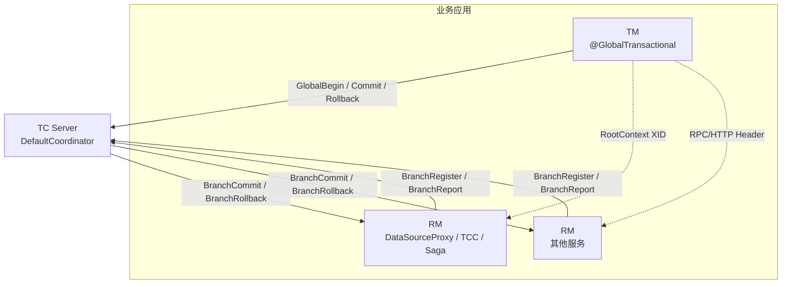
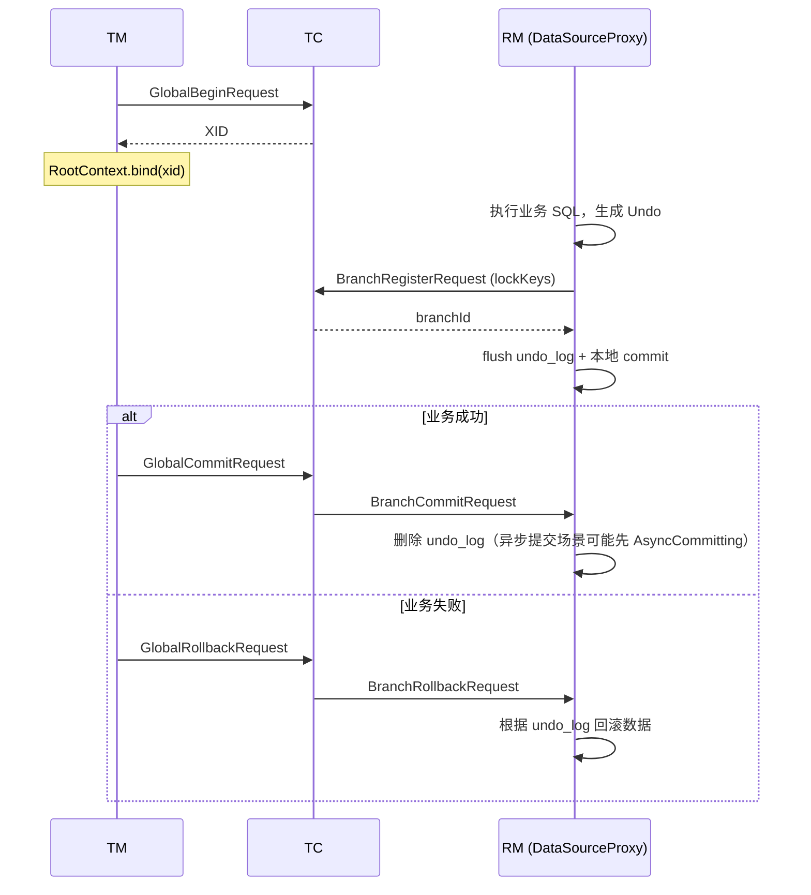

# Apache Seata 项目架构与实现原理深度分析

> 本文基于 Apache Seata（incubating）源码梳理，面向需要深入理解框架设计与实现的开发者。  
> 分析范围：仓库根目录 Maven 多模块工程（版本以 `pom.xml` 中 `${revision}` 为准，当前父 POM 标注约 **2.5.0**）。

---

## 目录

1. [项目定位与背景](#1-项目定位与背景)
2. [整体架构](#2-整体架构)
3. [Maven 模块分层](#3-maven-模块分层)
4. [核心概念与数据模型](#4-核心概念与数据模型)
5. [全局事务生命周期](#5-全局事务生命周期)
6. [通信协议与 RPC 层](#6-通信协议与-rpc-层)
7. [TC（Transaction Coordinator）服务端](#7-tctransaction-coordinator服务端)
8. [TM（Transaction Manager）客户端](#8-tmtransaction-manager客户端)
9. [RM（Resource Manager）与 AT 模式实现](#9-rmresource-manager与-at-模式实现)
10. [TCC、Saga、XA 事务模式](#10-tccsagaxa-事务模式)
11. [配置中心与注册中心](#11-配置中心与注册中心)
12. [Spring Boot 集成](#12-spring-boot-集成)
13. [扩展机制（SPI）](#13-扩展机制spi)
14. [高可用与会话存储](#14-高可用与会话存储)
15. [技术亮点与设计亮点](#15-技术亮点与设计亮点)
16. [关键类索引](#16-关键类索引)

**各模式源码级深度剖析**（调用栈、分支条件、核心方法）：[SEATA_MODE_SOURCE_DEEP_DIVE.md](./SEATA_MODE_SOURCE_DEEP_DIVE.md)  
**分模式文档**： [AT](./SEATA_MODE_AT.md) | [TCC](./SEATA_MODE_TCC.md) | [XA](./SEATA_MODE_XA.md) | [Saga](./SEATA_MODE_SAGA.md)

---

## 1. 项目定位与背景

### 1.1 解决什么问题

在微服务架构下，业务常按「**Database per Service**」拆分，单个服务内可用本地事务保证一致性，但**跨服务的业务操作**无法再用单机 ACID 事务覆盖。Apache Seata 提供**分布式事务**能力：将跨库、跨服务的一组本地事务编排为一个**全局事务（Global Transaction）**，在失败时协调回滚，在成功时协调提交。

### 1.2 名称与演进

- **Seata**：Simple Extensible Autonomous Transaction Architecture  
- 前身：阿里 **TXC / GTS（Fescar）**、蚂蚁 **XTS / DTX** 等能力的开源融合  
- 2023 年 10 月进入 **Apache Incubator**

### 1.3 三种角色（官方模型）

| 角色 | 英文 | 职责 |
|------|------|------|
| **事务协调者** | TC (Transaction Coordinator) | 维护全局/分支事务状态，驱动二阶段提交或回滚 |
| **事务管理器** | TM (Transaction Manager) | 定义全局事务边界：开启、提交、回滚全局事务 |
| **资源管理器** | RM (Resource Manager) | 管理分支事务所依赖的资源；向 TC 注册分支、上报状态；执行分支提交/回滚 |

关系可概括为：**TM 发起全局事务 → XID 在调用链传播 → RM 注册分支 → TM 请求 TC 提交/回滚 → TC 驱动各 RM 完成二阶段**。

---

## 2. 整体架构

### 2.1 逻辑架构图



### 2.2 物理部署

- **TC**：独立进程，模块 `server`，Spring Boot 启动（`ServerApplication` → `ServerRunner` → `Server.start()`）
- **TM / RM**：嵌入各业务 JVM，通过 `tm`、`rm`、`rm-datasource`、`spring` 等模块接入
- **发现与配置**：`discovery`、`config` 模块 SPI 对接 Nacos、Eureka、Apollo 等

### 2.3 代码分层（自底向上）

```
common / json-common          → 工具、XID、SPI 加载器
config / discovery            → 配置与注册
serializer / compressor       → RPC 序列化与压缩
sqlparser                     → SQL 解析（AT 锁与 Undo）
core                          → 协议、Netty、RootContext
tm / rm / rm-datasource       → 客户端 TM/RM
integration-tx-api / spring   → 注解、AOP、Boot 自动配置
server                        → TC 协调器、会话存储、锁
tcc / saga                    → 其它事务模式
extensions                    → Dubbo、gRPC、HTTP 等传播与集成
```

---

## 3. Maven 模块分层

根 `pom.xml`（`seata-parent`）声明的主要模块：

| 模块 | 作用 |
|------|------|
| **build / bom / dependencies** | 构建父 POM、BOM、第三方依赖收敛 |
| **all** | 聚合发布 `seata-all` |
| **common** | `XID`、常量、`EnhancedServiceLoader`、线程池等 |
| **config** | 配置中心 SPI（file、nacos、apollo、zk、etcd3…） |
| **discovery** | 注册中心 SPI（nacos、eureka、consul、redis、raft…） |
| **core** | `RpcMessage`、事务报文、Netty 客户端/服务端、`RootContext` |
| **serializer / compressor** | 报文体序列化（Seata/Kryo/Protobuf…）与压缩 |
| **sqlparser** | Druid/ANTLR 等 SQL 识别，供 AT 解析 |
| **tm** | `DefaultGlobalTransaction`、`DefaultTransactionManager`、`TransactionalTemplate` |
| **rm** | `AbstractResourceManager`、`AbstractRMHandler` |
| **rm-datasource** | AT/XA：`DataSourceProxy`、`ConnectionProxy`、Undo、SQL 执行器 |
| **integration-tx-api** | 与框架无关的事务拦截器 API |
| **spring** | `GlobalTransactionScanner`、Boot Starter、自动配置 |
| **server** | TC：`DefaultCoordinator`、`SessionHolder`、各 `*Core` |
| **tcc** | TCC 资源管理与拦截 |
| **saga** | 状态机引擎、RM、statelang、Spring 适配 |
| **compatible** | `io.seata.*` 兼容包 |
| **extensions** | RPC/消息/APM 扩展 |
| **metrics** | Prometheus 指标 |
| **mock-server** | 测试用轻量 TC |

---

## 4. 核心概念与数据模型

### 4.1 全局事务与分支事务

- **全局事务（Global Transaction）**：一次分布式业务调用链对应的逻辑事务，由 TC 持久化会话（`GlobalSession`）
- **分支事务（Branch Transaction）**：全局事务下的一个资源参与者，通常对应一个本地 JDBC 事务或 TCC/Saga 的一个参与步骤（`BranchSession`）

### 4.2 XID

全局事务唯一标识，格式由 TC 生成：

```
{ip}:{port}:{transactionId}
```

实现见 `org.apache.seata.common.XID`：

- TC 启动时设置 `XID.setIpAddress` / `XID.setPort`
- `generateXID(tranId)` 拼接 IP、端口与递增事务号

客户端通过 `RootContext.bind(xid)` 绑定到当前线程；跨服务经 RPC Attachment 或 HTTP Header（如 `TX_XID`）传播。

### 4.3 BranchType

`org.apache.seata.core.model.BranchType` 定义事务模式：

| 枚举 | 含义 |
|------|------|
| **AT** | Automatic Transaction，自动补偿型（默认 JDBC） |
| **TCC** | Try-Confirm-Cancel 业务补偿 |
| **SAGA** | 状态机驱动的长事务 |
| **XA** | XA 两阶段提交协议 |
| **SAGA_ANNOTATION** | 注解式 Saga |

TC 侧通过 `DefaultCore` 将 `BranchType` 路由到 `ATCore`、`TccCore`、`SagaCore`、`XACore` 等。

### 4.4 全局状态 GlobalStatus

`org.apache.seata.core.model.GlobalStatus` 描述全局事务在 TC 的状态机（节选）：

| 阶段 | 状态 | 说明 |
|------|------|------|
| 一阶段 | `Begin` | 可接受新分支注册 |
| 二阶段进行中 | `Committing` / `CommitRetrying` | 正在提交或重试提交 |
| 二阶段进行中 | `Rollbacking` / `RollbackRetrying` | 正在回滚或重试回滚 |
| 超时 | `TimeoutRollbacking` 等 | 全局超时触发的回滚 |
| AT 特有 | `AsyncCommitting` | 分支可异步提交（AT 优化路径） |
| 终态 | `Committed` / `Rollbacked` / `CommitFailed` / `RollbackFailed` 等 | 不再变更 |
| 其它 | `Finished` | Saga 上报等场景 |
| 运维 | `StopCommitOrCommitRetry` / `StopRollbackOrRollbackRetry` | 人工停止重试 |

工具方法：`isOnePhaseTimeout`、`isTwoPhaseSuccess`、`isTwoPhaseHeuristic` 用于协调器定时任务筛选会话。

### 4.5 分支状态 BranchStatus

`BranchStatus` 描述分支从一阶段注册到二阶段完成的全过程，包括：

- `Registered` → `PhaseOne_Done` / `PhaseOne_Failed` / `PhaseOne_Timeout`
- `PhaseTwo_Committed` / `PhaseTwo_Rollbacked`
- 可重试失败：`PhaseTwo_CommitFailed_Retryable`、`PhaseTwo_RollbackFailed_Retryable`
- XA 特殊：`PhaseTwo_*_XAER_NOTA_Retryable`
- `STOP_RETRY`：用户停止重试

---

## 5. 全局事务生命周期

### 5.1 标准时序（AT 为例）



### 5.2 入口调用链（Spring）

```
@GlobalTransactional 方法
  → GlobalTransactionalInterceptorHandler.invoke()
  → TransactionalTemplate.execute()
  → DefaultGlobalTransaction.begin() / commit() / rollback()
  → DefaultTransactionManager（RPC 至 TC）
  → RootContext.bind / unbind
```

非 Spring 场景可直接使用 `TransactionalTemplate` + `TransactionalExecutor`。

### 5.3 传播行为

`TransactionalTemplate` 实现与 Spring 类似的事务传播（`Propagation`）：

- **REQUIRED**：有则加入，无则新建（Launcher）
- **REQUIRES_NEW**：挂起当前 XID，新建全局事务
- **SUPPORTS / NOT_SUPPORTED / NEVER / MANDATORY**：与 Spring 语义对齐

内部通过 `SuspendedResourcesHolder` 保存/恢复 `RootContext` 中的 XID 与分支类型。

---

## 6. 通信协议与 RPC 层

### 6.1 报文模型

- **`RpcMessage`**：统一信封（id、messageType、codec、compressor、headMap、body）
- **`AbstractMessage`** 及 `core/protocol/transaction/*` 下具体请求/响应

`core/README.md` 归纳了主要方向：

**TM → TC**：`RegisterTMRequest`、`GlobalBegin/Commit/Rollback/Status/ReportRequest`  
**RM → TC**：`RegisterRMRequest`、`BranchRegister/ReportRequest`、`GlobalLockQueryRequest`  
**TC → RM**：`BranchCommitRequest`、`BranchRollbackRequest`、`UndoLogDeleteRequest`  
**合并消息**：`MergedWarpMessage` / `MergeResultMessage`（批量合并降低 RTT）

### 6.2 Netty Remoting

| 组件 | 类 | 说明 |
|------|-----|------|
| TC 服务端 | `NettyRemotingServer` | 监听 TM/RM 连接 |
| TM 客户端 | `TmNettyRemotingClient` | 同步/异步发全局事务指令 |
| RM 客户端 | `RmNettyRemotingClient` | 注册资源、上报分支 |
| 通道管理 | `ChannelManager` | applicationId / resourceId → Channel |
| 处理器 | `RegTmProcessor`、`RegRmProcessor`、`ServerOnRequestProcessor` 等 | 协议分发 |

`TransactionMessageHandler` 是业务处理回调接口；TC 上由 `DefaultCoordinator` 实现。

### 6.3 序列化与压缩

- **serializer** 模块：Seata 默认、Kryo、Protobuf、FST 等，可配置 `serializer`  
- **compressor** 模块：对较大报文（如 Undo 相关）做压缩，与 Undo flush 时 `CompressorType` 呼应

---

## 7. TC（Transaction Coordinator）服务端

### 7.1 启动流程

1. `ServerApplication`（Spring Boot main）
2. `ServerRunner` 调用 `Server.start()`
3. 初始化 Metrics、`SessionHolder.init()`、锁管理器 `LockerManagerFactory`
4. 创建 `NettyRemotingServer`，注册 `DefaultCoordinator` 为 `TransactionMessageHandler`
5. 启动多个**定时任务线程池**（见下节）

### 7.2 DefaultCoordinator

`org.apache.seata.server.coordinator.DefaultCoordinator` 是 TC 的核心：

- 继承 `AbstractTCInboundHandler`，实现 `TransactionMessageHandler`
- 处理 `GlobalBegin`、`GlobalCommit`、`GlobalRollback`、`BranchRegister`、`BranchReport` 等
- 维护定时任务（可配置周期）：
  - **retryCommitting**：提交失败重试
  - **retryRollbacking**：回滚失败重试
  - **asyncCommitting**：AT 异步提交推进
  - **timeoutCheck**：全局超时检测
  - **undoLogDelete**：通知 RM 清理过期 undo_log
  - **syncProcessing**：同步处理队列

这种**服务端主动重试 + 客户端上报**的设计，保证在进程崩溃、网络闪断后仍能推进事务到终态。

### 7.3 会话管理 SessionHolder

`SessionHolder` 根据 `SessionMode` 选择存储后端（SPI 加载）：

| SessionMode | 实现类（示例） |
|-------------|----------------|
| file | `FileSessionManager` |
| db | `DataBaseSessionManager` |
| redis | `RedisSessionManager` |
| raft | `RaftSessionManager`（集群） |

核心模型：

- **`GlobalSession`**：xid、status、timeout、branch 列表、应用数据
- **`BranchSession`**：branchId、resourceId、lockKeys、branchType、status

`SessionHelper` 负责创建会话、变更状态并委托 `DefaultCore` 执行二阶段逻辑。

### 7.4 DefaultCore 与 *Core

`DefaultCore` 在构造时通过 `EnhancedServiceLoader.loadAll(AbstractCore.class)` 加载所有模式实现，放入 `CORE_MAP<BranchType, AbstractCore>`。

各 `*Core` 职责示例：

- **`ATCore`**：分支注册时 `branchSession.lock()` 获取全局锁；`lockQuery` 委托 `lockManager`；删除分支时通过 commit 路径删 undo
- **`TccCore`**：驱动 confirm/cancel
- **`SagaCore` / `SagaAnnotationCore`**：与状态机引擎协作
- **`XACore`**：XA 资源二阶段

支持 `ENABLE_PARALLEL_HANDLE_BRANCH` 并行处理多分支，提升吞吐。

### 7.5 全局锁（AT）

AT 模式在 TC 侧维护**全局锁**（按 resourceId + lockKeys），防止脏写。`ATCore.branchSessionLock` 在注册分支时获取锁，冲突抛出 `LockKeyConflict`。

RM 侧在 `@GlobalLock` 场景下也会 `checkLock` 后再提交本地事务（`ConnectionProxy.processLocalCommitWithGlobalLocks`）。

---

## 8. TM（Transaction Manager）客户端

### 8.1 核心类

| 类 | 路径 | 职责 |
|----|------|------|
| `DefaultTransactionManager` | `tm` | 发送 GlobalBegin/Commit/Rollback/Status RPC |
| `DefaultGlobalTransaction` | `tm.api` | 实现 `GlobalTransaction`；区分 Launcher / Participant |
| `TransactionalTemplate` | `tm.api` | 模板方法：传播、钩子、异常与回滚规则 |
| `TransactionManagerHolder` | `tm` | 单例 TM |
| `TMClient` | `tm` | 初始化 Netty 并注册到 TC |

### 8.2 GlobalTransactionRole

- **Launcher**：真正调用 `begin()` 的服务（全局事务发起方）
- **Participant**：仅携带 XID、不发起 begin 的服务（被调用方）

### 8.3 拦截器与降级

`GlobalTransactionalInterceptorHandler`（`integration-tx-api`）：

- 解析 `@GlobalTransactional` 构建 `TransactionInfo`（超时、name、propagation、rollbackRules）
- 支持 **TM 降级**：`degradeCheck` 在 TC 不可用时自动关闭全局事务，避免阻塞业务
- 集成 `FailureHandler` 处理提交/回滚失败回调
- `@GlobalLock` 走 `GlobalLockTemplate` 而非完整全局事务

### 8.4 XID 传播

`RootContext`（`core.context`）：

- ThreadLocal（可插拔 `ContextCore`）存储 `TX_XID`、`TX_BRANCH_TYPE`、`TX_LOCK` 等
- 与 SLF4J MDC 集成（`X-TX-XID`）便于日志追踪
- **extensions** 中 `TransactionPropagationHandler`（Dubbo 等）、`TransactionPropagationInterceptor`（HTTP）在调用边界 bind/unbind

---

## 9. RM（Resource Manager）与 AT 模式实现

AT（Automatic Transaction）是 Seata 最具特色的模式：**对业务 SQL 无侵入**，通过数据源代理 + Undo Log 实现补偿。

### 9.1 资源代理栈

```
DataSourceProxy
  └── getConnection() → ConnectionProxy
        └── createStatement() → StatementProxy
              └── Executor（按 SQL 类型）
```

- **`DataSourceProxy`**：包装 JDBC `DataSource`，解析 jdbcUrl、dbType，校验 `undo_log` 表，向 RM 注册 `Resource`
- **`ConnectionProxy`**：拦截 `commit`/`rollback`/`setAutoCommit`
- **`ConnectionContext`**：保存 xid、branchId、undo 条目、lock keys、savepoint

### 9.2 一阶段：SQL 执行与 Undo 生成

`BaseTransactionalExecutor` 及子类（`InsertExecutor`、`UpdateExecutor`、`DeleteExecutor` 等）：

1. 通过 **sqlparser** 的 `SQLRecognizer` 解析 SQL
2. 查询前镜像 / 后镜像（`TableRecords`）
3. 构造 `SQLUndoLog` 放入 `ConnectionContext`
4. 提取 **lock keys**（主键等）供 TC 加锁

### 9.3 本地提交时（全局事务内）

`ConnectionProxy.processGlobalTransactionCommit()` 核心步骤：

```text
1. register() → DefaultResourceManager.branchRegister(AT, resourceId, xid, lockKeys)
2. UndoLogManager.flushUndoLogs() → 写入业务库的 undo_log 表
3. targetConnection.commit() → 提交本地事务
4. report(true) → BranchReport PhaseOne_Done（可配置）
```

若 `setAutoCommit(true)` 在全局事务连接上被调用，会先触发 `doCommit()`（符合 JDBC 规范）。

**回滚**：`rollback()` 后若已注册分支则 `report(false)`。

### 9.4 Undo Log

- 表名默认 `undo_log`（可配置）
- `BranchUndoLog` 序列化（`UndoLogParser`：Jackson/Kryo 等）
- 大报文可压缩（`CompressorFactory`）
- 二阶段**回滚**：`UndoLogManager.undo()` 解析并执行反向 SQL
- 二阶段**提交**：删除 undo 记录（`deleteUndoLog`）；TC 定时 `UndoLogDeleteRequest` 清理历史数据

### 9.5 二阶段 RM 处理

`RMHandlerAT` 处理 TC 下发的：

- `BranchCommit` → 异步或同步删除 undo
- `BranchRollback` → `undo()`
- `UndoLogDelete` → 按保留天数批量删除

`AbstractRMHandler` 统一入口，按 `BranchType` 路由到各 Handler。

### 9.6 AT 异步提交

全局状态 `AsyncCommitting`：一阶段已落库并写 undo 后，TC 可先认为逻辑可提交，再异步通知 RM 删 undo，降低同步等待时间（需结合配置与业务容忍度理解）。

---

## 10. TCC、Saga、XA 事务模式

### 10.1 TCC

| 组件 | 说明 |
|------|------|
| `@TwoPhaseBusinessAction` | 标注 Try 方法，指定 confirm/cancel |
| `@LocalTCC` | 非远程 TCC Bean |
| `TCCResourceManager` | 注册 TCC 资源，二阶段反射调用 confirm/cancel |
| `TccActionInterceptorHandler` | Try 阶段拦截并注册分支 |
| `TccCore` / `RMHandlerTCC` | TC 与 RM 侧协调 |

特点：**业务实现三个接口**，性能与隔离可控，但需要设计幂等与空回滚、悬挂等问题（框架提供 **TCC Fence** 等 Spring 配置辅助）。

### 10.2 Saga

模块链：`seata-saga-statelang`（JSON 状态语言）→ `seata-saga-processctrl` → `seata-saga-engine` → `seata-saga-rm` / `seata-saga-spring`

- **`StateMachineEngine`**：驱动状态机执行、正向/补偿
- **`SagaCore`**：TC 侧与 Saga 分支协作
- 适合**长流程、可补偿**的业务（订单、审批流等）

### 10.3 XA

- `DataSourceProxyXA`、`ResourceManagerXA`
- 依赖数据库原生 XA 协议，二阶段由 RM 通过 XA commit/rollback 完成
- `BranchStatus` 含 `XAER_NOTA` 可重试状态，TC 有专门重试超时配置

---

## 11. 配置中心与注册中心

### 11.1 配置 ConfigurationFactory

- 入口：`ConfigurationFactory.getInstance()`
- 本地 file + 远程配置中心（`config.type`）
- 实现：nacos、apollo、zk、etcd3、consul、spring-cloud、custom

典型项：`service.vgroupMapping`、`transport`、`store.session.mode`、`store.lock.mode` 等。

### 11.2 注册 RegistryFactory

- SPI：`RegistryService`
- `lookup(key)` 解析 TC 地址列表
- 实现：nacos、eureka、consul、zk、etcd3、redis、raft、sofa、custom

客户端启动时根据 **事务分组（vgroup）** 找到可用 TC 集群。

---

## 12. Spring Boot 集成

### 12.1 自动配置（`seata-spring-boot-starter`）

| 配置类 | 作用 |
|--------|------|
| `SeataCoreAutoConfiguration` | 上下文 Provider、属性绑定 |
| `SeataAutoConfiguration` | `GlobalTransactionScanner`、`FailureHandler` |
| `SeataDataSourceAutoConfiguration` | 自动包装 `DataSource` 为 `DataSourceProxy` |
| `SeataHttpAutoConfiguration` | HTTP XID 传播 |
| `SeataSagaAutoConfiguration` | Saga 引擎 Bean |
| `SeataSpringFenceAutoConfiguration` | TCC 防悬挂 |

### 12.2 GlobalTransactionScanner

`AbstractAutoProxyCreator`：

- 扫描 `@GlobalTransactional`、`@GlobalLock`
- 初始化 `TMClient`、`RMClient`
- 注册 `GlobalTransactionalInterceptorHandler` 等到代理链

---

## 13. 扩展机制（SPI）

`EnhancedServiceLoader`（`common.loader`）是 Seata 扩展性的核心：

- 读取 `META-INF/services/` 与增强加载逻辑
- 支持按 name、按构造参数加载
- 用于：`AbstractCore`、`SessionManager`、`RegistryService`、`Configuration`、`UndoLogManager`、SQL 解析器等

**设计意义**：同一套 TC/TM/RM 核心，通过换 JAR 即可对接不同注册中心、存储、数据库 Undo 实现，无需改核心代码。

---

## 14. 高可用与会话存储

### 14.1 TC 集群

- **DB/Redis 模式**：会话与锁存外部存储，多 TC 需配合 DB 锁或 Redis 锁（`DistributedLocker`）
- **Raft 模式**：`RaftCoordinator`、`RaftSessionManager`，强一致复制会话状态

### 14.2 存储维度

| 维度 | 可配置项 | 说明 |
|------|----------|------|
| 会话 | `store.session.mode` | file / db / redis / raft |
| 锁 | `store.lock.mode` | file / db / redis |
| 模式映射 | vgroup → tc cluster | `VGroupMappingStoreManager` |

### 14.3 故障恢复

- TC 重启后从 SessionStore **reload** 未完成全局事务
- `DefaultCoordinator` 定时扫描 `Committing`、`Rollbacking`、`Retry*` 状态继续推进
- 重试上限与超时：`MAX_COMMIT_RETRY_TIMEOUT`、`RETRY_DEAD_THRESHOLD` 等，防止无限重试

---

## 15. 技术亮点与设计亮点

### 15.1 技术亮点

1. **AT 无侵入补偿**：数据源代理 + SQL 解析 + 前后镜像，业务代码几乎不改  
2. **TC 端全局锁**：集中式锁服务避免分布式下的写冲突  
3. **合并消息（Merge）**：`MergedWarpMessage` 批量 RPC，降低高并发下网络开销  
4. **多模式统一协调**：`DefaultCore` + `BranchType` 路由，同一 TC 支持 AT/TCC/Saga/XA  
5. **可插拔存储与注册**：file/db/redis/raft + 多种注册中心，适配从开发到生产  
6. **完善的超时与重试状态机**：`GlobalStatus` / `BranchStatus` 细分可重试与终态  
7. **TM 降级与熔断思路**：TC 不可用时自动关闭全局事务，保护业务可用性  
8. **Undo 压缩与序列化多种实现**：平衡存储与性能  
9. **并行分支处理**：可配置并行二阶段，提高大事务分支数场景吞吐  
10. **metrics 模块**：便于观测 TC 与各阶段耗时

### 15.2 设计亮点

1. **角色分离清晰**：TM 管边界、RM 管资源、TC 管状态，符合 2PC 协调者模型，易于推理  
2. **Template + Hook**：`TransactionalTemplate` 与 `TransactionHook` 分离流程与扩展  
3. **RootContext 与传播解耦**：核心只认 ThreadLocal XID，RPC/HTTP 传播在 extensions 实现  
4. **integration-tx-api 与 spring 分离**：非 Spring 项目也可使用同一套事务 API  
5. **Launcher / Participant**：嵌套调用不必重复 begin，避免全局事务泛滥  
6. **Connection 层统一拦截 commit**：在 JDBC 语义最自然的位置注册分支与刷 undo  
7. **兼容模块**：`io.seata` 包名迁移期平滑升级  
8. **状态机显式枚举**：运维与排障可对照 `GlobalStatus` 精确定位阶段  

### 15.3 使用与选型建议

| 场景 | 推荐模式 |
|------|----------|
| 单库多表、多库 JDBC、希望少改代码 | **AT** |
| 高并发、需精细控制资源预留 | **TCC** |
| 长流程、人工节点、可视化状态机 | **Saga** |
| 强依赖 DB XA、传统 2PC | **XA** |

各模式实现原理详见：[AT](./SEATA_MODE_AT.md) | [TCC](./SEATA_MODE_TCC.md) | [XA](./SEATA_MODE_XA.md) | [Saga](./SEATA_MODE_SAGA.md)

---

## 16. 关键类索引

### 16.1 TC Server

| 类 | 包路径 |
|----|--------|
| `ServerApplication` | `org.apache.seata.server` |
| `Server` | `org.apache.seata.server` |
| `DefaultCoordinator` | `org.apache.seata.server.coordinator` |
| `DefaultCore` | `org.apache.seata.server.coordinator` |
| `ATCore` | `org.apache.seata.server.transaction.at` |
| `SessionHolder` | `org.apache.seata.server.session` |
| `GlobalSession` / `BranchSession` | `org.apache.seata.server.session` |

### 16.2 TM

| 类 | 包路径 |
|----|--------|
| `TransactionalTemplate` | `org.apache.seata.tm.api` |
| `DefaultGlobalTransaction` | `org.apache.seata.tm.api` |
| `DefaultTransactionManager` | `org.apache.seata.tm` |
| `GlobalTransactionalInterceptorHandler` | `org.apache.seata.integration.tx.api.interceptor.handler` |

### 16.3 RM / AT

| 类 | 包路径 |
|----|--------|
| `DataSourceProxy` | `org.apache.seata.rm.datasource` |
| `ConnectionProxy` | `org.apache.seata.rm.datasource` |
| `ConnectionContext` | `org.apache.seata.rm.datasource` |
| `UndoLogManager` | `org.apache.seata.rm.datasource.undo` |
| `AbstractResourceManager` | `org.apache.seata.rm` |
| `AbstractRMHandler` | `org.apache.seata.rm` |
| `RMHandlerAT` | `org.apache.seata.rm` |

### 16.4 Core

| 类 | 包路径 |
|----|--------|
| `RootContext` | `org.apache.seata.core.context` |
| `RpcMessage` | `org.apache.seata.core.protocol` |
| `GlobalStatus` / `BranchStatus` / `BranchType` | `org.apache.seata.core.model` |
| `NettyRemotingServer` | `org.apache.seata.core.rpc.netty` |
| `TmNettyRemotingClient` / `RmNettyRemotingClient` | `org.apache.seata.core.rpc.netty` |

### 16.5 Spring

| 类 | 包路径 |
|----|--------|
| `GlobalTransactionScanner` | `org.apache.seata.spring.annotation` |
| `GlobalTransactional` | `org.apache.seata.spring.annotation` |
| `SeataAutoConfiguration` | `org.apache.seata.spring.boot.autoconfigure` |

---

## 附录 A：协议消息速查

详见仓库 `core/src/main/java/org/apache/seata/core/README.md`。

## 附录 B：进一步阅读

- 官方文档：https://seata.apache.org/zh-cn/docs/overview/what-is-seata  
- 官方 Wiki：https://github.com/apache/incubator-seata/wiki  
- 部署入门：https://seata.apache.org/zh-cn/docs/ops/deploy-guide-beginner  

---

*文档生成说明：基于源码静态分析，具体配置项默认值以运行环境 `Configuration` 为准。若与官方文档有出入，以 Apache Seata 官方发布为准。*
