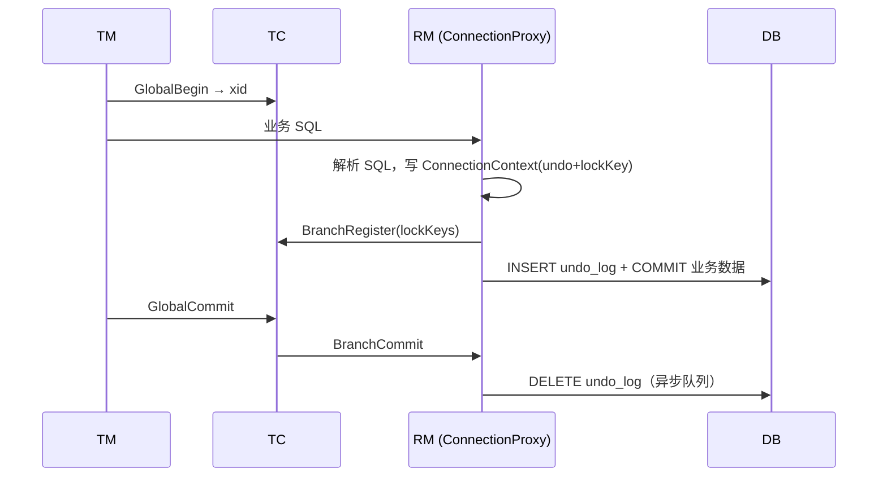

# Seata AT 模式底层实现原理

> **AT**（Automatic Transaction）：自动补偿型事务。业务仍使用普通 JDBC/SQL，Seata 在数据源层拦截 SQL，记录 **前后镜像** 与 **undo_log**，由 TC 协调全局提交/回滚。  
> 配套：[架构总览](./SEATA_ARCHITECTURE_ANALYSIS.md) | [RPC 通信](./SEATA_RPC_COMMUNICATION.md)

---

## 目录

1. [模式定位与设计思想](#1-模式定位与设计思想)
2. [两阶段模型在 AT 中的含义](#2-两阶段模型在-at-中的含义)
3. [整体架构与类分层](#3-整体架构与类分层)
4. [一阶段：SQL 拦截与 Undo 生成](#4-一阶段sql-拦截与-undo-生成)
5. [一阶段：分支注册与本地提交](#5-一阶段分支注册与本地提交)
6. [TC 侧：全局锁与 ATCore](#6-tc-侧全局锁与-atcore)
7. [二阶段：全局提交（删 Undo）](#7-二阶段全局提交删-undo)
8. [二阶段：全局回滚（数据补偿）](#8-二阶段全局回滚数据补偿)
9. [异步提交优化](#9-异步提交优化)
10. [@GlobalLock 与全局锁查询](#10-globallock-与全局锁查询)
11. [undo_log 表与序列化](#11-undo_log-表与序列化)
12. [脏数据校验与异常分支](#12-脏数据校验与异常分支)
13. [关键配置](#13-关键配置)
14. [源码索引](#14-源码索引)

---

## 1. 模式定位与设计思想

### 1.1 解决什么问题

微服务下多个数据库各自有本地事务，但**没有统一的分布式 ACID**。AT 在**不改造业务 SQL** 的前提下：

- **一阶段**：各 RM 在本地事务中执行业务 SQL，同时把「如何撤销这次变更」写入 `undo_log`，并向 TC 注册分支、申请**全局行锁**。
- **二阶段提交**：TC 通知各 RM **删除 undo_log**（业务数据已在阶段一提交）。
- **二阶段回滚**：TC 通知各 RM **按 undo_log 生成反向 SQL** 恢复数据。

本质是 **2PC + 本地事务已提交 + 补偿日志**，而非阻塞的 XA 两阶段持有锁到全局结束。

### 1.2 适用与限制

| 适合 | 不适合 |
|------|--------|
| 关系型数据库、标准 DML | 非关系型、无 undo 表 |
| 希望低侵入 | 需要业务手写 Try/Confirm |
| 读多写少、可接受全局锁 | 极高并发热点行（锁竞争） |

---

## 2. 两阶段模型在 AT 中的含义



| 阶段 | 业务库状态 | TC 状态 | undo_log |
|------|------------|---------|----------|
| 一阶段结束 | 已 COMMIT | 分支 Registered / PhaseOne_Done | 已写入 |
| 二阶段提交 | 不变 | Committed | 删除 |
| 二阶段回滚 | 反向 SQL 恢复 | Rollbacked | 删除 |

---

## 3. 整体架构与类分层

```text
@GlobalTransactional
    └── RootContext.xid
            └── DataSourceProxy
                    └── ConnectionProxy
                            └── StatementProxy / PreparedStatementProxy
                                    └── ExecuteTemplate
                                            └── *Executor (Update/Insert/Delete/...)
                            └── ConnectionContext (undoItems, lockKeys, branchId)
                    └── DataSourceManager (AbstractResourceManager, BranchType.AT)
                            └── RmNettyRemotingClient → TC

TC: DefaultCoordinator → DefaultCore → ATCore
        └── LockManager (file/db/redis)
        └── GlobalSession / BranchSession
```

| 层级 | 核心类 | 模块 |
|------|--------|------|
| 数据源代理 | `DataSourceProxy`, `ConnectionProxy`, `StatementProxy` | `rm-datasource` |
| SQL 执行器 | `ExecuteTemplate`, `AbstractDMLBaseExecutor`, `*Executor` | `rm-datasource/exec` |
| Undo | `UndoLogManager`, `AbstractUndoLogManager`, `*Undo*Executor` | `rm-datasource/undo` |
| RM | `DataSourceManager`, `RMHandlerAT` | `rm-datasource`, `rm` |
| SQL 解析 | `SQLVisitorFactory` → Druid 等 | `sqlparser`, `rm-datasource/sql` |
| TC | `ATCore`, `AbstractLockManager` | `server` |

---

## 4. 一阶段：SQL 拦截与 Undo 生成

### 4.1 入口：Statement 代理

所有 `execute*` / `executeQuery` / `executeUpdate` 进入 `StatementProxy`，由 **`ExecuteTemplate.execute()`** 统一处理：

1. `SQLVisitorFactory.get(sql)` 解析为 `SQLRecognizer`（默认 **Druid** 解析器，`client.rm.sqlParserType`）。
2. 按 `SQLType`（INSERT/UPDATE/DELETE/SELECT_FOR_UPDATE）选择 Executor。
3. 调用 `BaseTransactionalExecutor.execute()`。

### 4.2 绑定全局事务上下文

`BaseTransactionalExecutor.execute()`：

- 从 `RootContext.getXID()` 读取 xid；无 xid 则直接执行原 SQL（非分布式事务）。
- 若 `@GlobalLock`：`RootContext.requireGlobalLock()` → 仅做锁校验路径，不注册分支。
- 设置 `ConnectionContext` 的 xid、全局锁标志。

### 4.3 DML 执行模板（autoCommit=false）

`AbstractDMLBaseExecutor.executeAutoCommitFalse()`：

```text
beforeImage = beforeImage()     // SELECT ... FOR UPDATE 查变更前
result = 执行原始 SQL
afterImage = afterImage(before) // 查变更后
prepareUndoLog(before, after)   // 构造 SQLUndoLog + lockKey
```

| SQL 类型 | beforeImage | afterImage | Undo 语义 |
|----------|-------------|------------|-------------|
| INSERT | 空 | 插入后按 PK 查询 | INSERT → 回滚时 DELETE |
| UPDATE | WHERE 命中行（FOR UPDATE） | 更新后按 PK | UPDATE → 回滚时 UPDATE 回 before |
| DELETE | WHERE 命中行 | 空 | DELETE → 回滚时 INSERT before |
| SELECT FOR UPDATE | — | — | 不生成 undo，仅 `checkLock` |

**列裁剪**：`client.undo.onlyCareUpdateColumns=true`（默认）时，镜像只含 **变更列 + 主键 + ON UPDATE 列**，减小 undo 体积。

### 4.4 锁键（lockKey）格式

`BaseTransactionalExecutor.buildLockKey(TableRecords)`：

```text
{tableName}:{pkVal1}_{pkVal2},{pkVal2};{table2}:...
```

- 表内多行用 `,` 分隔；多表用 `;` 分隔。
- UPDATE/INSERT 用 **afterImage** 的主键；DELETE 用 **beforeImage**。
- 注册分支时整串传给 TC，用于 **全局行锁**。

### 4.5 SQLUndoLog 结构

`SQLUndoLog` 包含：`sqlType`、`tableName`、`beforeImage`、`afterImage`（`TableRecords` + `TableMeta`）。

多个 `SQLUndoLog` 放在 `ConnectionContext` 中，commit 时合并为 `BranchUndoLog` 序列化写入 `undo_log` 表。

---

## 5. 一阶段：分支注册与本地提交

### 5.1 commit 拦截

`ConnectionProxy.commit()` → `doCommit()`：

- 非全局事务：直接 `targetConnection.commit()`。
- `@GlobalLock`：`processLocalCommitWithGlobalLocks()` → RPC `lockQuery` 后本地提交，**不** flush undo、**不** branchRegister。
- 全局事务：`processGlobalTransactionCommit()`。

### 5.2 processGlobalTransactionCommit 步骤

```text
1. register()
   - 若 context 无 undo 或无 lockKey → 跳过
   - DefaultResourceManager.branchRegister(AT, resourceId, xid, applicationData, lockKeys)
   - TC: ATCore.branchSessionLock() 获取全局锁
   - 返回 branchId → context.setBranchId()

2. UndoLogManagerFactory.getUndoLogManager(dbType).flushUndoLogs(this)
   - 编码 BranchUndoLog → INSERT undo_log

3. targetConnection.commit()
   - 业务行 + undo_log 同一本地事务提交

4. report(true) [可选，client.rm.reportSuccessEnable]
   - branchReport(PhaseOne_Done)
```

### 5.3 setAutoCommit(true) 的 JDBC 语义

若在全局事务连接上调用 `setAutoCommit(true)`，JDBC 规范要求先 commit。`ConnectionProxy.setAutoCommit()` 会先 `doCommit()` 再走原连接，从而触发上述注册与 flush 流程。

### 5.4 rollback

`ConnectionProxy.rollback()`：物理回滚；若已 `branchRegister` 则 `report(false)`（`PhaseOne_Failed`），并 `context.reset()`。

---

## 6. TC 侧：全局锁与 ATCore

### 6.1 分支注册（TC）

`AbstractCore.branchRegister()`：

1. `SessionHelper.newBranchByGlobal()` 创建 `BranchSession`。
2. `getCore(AT).branchSessionLock()` → **`ATCore.branchSessionLock()`**。
3. `globalSession.addBranch()`；失败则 unlock。

**ATCore.branchSessionLock()** 解析 `applicationData` JSON：

| 键 | 含义 |
|----|------|
| `autoCommit` | 客户端是否改过 autocommit |
| `skipCheckLock` | 乐观策略，跳过部分锁检查 |

调用 `branchSession.lock(autoCommit, skipCheckLock)` → `LockManager.acquireLock()`。

### 6.2 锁模型

- 粒度：`(resourceId, tableName, primaryKey)`。
- 实现：`LockerManagerFactory` → file / db / redis / raft（`store.lock.mode`）。
- 冲突：抛 `LockKeyConflict`，RM 侧可重试（`client.rm.lock.retryTimes`）。
- 同 xid 重入：允许。

### 6.3 lockQuery

`ATCore.lockQuery()` → `lockManager.isLockable(xid, resourceId, lockKeys)`，供 `@GlobalLock` 本地提交前检查。

### 6.4 branchDelete

AT 模式下删除分支走 **`branchCommit`**（即删 undo），见 `ATCore.branchDelete()`。

---

## 7. 二阶段：全局提交（删 Undo）

### 7.1 TC 驱动

`DefaultCore.commit()` → `doGlobalCommit()`：

- 若所有分支可异步提交且配置允许 → `GlobalSession.asyncCommit()` → 状态 `AsyncCommitting`。
- 对每个分支：`AbstractCore.branchCommit()` → RPC **`BranchCommitRequest`**。

### 7.2 RM：DataSourceManager.branchCommit

```text
AsyncWorker.branchCommit(xid, branchId, resourceId)
  → 立即返回 PhaseTwo_Committed（不阻塞 TM）
  → 后台线程批量 DELETE undo_log
```

队列上限 `client.rm.asyncCommitBufferLimit`（默认 10000），满则紧急刷盘。

### 7.3 为何阶段一已提交还能“全局提交”

业务数据在一阶段已落库；二阶段提交**不再次提交业务 SQL**，仅删除补偿日志并释放 TC 全局锁。若删除 undo 失败，TC 重试 `CommitRetrying`。

---

## 8. 二阶段：全局回滚（数据补偿）

### 8.1 TC 驱动

`DefaultCore.rollback()` → 每分支 `branchRollback()` → **`BranchRollbackRequest`**。

### 8.2 RM：UndoLogManager.undo()

`AbstractUndoLogManager.undo()` 核心步骤：

```text
1. SELECT undo_log WHERE xid=? AND branch_id=? FOR UPDATE
2. 若 log_status != Normal(0) → 幂等跳过
3. 解码 rollback_info（parser + 解压）→ BranchUndoLog
4. 按 SQLUndoLog 列表 **逆序** 执行 UndoExecutor
   - INSERT 的 undo → DELETE
   - UPDATE 的 undo → UPDATE 为 before 值
   - DELETE 的 undo → INSERT before 行
5. dataValidation：对比当前行与 afterImage，防止脏写
6. DELETE undo_log 行 + commit
```

若无 undo_log 记录（一阶段未完成）：`insertUndoLogWithGlobalFinished()` 防御悬挂（issue #489）。

### 8.3 脏数据异常

`client.undo.dataValidation=true` 时，若当前数据既不是 before 也不是 after，抛 **`SQLUndoDirtyException`** → `PhaseTwo_RollbackFailed_Unretryable`，需人工介入。

---

## 9. 异步提交优化

### 9.1 TC 侧

- `GlobalSession.canBeCommittedAsync()`：全部 AT 分支且非失败 → 可异步。
- 状态 `AsyncCommitting`：定时任务 `handleAsyncCommitting` 推进，**跳过**已在 RM 异步完成的分支。

### 9.2 RM 侧

见 §7.2。降低 TM `commit()` 等待所有 RM 删 undo 的延迟。

### 9.3 与同步提交对比

| | 同步 | 异步 |
|--|------|------|
| TM 感知 | 等 RM 删完 undo | 较快返回 |
| 故障 | undo 仍在，可重试删 | 同左 |
| 全局锁释放 | TC 会话结束后 | 同左 |

---

## 10. @GlobalLock 与全局锁查询

**场景**：未加入全局事务，但需避免与进行中的全局事务改同一行（批处理、定时任务）。

**链路**：

```text
@GlobalLock → GlobalLockTemplate → RootContext.bindGlobalLockFlag()
  → Executor 仍解析 lockKey
  → ConnectionProxy.processLocalCommitWithGlobalLocks()
       → checkLock(lockKeys)  // GlobalLockQueryRequest
       → commit（无 branchRegister、无 undo_log）
```

与 `@GlobalTransactional` 对比：无 xid 注册、无 undo 持久化，性能更好，**不参与** 全局提交/回滚。

---

## 11. undo_log 表与序列化

### 11.1 表结构（MySQL）

见 `script/client/at/db/mysql.sql`：

| 列 | 说明 |
|----|------|
| `branch_id` | 分支 ID |
| `xid` | 全局事务 ID |
| `context` | 序列化器名、压缩类型、max_allowed_packet 等 |
| `rollback_info` | BLOB：序列化后的 `BranchUndoLog` |
| `log_status` | 0 正常 / 1 防御完成 |
| `log_created` / `log_modified` | 时间 |

表名：`client.undo.logTable`（默认 `undo_log`），需在**业务库**初始化，非 TC 库。

### 11.2 序列化 SPI

`UndoLogParserFactory`：`jackson`（默认）、`kryo`、`fastjson`、`protobuf` 等。  
`context` 列记录 parser 名称，回滚时必须一致。

### 11.3 压缩

`client.undo.compress.enable`：超过 `threshold`（默认 64k）用 zip 等压缩 `rollback_info`。

---

## 12. 脏数据校验与异常分支

| 场景 | 行为 |
|------|------|
| 一阶段注册锁失败 | `LockKeyConflict`，本地不 commit |
| 一阶段 commit 后 TM 回滚 | undo 回滚数据 |
| 二阶段删 undo 失败 | TC `CommitRetrying` |
| 回滚时数据被业务改掉 | `SQLUndoDirtyException` |
| autoCommit=true 路径锁冲突 | `lock.retryPolicyBranchRollbackOnConflict` 可回滚本地 |

---

## 13. 关键配置

| 配置键 | 默认 | 说明 |
|--------|------|------|
| `client.undo.logTable` | undo_log | 表名 |
| `client.undo.logSerialization` | jackson | 序列化 |
| `client.undo.dataValidation` | true | 脏数据检查 |
| `client.undo.onlyCareUpdateColumns` | true | 镜像列裁剪 |
| `client.undo.compress.enable` | true | 压缩 |
| `client.rm.lock.retryInterval` | 10 | 锁重试间隔 ms |
| `client.rm.lock.retryTimes` | 30 | 锁重试次数 |
| `client.rm.asyncCommitBufferLimit` | 10000 | 异步提交队列 |
| `client.rm.reportSuccessEnable` | false | 一阶段成功上报 |
| `client.rm.sqlParserType` | druid | SQL 解析器 |
| `store.lock.mode` | file | TC 全局锁存储 |

---

## 14. 源码索引

| Concern | Class.Method |
|---------|----------------|
| SQL 入口 | `StatementProxy` → `ExecuteTemplate.execute` |
| Undo 生成 | `BaseTransactionalExecutor.prepareUndoLog` |
| 分支注册 | `ConnectionProxy.register` |
| Flush undo | `AbstractUndoLogManager.flushUndoLogs` |
| TC 加锁 | `ATCore.branchSessionLock` |
| 全局提交 | `AsyncWorker.branchCommit` |
| 全局回滚 | `AbstractUndoLogManager.undo` |
| 全局锁本地提交 | `ConnectionProxy.processLocalCommitWithGlobalLocks` |

路径前缀：`rm-datasource/`、`server/transaction/at/`、`server/lock/`。

---

## 15. 附录：源码级实现补充

> 完整四模式对照见 [SEATA_MODE_SOURCE_DEEP_DIVE.md](./SEATA_MODE_SOURCE_DEEP_DIVE.md) 第 3 节。

### 15.1 调用栈（一阶段 commit）

```text
StatementProxy.execute*()
  → ExecuteTemplate.execute()          // 非 AT 且无 GlobalLock 则直通
  → *Executor.execute()
       → BaseTransactionalExecutor.prepareUndoLog()
  → ConnectionProxy.commit()
       → doCommit()
       → processGlobalTransactionCommit()
            → register() → branchRegister(AT, lockKeys)
            → AbstractUndoLogManager.flushUndoLogs()
            → targetConnection.commit()
            → report(PhaseOne_Done) [可选]
```

### 15.2 关键分支条件

| 位置 | 条件 | 结果 |
|------|------|------|
| `ExecuteTemplate` | `!requireGlobalLock() && branchType!=AT` | 不拦截 |
| `register()` | `!hasUndoLog() \|\| !hasLockKey()` | 不注册分支 |
| `processGlobalTransactionCommit` | 注册抛 `LockKeyConflict` | `recognizeLockKeyConflictException` 重试或失败 |
| `AbstractUndoLogManager.undo` | `log_status != Normal` | 幂等 return |
| `undo` 无记录 | `exists==false` | `insertUndoLogWithGlobalFinished` |

### 15.3 TC 注册与加锁源码锚点

```java
// AbstractCore.branchRegister — 所有模式入口
branchSessionLock(globalSession, branchSession);  // ATCore 内真正 acquireLock
globalSession.addBranch(branchSession);

// ATCore — 解析 applicationData 后
branchSession.lock(autoCommit, skipCheckLock);
```

### 15.4 二阶段删除 undo

```java
// DataSourceManager.branchCommit → AsyncWorker
public BranchStatus branchCommit(...) {
    return addToCommitQueue(xid, branchId, resourceId);  // 立即 PhaseTwo_Committed
}
// 后台线程 batchDeleteUndoLog
```

---

*基于 Apache Seata 源码整理；行为以实际版本配置为准。*
