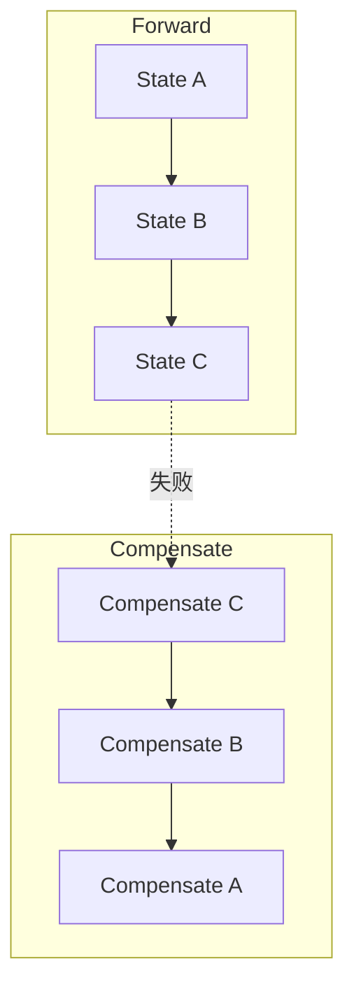

# Seata Saga 模式底层实现原理

> **Saga**：长事务通过 **正向服务编排 + 补偿服务** 实现最终一致；Seata 提供 **状态机引擎（statelang）**、**执行持久化** 与 **TC 协同**。含 **状态机 Saga** 与 **注解 Saga** 两种形态。  
> 配套：[架构总览](./SEATA_ARCHITECTURE_ANALYSIS.md)

---

## 目录

1. [模式定位](#1-模式定位)
2. [Saga 与 2PC/TCC 的差异](#2-saga-与-2pctcc-的差异)
3. [模块组成](#3-模块组成)
4. [状态机定义（Statelang）](#4-状态机定义statelang)
5. [状态机引擎执行流程](#5-状态机引擎执行流程)
6. [状态存储与 TC 协同](#6-状态存储与-tc-协同)
7. [分支注册模型](#7-分支注册模型)
8. [全局结束：globalReport](#8-全局结束globalreport)
9. [二阶段：forward 与 compensate](#9-二阶段forward-与-compensate)
10. [TC 侧 SagaCore](#10-tc-侧-sagacore)
11. [注解 Saga（SAGA_ANNOTATION）](#11-注解-sagasaga_annotation)
12. [失败、重试与恢复策略](#12-失败重试与恢复策略)
13. [关键配置与表](#13-关键配置与表)
14. [源码索引](#14-源码索引)

---

## 1. 模式定位

Saga 将长流程拆为多个 **本地事务步骤**：

- **正向（Forward）**：按状态机顺序调用各服务。
- **补偿（Compensate）**：任一步失败或全局回滚时，按**逆序**调用补偿逻辑。

**无全局锁、无 undo_log**；一致性为 **最终一致**，每步需 **幂等**。

Seata Saga 在业务侧提供：

1. **JSON/YAML 状态机**（`seata-saga-statelang` + `seata-saga-engine`）
2. **DB 持久化** 实例与状态（`seata-saga-engine-store`）
3. **与 TC 的全局事务绑定**（xid = 状态机实例 ID）

---

## 2. Saga 与 2PC/TCC 的差异

| 维度 | AT/TCC/XA | Saga（状态机） |
|------|-----------|----------------|
| 全局提交语义 | 同时 2PC 或 TCC Confirm | 正向跑完 → **report Committed** |
| 全局回滚 | 同时回滚/补偿 | **compensate** 状态图 |
| TC 分支数 | 每 SQL/每 TCC 一个 | 常 **1 个虚拟分支** + 可选每状态分支 |
| 结束 API | `commit()` / `rollback()` | 常用 **`globalReport()`** |
| 隔离 | 强（锁或 XA） | 弱，靠补偿 |



---

## 3. 模块组成

| 模块 | 路径 | 职责 |
|------|------|------|
| `seata-saga-statelang` | `saga/seata-saga-statelang/` | DSL 解析、状态/转移模型 |
| `seata-saga-processctrl` | `saga/seata-saga-processctrl/` | 流程控制、事件驱动 |
| `seata-saga-engine` | `saga/seata-saga-engine/` | `StateMachineEngine` 实现 |
| `seata-saga-engine-store` | `saga/seata-saga-engine-store/` | `StateLogStore` 接口 |
| `seata-saga-spring` | `saga/seata-saga-spring/` | Spring 集成、`DbAndReportTcStateLogStore` |
| `seata-saga-rm` | `saga/seata-saga-rm/` | `SagaResourceManager` |
| `seata-saga-annotation` | `saga/seata-saga-annotation/` | `@SagaTransactional`、`@CompensationBusinessAction` |
| TC | `server/transaction/saga/SagaCore.java` | 单分支全局提交/回滚路由 |
| TC | `server/transaction/saga/SagaAnnotationCore.java` | 注解 Saga |

---

## 4. 状态机定义（Statelang）

### 4.1 文件格式

JSON/YAML 定义，示例见 `seata-saga-statelang/src/test/resources/statelang/simple_statemachine.json`。

### 4.2 顶层字段

| 字段 | 说明 |
|------|------|
| `Name` | 状态机名称 |
| `Version` | 版本 |
| `StartState` | 入口状态名 |
| `States` | 状态集合（Map） |

### 4.3 状态类型（常见）

| 类型 | 说明 |
|------|------|
| `ServiceTask` | 调用 Spring Bean 方法（正向服务） |
| `ScriptTask` | 脚本/Groovy 等 |
| `Choice` | 条件分支 |
| `CompensationTrigger` | 触发补偿子图 |
| `SubStateMachine` | 嵌套子状态机 |

### 4.4 ServiceTask 关键属性

| 属性 | 说明 |
|------|------|
| `ServiceName` | Bean 名 |
| `ServiceMethod` | 方法名 |
| `CompensateState` | 关联补偿状态名 |
| `Input` / `Output` | 参数映射表达式 |
| `Retry` | 重试策略 |
| `Catch` | 异常捕获转移 |
| `Status` | 表达式：成功 `SU`、失败 `FA`、未知 `UN` |

解析器：`StateMachineParserImpl`（`statelang/parser/`）。

---

## 5. 状态机引擎执行流程

### 5.1 核心接口

`StateMachineEngine`（`seata-saga-engine`）：

| 方法 | 用途 |
|------|------|
| `start` / `startAsync` | 启动实例，状态 `ExecutionStatus.RU`（Running） |
| `forward` | 继续正向（提交/重试） |
| `compensate` | 执行补偿链 |
| `reloadStateMachineInstance` | 从 store 恢复 |

默认实现：**`ProcessCtrlStateMachineEngine`**（基于 `processctrl` 事件总线）。

### 5.2 启动流程（简化）

```text
1. TM 开启全局事务（或 Saga 模板内 begin）
2. StateMachineEngine.start(machineName, inputParams)
3. StateLogStore.recordStateMachineStarted
   - xid = globalTransaction.getXid()
   - RootContext.bind(xid), BranchType.SAGA
4. 发布 OPERATION_NAME_START 事件
5. 按 StartState 执行 ServiceTask Handler
6. 每状态结束 → recordStateEnded / 转移下一状态
7. 全部成功 → recordStateMachineFinished → globalReport(Committed)
```

### 5.3 Handler 链

`engine/pcext/handlers/`：

- `ServiceTaskStateHandler`：反射调用业务服务
- `CompensationTriggerStateHandler`：进入补偿
- `SubStateMachineHandler`：子机
- `ChoiceStateHandler`：条件路由

---

## 6. 状态存储与 TC 协同

### 6.1 StateLogStore

接口：`seata-saga-engine-store/.../StateLogStore.java`

Spring DB 实现：**`DbAndReportTcStateLogStore`**（`seata-saga-spring/.../store/db/`）。

### 6.2 持久化内容

| 记录 | 说明 |
|------|------|
| 状态机实例 | id = **xid**，name、status、input/output、parentId（子机） |
| 状态实例 | 每步执行记录、开始/结束时间、状态 `SU/FA/UN` |
| 与 TC | begin / branchRegister / globalReport |

### 6.3 recordStateMachineStarted

```text
若非子状态机：
  DefaultGlobalTransaction.begin() → 获得 xid
  machineInstance.id = xid
  RootContext.bind(xid), BranchType.SAGA
  INSERT 状态机实例行
```

子状态机：继承父 xid，**不**单独 begin。

---

## 7. 分支注册模型

### 7.1 状态机级（SagaCore 虚拟分支）

TC `SagaCore.doGlobalCommit/Rollback` 使用 **单虚拟分支**：

- `branchId = -1`
- `resourceId = applicationId + "#" + transactionServiceGroup`

向 **Saga RM Channel** 发一次 `BranchCommit`/`BranchRollback`，由引擎 `forward`/`compensate` 整机推进。

### 7.2 状态级（可选）

`DbAndReportTcStateLogStore.recordStateStarted`：

- 对普通正向 `ServiceTask`：`branchRegister(SAGA, stateMachineName#stateName, xid, ...)`
- `stateInstance.id` 与 branchId 关联
- `sagaBranchRegisterEnable=false` 可关闭（减少 TC 分支数）

### 7.3 SagaResourceManager 资源

`DefaultSagaTransactionalTemplate` 注册：

```text
resourceId = applicationId + "#" + transactionServiceGroup
```

一个应用一个 Saga RM 资源，对应状态机引擎入口。

---

## 8. 全局结束：globalReport

Saga **通常不用** TM 的 `commit()` 结束事务，而用 **`globalReport(GlobalStatus)`**。

### 8.1 状态映射

`DbAndReportTcStateLogStore.reportTransactionFinished`：

| 执行结果 | globalReport 状态 |
|----------|-------------------|
| 正向 SU，无补偿 | `Committed` |
| 补偿 SU | `Rollbacked` |
| 补偿 FA/UN | `RollbackRetrying` |
| 仅正向 FA | `Finished` |
| 仅正向 UN | `CommitRetrying` |
| 其他 | `UnKnown` |

### 8.2 调用链

```text
StateMachineEngine 完成
  → DefaultSagaTransactionalTemplate.reportTransaction(status)
  → DefaultGlobalTransaction.globalReport(status)
  → GlobalReportRequest → TC
  → SagaCore.doGlobalReport()
```

### 8.3 SagaCore.doGlobalReport（TC）

| 上报状态 | TC 行为 |
|----------|---------|
| `Committed` | 删分支，`endCommitted` |
| `Rollbacked` / `Finished` | 删分支，`endRollbacked` |
| `RollbackRetrying` / `TimeoutRollbackRetrying` | 入队回滚重试 |
| `CommitRetrying` | 入队提交重试 |

`DefaultGlobalTransaction.globalReport` 后若 xid 仍绑定，会 **`suspend`** 解绑 RootContext。

---

## 9. 二阶段：forward 与 compensate

### 9.1 触发来源

| 全局操作 | TC → RM | 引擎方法 |
|----------|---------|----------|
| TM `commit()`（少见） | BranchCommit | `forward(xid)` |
| TM `rollback()` | BranchRollback | `compensate(xid)` |
| globalReport 后的重试 | 同上 | 同上 |

### 9.2 SagaResourceManager.branchCommit

```text
StateMachineEngineHolder.getStateMachineEngine().forward(xid, null)

根据 ExecutionStatus：
  - SU 且无补偿 → PhaseTwo_Committed
  - 补偿 SU → PhaseTwo_Rollbacked
  - 失败 → PhaseTwo_CommitFailed_Retryable 等
```

### 9.3 SagaResourceManager.branchRollback

```text
engine.compensate(xid)

成功 → PhaseTwo_Rollbacked
超时 + RecoverStrategy.Forward → 可能返回 CommitFailed_Retryable 触发正向重试
```

### 9.4 forward / compensate 语义

- **forward**：从持久化实例恢复，执行**未完成**的正向状态（用于提交重试、断点续跑）。
- **compensate**：按状态机定义的 **CompensateState** 链逆向执行补偿服务。

---

## 10. TC 侧 SagaCore

路径：`server/transaction/saga/SagaCore.java`

| 特性 | 说明 |
|------|------|
| `branchCommitSend` / `branchRollbackSend` | 按 `getSagaResourceId(globalSession)` 找 **唯一** RM Channel，非 per-branch 循环 |
| `doGlobalCommit` / `doGlobalRollback` | 自定义：单分支 RPC |
| `globalSessionStatusCheck` | 允许超时后 forward 重试注册剩余分支 |
| `branchDelete` | 不支持（抛 `ShouldNeverHappenException`） |

与 `DefaultCore` 对 AT「每分支一次 RPC」的模式显著不同。

---

## 11. 注解 Saga（SAGA_ANNOTATION）

### 11.1 注解

- `@SagaTransactional`：类/方法级 Saga 事务边界（类似全局事务 + Saga 分支类型）
- `@CompensationBusinessAction`：标注补偿方法（对标 TCC 的 `@TwoPhaseBusinessAction`）

### 11.2 实现

- `SagaAnnotationActionInterceptorHandler` + `ActionInterceptorHandler`（`BranchType.SAGA_ANNOTATION`）
- TC：**`SagaAnnotationCore`**
  - `branchCommit` **直接返回 `PhaseTwo_Committed`**（占位）
  - 真实补偿由注解拦截器在业务层驱动

适用于 **无 JSON 状态机**、代码编排的 Saga 场景。

---

## 12. 失败、重试与恢复策略

| 机制 | 说明 |
|------|------|
| 状态级 Retry | statelang `Retry` 配置 |
| TC 重试队列 | `CommitRetrying` / `RollbackRetrying` 定时任务 |
| Forward recover | 超时策略可选继续正向而非补偿 |
| 子状态机 | `parentId` 关联，失败影响父机上报 |
| 幂等 | 业务服务与补偿服务必须幂等 |

---

## 13. 关键配置与表

| 项 | 说明 |
|----|------|
| Saga 状态表 | `StateLogStoreSqls` 定义的 instance/state 表（业务库） |
| `sagaBranchRegisterEnable` | 是否每状态注册分支 |
| `SeataSagaAutoConfiguration` | Spring 自动装配引擎与 Store |
| 状态机定义加载 | `classpath*:statelang/**/*.json` 等 |

---

## 14. 源码索引

| 组件 | 路径 |
|------|------|
| 引擎 | `saga/seata-saga-engine/.../ProcessCtrlStateMachineEngine.java` |
| Store | `saga/seata-saga-spring/.../DbAndReportTcStateLogStore.java` |
| RM | `saga/seata-saga-rm/.../SagaResourceManager.java` |
| TC | `server/transaction/saga/SagaCore.java`, `SagaAnnotationCore.java` |
| 模板 | `saga/seata-saga-spring/.../DefaultSagaTransactionalTemplate.java` |
| DSL | `saga/seata-saga-statelang/` |

---

## 15. 附录：源码级实现补充

> 见 [SEATA_MODE_SOURCE_DEEP_DIVE.md](./SEATA_MODE_SOURCE_DEEP_DIVE.md) 第 6 节。

### 15.1 启动与 xid 绑定

```text
DbAndReportTcStateLogStore.recordStateMachineStarted()
  → sagaTransactionalTemplate.beginTransaction()  // GlobalBegin
  → machineInstance.setId(globalTransaction.getXid())
  → RootContext.bind(xid); bindBranchType(SAGA)
```

子状态机（`parentId != null`）不单独 begin，共用父 xid。

### 15.2 结束：globalReport 源码映射

`reportTransactionFinished()` 根据 `ExecutionStatus` / `compensationStatus` 映射 `GlobalStatus`，再：

```java
sagaTransactionalTemplate.reportTransaction(globalTransaction, globalStatus);
// → DefaultGlobalTransaction.globalReport()
// → GlobalReportRequest → SagaCore.doGlobalReport()
```

**通常不走** `DefaultTransactionManager.commit()` 完成 Saga 主流程。

### 15.3 SagaCore 与 DefaultCore 分叉

```java
// DefaultCore.doGlobalCommit
if (globalSession.isSaga()) {
    success = getCore(BranchType.SAGA).doGlobalCommit(globalSession, retrying);
} else {
    // 按 BranchSession 循环 branchCommit
}
```

`SagaCore.branchCommitSend` 按 `applicationId#transactionServiceGroup` 找 **唯一** RM Channel，而非 per-state 循环。

### 15.4 RM 二阶段

```java
// SagaResourceManager.branchCommit
engine.forward(xid, null);   // 续跑未完成状态

// branchRollback
engine.compensate(xid);      // 补偿链
```

---

*基于 Apache Seata 源码整理。*
