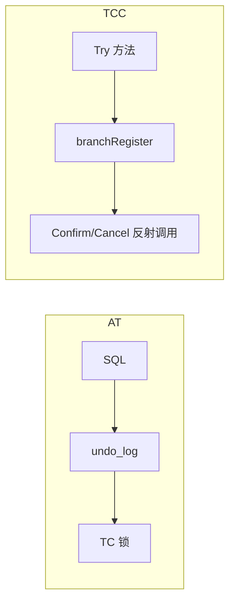

# Seata TCC 模式底层实现原理

> **TCC**（Try-Confirm-Cancel）：业务实现 **Try（预留）**、**Confirm（确认）**、**Cancel（取消）** 三阶段；Seata 负责全局事务边界、分支注册与二阶段 RPC 调度。  
> 配套：[架构总览](./SEATA_ARCHITECTURE_ANALYSIS.md) | [RPC 通信](./SEATA_RPC_COMMUNICATION.md)

---

## 目录

1. [模式定位](#1-模式定位)
2. [与 AT 的本质区别](#2-与-at-的本质区别)
3. [核心注解与资源模型](#3-核心注解与资源模型)
4. [一阶段：Try 与分支注册](#4-一阶段try-与分支注册)
5. [二阶段：Confirm / Cancel](#5-二阶段confirm--cancel)
6. [TC 侧 TccCore](#6-tc-侧-tcccore)
7. [TCC Fence 防悬挂与幂等](#7-tcc-fence-防悬挂与幂等)
8. [BusinessActionContext 与 applicationData](#8-businessactioncontext-与-applicationdata)
9. [异常、空回滚与悬挂](#9-异常空回滚与悬挂)
10. [关键配置与表结构](#10-关键配置与表结构)
11. [源码索引](#11-源码索引)

---

## 1. 模式定位

TCC 将分布式事务拆成业务可控制的三个阶段：

| 阶段 | 名称 | 典型职责 |
|------|------|----------|
| Try | 一阶段 | 冻结库存、预扣余额、占坑 |
| Confirm | 二阶段提交 | 真正扣款、确认订单 |
| Cancel | 二阶段回滚 | 释放冻结、退款 |

Seata **不解析 SQL**，不生成 undo_log；只保证：**全局事务开始时** 各参与者 Try 成功注册到 TC，**全局提交/回滚时** 调用对应 Confirm/Cancel 方法。

---

## 2. 与 AT 的本质区别

| 维度 | AT | TCC |
|------|----|-----|
| 侵入性 | 低（代理数据源） | 高（三接口/三方法） |
| 一阶段落库 | 业务 SQL 已 commit | Try 内由业务决定（可 commit 预留记录） |
| 二阶段提交 | 删 undo_log | 调 Confirm 方法 |
| 二阶段回滚 | 执行 undo SQL | 调 Cancel 方法 |
| TC 锁 | 全局行锁 | 无 AT 锁，靠业务预留 |
| 分支 resourceId | JDBC URL | `@TwoPhaseBusinessAction.name()` |



---

## 3. 核心注解与资源模型

### 3.1 @LocalTCC

标注在 **接口或实现类** 上，声明该 Bean 为 TCC 资源，供 `GlobalTransactionScanner` / `TccActionInterceptorParser` 扫描。

### 3.2 @TwoPhaseBusinessAction

标注在 **Try 方法** 上（`tcc/.../api/TwoPhaseBusinessAction.java`）：

| 属性 | 默认 | 说明 |
|------|------|------|
| `name()` | 必填 | TCC 资源唯一 ID，= `resourceId` |
| `commitMethod()` | `"commit"` | Confirm 方法名 |
| `rollbackMethod()` | `"rollback"` | Cancel 方法名 |
| `commitArgsClasses` | `{BusinessActionContext.class}` | Confirm 参数类型 |
| `rollbackArgsClasses` | 同上 | Cancel 参数类型 |
| `isDelayReport` | false | 延迟上报 context 到 TC |
| `useTCCFence` | false | 启用防悬挂 Fence 表 |

### 3.3 TCCResource

`TccActionInterceptorParser` 解析后构建：

- `actionName`（resourceId）
- `targetBean`、`prepareMethod`（Try）
- `commitMethod`、`rollbackMethod`
- `phaseTwoCommitKeys` / `phaseTwoRollbackKeys`（从 `@BusinessActionContextParameter` 提取）

注册：`DefaultResourceManager.registerResource(TCCResource)` → `TCCResourceManager`。

---

## 4. 一阶段：Try 与分支注册

### 4.1 拦截链

```text
@GlobalTransactional 业务方法
  → 其他服务调用带 xid 的 TCC Bean
  → TccActionInterceptorHandler.invoke()
       - 条件：RootContext.inGlobalTransaction() && !inSagaBranch()
       - RootContext.setBranchType(TCC)
  → ActionInterceptorHandler.proceed()
```

**模块分工**：

- `tcc/.../TccActionInterceptorHandler`：TCC 专用入口。
- `integration-tx-api/.../ActionInterceptorHandler`：通用 Try 逻辑（TCC 与 Saga 注解共用）。

### 4.2 分支注册时机（Try 之前）

`ActionInterceptorHandler.doTxActionLogStore()`：

1. 构造 `applicationData` JSON，根键 **`TX_ACTION_CONTEXT`**，内含：
   - `PREPARE_METHOD`、`COMMIT_METHOD`、`ROLLBACK_METHOD`、`ACTION_NAME`
   - `USE_COMMON_FENCE`（若启用 Fence）
   - `@BusinessActionContextParameter` 映射的业务参数
   - `HOST_NAME`、`ACTION_START_TIME` 等
2. **`branchRegister(BranchType.TCC, actionName, null, xid, applicationData, null)`**  
   - **无 lockKeys**（TCC 不用 AT 全局锁）
3. TC 返回 `branchId` → 写入 `BusinessActionContext`
4. 可选：`prepareFence()`（`useTCCFence=true`）
5. **反射调用 Try 方法**
6. Try 成功后：`BusinessActionContextUtil.reportContext()` 更新 applicationData（除非 `isDelayReport`）

### 4.3 Try 方法职责（业务）

框架不规定 Try 必须只写中间状态；常见模式：

- 插入 **冻结记录**（status=TRYING）
- 调用外部 API 预留资源
- 要求 **幂等**（重复 Try 相同业务键结果一致）

---

## 5. 二阶段：Confirm / Cancel

### 5.1 TC 调度

全局提交/回滚与 AT 相同：`DefaultCore.doGlobalCommit/Rollback` → 每分支 RPC：

- `BranchCommitRequest` → RM
- `BranchRollbackRequest` → RM

`TccCore` **不重写** commit/rollback 主流程，仅特殊处理 `branchDelete`（见 §6）。

### 5.2 TCCResourceManager

`TCCResourceManager.branchCommit()`：

```text
1. 从 applicationData 还原 BusinessActionContext
2. 若 USE_COMMON_FENCE → DefaultCommonFenceHandler.commitFence()
3. 否则 getResource(resourceId).getTargetBean()
4. 反射调用 commitMethod(context)  // 参数按 phaseTwoCommitKeys 组装
5. 返回 PhaseTwo_Committed 或 PhaseTwo_CommitFailed_Retryable
```

`branchRollback()`：对称调用 `rollbackMethod` + `rollbackFence()`。

### 5.3 返回值与 TC 重试

| 返回 | 含义 |
|------|------|
| `PhaseTwo_Committed` | Confirm 成功 |
| `PhaseTwo_CommitFailed_Retryable` | 可重试（网络、临时失败） |
| `PhaseTwo_CommitFailed_Unretryable` | 不可重试 |
| Rollback 侧类似 | `PhaseTwo_Rollbacked` / `*Retryable` |

TC `DefaultCoordinator` 定时任务对 `CommitRetrying` / `RollbackRetrying` 重发 RPC。

### 5.4 TccHook

SPI `TccHook`：在 prepare / commit / rollback 前后扩展（监控、日志）。

---

## 6. TC 侧 TccCore

路径：`server/transaction/tcc/TccCore.java`

| 方法 | 行为 |
|------|------|
| `getHandleBranchType()` | `BranchType.TCC` |
| `branchSessionLock` | **不实现 AT 锁**（继承默认空或跳过） |
| `branchDelete` | **委托 `branchRollback`**（删除分支 = 执行 Cancel） |

TCC 分支在 TC 仍占 `BranchSession`，但 **无 lockKeys**；二阶段按 `resourceId` + `clientId` 找 RM Channel。

---

## 7. TCC Fence 防悬挂与幂等

### 7.1 问题背景

| 问题 | 说明 |
|------|------|
| **空回滚** | Cancel 先到，Try 未执行 |
| **悬挂** | Try 未执行，Confirm 先到 |
| **幂等** | 重复 Confirm/Cancel |

### 7.2 机制

`@TwoPhaseBusinessAction(useTCCFence = true)` 时：

- 表 **`tcc_fence_log`**（`CommonFenceStore` / `SpringFenceHandler`）
- **Prepare**：本地事务插入 `STATUS_TRIED`；唯一键冲突 → 视为已 Cancel 路径，跳过 Try
- **Commit**：无记录或 `ROLLBACKED`/`SUSPENDED` → 拒绝；已 `COMMITTED` → 幂等成功
- **Rollback**：无记录 → `non_rollback`；处理悬挂

状态常量（`CommonFenceConstant`）：`TRIED(1)`、`COMMITTED(2)`、`ROLLBACKED(3)`、`SUSPENDED(4)`。

自动配置：`SeataSpringFenceAutoConfiguration`。

---

## 8. BusinessActionContext 与 applicationData

`BusinessActionContext` 携带：

- `xid`、`branchId`、`actionName`
- `actionContext`（Map）：业务在 Try 中写入、Confirm/Cancel 读取

**applicationData** 在 `BranchRegisterRequest` 中传给 TC，持久化在 `BranchSession`；二阶段原样下发给 RM，用于反射调用。

**isDelayReport**：Try 结束后再 `reportContext`，减少注册后立刻更新 RPC 次数。

---

## 9. 异常、空回滚与悬挂

### 9.1 Try 失败

Try 抛异常 → 全局事务回滚 → TC 发 Cancel；若 Try 未注册分支则无需 Cancel。

### 9.2 Confirm 失败

返回 Retryable → TC 重试；Unretryable → `CommitFailed`，需人工或补偿。

### 9.3 业务设计要点

- Try / Confirm / Cancel **必须幂等**
- Cancel 要能处理「Try 未执行」「Try 已执行」两种情况
- 预留资源与 Confirm 消耗之间的一致性由 **业务状态机** 保证

---

## 10. 关键配置与表结构

| 项 | 说明 |
|----|------|
| `tcc_fence_log` | Fence 开启时业务库建表（见 seata 脚本） |
| `client.rm.applicationDataSizeLimit` | applicationData 大小限制 |
| TM 全局事务 | 与 AT 相同 `@GlobalTransactional` |

---

## 11. 源码索引

| 组件 | 路径 |
|------|------|
| 注解 | `tcc/.../api/TwoPhaseBusinessAction.java`, `LocalTCC.java` |
| 解析 | `tcc/.../interceptor/parser/TccActionInterceptorParser.java` |
| 拦截 | `tcc/.../interceptor/TccActionInterceptorHandler.java` |
| Try 通用 | `integration-tx-api/.../ActionInterceptorHandler.java` |
| RM | `tcc/.../TCCResourceManager.java`, `TCCResource.java` |
| Fence | `spring/.../rm/fence/SpringFenceHandler.java` |
| TC | `server/transaction/tcc/TccCore.java` |
| Handler | `tcc/.../RMHandlerTCC.java` |

---

## 12. 附录：源码级实现补充

> 见 [SEATA_MODE_SOURCE_DEEP_DIVE.md](./SEATA_MODE_SOURCE_DEEP_DIVE.md) 第 4 节。

### 12.1 Try 阶段完整调用栈

```text
TccActionInterceptorHandler.invoke()
  → RootContext.bindBranchType(TCC)
  → ActionInterceptorHandler.proceed()
       → doTxActionLogStore()                    // Try 之前
            → branchRegister(TCC, actionName, applicationData, lockKeys=null)
       → [useCommonFence ? prepareFence : targetCallback.execute()]
       → finally: BusinessActionContextUtil.reportContext()
```

### 12.2 applicationData JSON 结构（源码构造）

`doTxActionLogStore()` 将下列内容放入 `Constants.TX_ACTION_CONTEXT`：

- `PREPARE_METHOD` / `COMMIT_METHOD` / `ROLLBACK_METHOD` / `ACTION_NAME`
- `@BusinessActionContextParameter` 解析出的业务参数
- `HOST_NAME`、`ACTION_START_TIME`
- `USE_COMMON_FENCE`（若启用）

整包 `JsonUtil.toJSONString` 后作为 `BranchRegisterRequest.applicationData` 发往 TC。

### 12.3 Confirm 反射（TCCResourceManager）

```java
BusinessActionContext ctx = BusinessActionContextUtil.getBusinessActionContext(
    xid, branchId, resourceId, applicationData);
Object[] args = getTwoPhaseMethodParams(tccResource.getPhaseTwoCommitKeys(), ctx, commitMethod);
Object ret = commitMethod.invoke(tccResource.getTargetBean(), args);
// ret 为 Boolean 或 TwoPhaseResult → 映射 BranchStatus
```

### 12.4 与 AT 在 TC 上的差异

同一 `AbstractCore.branchRegister()`，但 `TccCore` **不重写** `branchSessionLock`，TC **不解析 lockKeys**，无 `LockKeyConflict` 路径。

---

*基于 Apache Seata 源码整理。*
