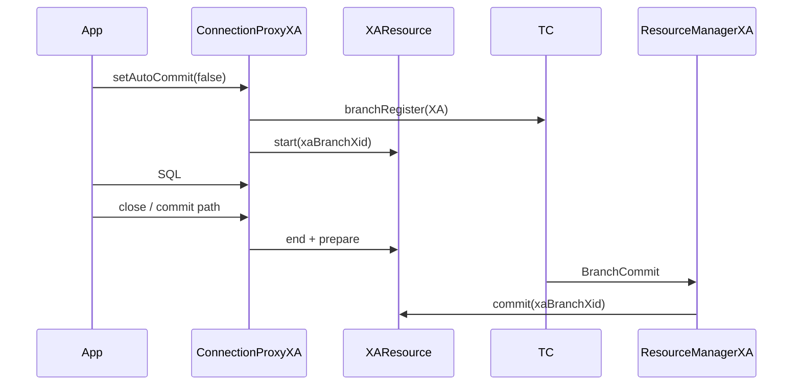

# Seata XA 模式底层实现原理

> **XA 模式**：基于数据库原生 **XA 协议**（`XAResource`），由 Seata 作为 **Transaction Manager** 协调各资源管理器的 **prepare / commit / rollback**，属于标准 **2PC**。  
> 配套：[架构总览](./SEATA_ARCHITECTURE_ANALYSIS.md) | [AT 模式对比](./SEATA_MODE_AT.md)

---

## 目录

1. [模式定位](#1-模式定位)
2. [XA 协议与 Seata 角色](#2-xa-协议与-seata-角色)
3. [与 AT 模式对比](#3-与-at-模式对比)
4. [客户端架构](#4-客户端架构)
5. [一阶段：分支注册与 XA Start](#5-一阶段分支注册与-xa-start)
6. [一阶段结束：XA End 与 Prepare](#6-一阶段结束xa-end-与-prepare)
7. [二阶段：XA Commit / Rollback](#7-二阶段xa-commit--rollback)
8. [连接持有与超时](#8-连接持有与超时)
9. [TC 侧 XACore](#9-tc-侧-xacore)
10. [XAER_NOTA 与重试策略](#10-xaer_nota-与重试策略)
11. [适用场景与限制](#11-适用场景与限制)
12. [关键配置](#12-关键配置)
13. [源码索引](#13-源码索引)

---

## 1. 模式定位

XA 是 X/Open DTP 模型中的**两阶段提交**标准接口：

- **RM**：数据库的 `XAResource`（MySQL、PostgreSQL、Oracle 等支持 XA 的驱动）。
- **TM**：Seata TC + 客户端 RM 协同，在全局事务内对多个 `XAResource` 执行 2PC。

Seata XA 模式 **不生成 undo_log**，**不使用 AT 全局行锁**；一致性依赖数据库 XA 实现。

---

## 2. XA 协议与 Seata 角色



| XA 接口 | Seata 调用时机 |
|---------|----------------|
| `start(xid, TMNOFLAGS)` | 进入本地事务（`setAutoCommit(false)`） |
| `end(xid, TMSUCCESS/TMFAIL)` | 业务结束、准备 prepare |
| `prepare(xid)` | 一阶段结束（连接 close 路径） |
| `commit(xid, onePhase)` | 二阶段全局提交 |
| `rollback(xid)` | 二阶段全局回滚 |

**xaBranchXid**：`XAXidBuilder.build(globalXid, branchId)`，全局 xid 与分支 ID 组合为 XA 事务名。

---

## 3. 与 AT 模式对比

| 维度 | AT | XA |
|------|----|----|
| 集成点 | `DataSourceProxy` + undo | `DataSourceProxyXA` + `XAResource` |
| 分支注册 | 本地 `commit` 前，需 undo+lockKey | `setAutoCommit(false)` 时立即注册 |
| 一阶段结束 | JDBC commit + undo 落库 | `xa prepare`（数据仍在未决态） |
| 二阶段 | 删 undo / 执行 undo SQL | `xa commit` / `xa rollback` |
| TC 锁 | 有 | 无 |
| 性能 | 一阶段即提交，锁到全局结束 | prepare 后持有资源，直到 2PC |
| 隔离 | 全局锁 + 本地事务 | 数据库 XA 隔离 |

---

## 4. 客户端架构

```text
DataSourceProxyXA (branchType=XA)
  └── getConnection()
        └── ConnectionProxyXA
              ├── targetConnection (JDBC)
              └── xaResource / xaConnection
ResourceManagerXA (BranchType.XA)
  └── branchCommit / branchRollback → ConnectionProxyXA.xaCommit/xaRollback
```

| 类 | 路径 | 职责 |
|----|------|------|
| `DataSourceProxyXA` | `rm-datasource/xa/DataSourceProxyXA.java` | 包装数据源，注册 XA 资源 |
| `ConnectionProxyXA` | `rm-datasource/xa/ConnectionProxyXA.java` | XA 生命周期 |
| `AbstractDataSourceProxyXA` | `rm-datasource/xa/` | 连接池、keeper 持有 |
| `ResourceManagerXA` | `rm-datasource/xa/ResourceManagerXA.java` | 二阶段 RPC 处理 |
| `XAXidBuilder` | `rm-datasource/xa/` | 构造 xa xid |

启动时 `RootContext.setDefaultBranchType(XA)`（与 AT 二选一默认）。

---

## 5. 一阶段：分支注册与 XA Start

### 5.1 触发条件

全局事务内（`RootContext.inGlobalTransaction()`），当应用调用：

```java
connection.setAutoCommit(false);
```

`ConnectionProxyXA.setAutoCommit(false)` 触发 **`begin()`** 逻辑（首次进入本地事务）。

### 5.2 begin() 步骤

```text
1. branchRegister(BranchType.XA, resourceId, xid, null, null)
   - lockKeys = null
   - TC 创建 BranchSession（无 AT 锁）

2. xaBranchXid = XAXidBuilder.build(xid, branchId)

3. keepIfNecessary()
   - MySQL < 8.0.29、MariaDB、Oscar 等需 shouldBeHeld=true
   - 将物理连接放入 keeper，供二阶段使用

4. xaResource.start(xaBranchXid, TMNOFLAGS)
   - Oracle 可能使用 ORATRANSLOOSE 等标志
```

### 5.3 业务 SQL

在 **XA 分支已 start** 后，普通 JDBC 语句在同一连接上执行，数据库将变更纳入该 XA 分支。

---

## 6. 一阶段结束：XA End 与 Prepare

### 6.1 触发路径

通常在 **`ConnectionProxyXA.close()`** 或 commit 相关路径（业务方法结束、连接归还池前）：

```text
1. xaResource.end(xaBranchXid, TMSUCCESS)  // 或 TMFAIL 若失败

2. xaResource.prepare(xaBranchXid)
   - 失败 → branchReport(PhaseOne_Failed)

3. 只读优化：若判定为只读 → branchReport(PhaseOne_RDONLY)

4. cleanXABranchContext()
   - 若 shouldBeHeld：连接保留在 keeper，不归还池
   - 否则归还
```

### 6.2 与 AT 一阶段 commit 的差异

| AT | XA |
|----|-----|
| 业务数据 **已提交** 到库 | prepare 后事务 **未最终提交** |
| undo_log 已写入 | 无 undo |
| 依赖补偿回滚 | 依赖 `xa rollback` |

### 6.3 失败与 rollback

业务失败路径：`xa end(TMFAIL)` + `xa rollback` + `PhaseOne_Failed` 上报。

---

## 7. 二阶段：XA Commit / Rollback

### 7.1 TC 发起

与 AT/TCC 相同：`AbstractCore.branchCommitSend` → `BranchCommitRequest` → `ResourceManagerXA`。

### 7.2 ResourceManagerXA.finishBranch()

```text
1. connectionProxyXA = getConnectionForXAFinish(xaBranchXid)
   - 从 keeper 或缓存按 xid+branchId 取连接

2. committed ? connectionProxyXA.xaCommit() : xaRollback()

3. 内部调用 XAResource.commit(xaBranchXid, false) / rollback(xaBranchXid)

4. 返回 BranchStatus
```

### 7.3 连接找不到

若 RM 重启、连接已释放 → 可能 `XAER_NOTA`（见 §10）。

---

## 8. 连接持有与超时

### 8.1 shouldBeHeld

部分数据库驱动在 `prepare` 后若连接归还池，二阶段 `commit` 会失败。Seata 对 MySQL 老版本等 **`shouldBeHeld=true`**，将 `ConnectionProxyXA` 放入 **`BaseDataSourceProxyXA.keeper`**。

### 8.2 xaTwoPhaseTimeoutChecker

`ResourceManagerXA` 后台线程：超过 `xaConnectionTwoPhaseHoldTimeout` 的 held 连接强制关闭，避免泄漏。

### 8.3 Combine Transaction

`RootContext.KEY_COMBINE_TRANSACTION_FLAG`：同一数据源多操作复用单一 `ConnectionProxyXA`。

---

## 9. TC 侧 XACore

路径：`server/transaction/xa/XACore.java`

| 方法 | 行为 |
|------|------|
| `getHandleBranchType()` | `BranchType.XA` |
| `branchReport` | 处理 `PhaseOne_Failed` 等上报 |
| `branchDelete` | → **`branchRollback`**（释放 XA） |
| 全局锁 | **不使用** AT 锁逻辑 |

---

## 10. XAER_NOTA 与重试策略

### 10.1 含义

`XAException.XAER_NOTA`：二阶段时 XA 分支在数据库侧 **已不存在**（可能已被提交/回滚或连接断开）。

### 10.2 RM 映射

`ResourceManagerXA` 捕获后返回：

- `PhaseTwo_CommitFailed_XAER_NOTA_Retryable`
- `PhaseTwo_RollbackFailed_XAER_NOTA_Retryable`

### 10.3 TC 策略

`DefaultCore.isXaerNotaTimeout()`：

- 超过 `globalTimeout + xaerNotaRetryTimeout`（`ConfigurationKeys.XAER_NOTA_RETRY_TIMEOUT`，默认 60000ms）后，可将分支视为**已结束**，避免无限重试。

运维控制台会标注此类分支状态。

---

## 11. 适用场景与限制

| 适合 | 限制 |
|------|------|
| 数据库原生支持 XA、强一致 | 性能低于 AT（prepare 阻塞资源） |
| 不愿维护 undo 表 | 部分云数据库 XA 受限 |
| 与遗留 XA 应用集成 | 连接池 + XA 兼容性需验证 |

---

## 12. 关键配置

| 配置 | 说明 |
|------|------|
| `client.rm.branchType` / 默认分支类型 | 设为 XA |
| `XAER_NOTA_RETRY_TIMEOUT` | TC 对 NOTA 的容忍时间 |
| `xaConnectionTwoPhaseHoldTimeout` | 持有连接超时 |
| 数据源 | 使用 `DataSourceProxyXA` 而非 `DataSourceProxy` |

---

## 13. 源码索引

| 步骤 | Class.Method |
|------|----------------|
| XA start | `ConnectionProxyXA.setAutoCommit(false)` → begin |
| prepare | `ConnectionProxyXA.close()` / commit 路径 |
| 二阶段 | `ResourceManagerXA.branchCommit/branchRollback` |
| TC | `XACore` |
| Handler | `rm-datasource/.../RMHandlerXA.java` |

---

## 14. 附录：源码级实现补充

> 见 [SEATA_MODE_SOURCE_DEEP_DIVE.md](./SEATA_MODE_SOURCE_DEEP_DIVE.md) 第 5 节。

### 14.1 一阶段源码锚点（ConnectionProxyXA.setAutoCommit）

```java
// autoCommit: true → false 且非只读
branchId = DefaultResourceManager.get().branchRegister(BranchType.XA, resourceId, xid, null, null);
xaBranchXid = XAXidBuilder.build(xid, branchId);
keepIfNecessary();   // MySQL 老版本等：连接进 keeper
xaResource.start(xaBranchXid, TMNOFLAGS);
xaActive = true;
```

**注意**：XA 在 **开启本地事务** 时注册；AT 在 **commit 前** 注册。

### 14.2 prepare 触发点

`close()` / 提交路径 → `end(TMSUCCESS)` → `xaResource.prepare(xaBranchXid)` → `reportStatusToTC(PhaseOne_Done)`。

失败：`end(TMFAIL)` + `xaRollback` + `PhaseOne_Failed`。

### 14.3 二阶段与 XAER_NOTA

`ResourceManagerXA.finishBranch()` 从 `keeper` 取 `ConnectionProxyXA`，调用 `xaCommit`/`xaRollback`。  
捕获 `XAER_NOTA` 返回 `PhaseTwo_CommitFailed_XAER_NOTA_Retryable`，TC `DefaultCore.isXaerNotaTimeout()` 超时后视为已提交并 `removeBranch`。

### 14.4 DefaultCore 只读优化

```java
if (currentStatus == BranchStatus.PhaseOne_RDONLY && branchSession.getBranchType() == BranchType.XA) {
    SessionHelper.removeBranch(globalSession, branchSession, !retrying);
    return CONTINUE;  // 不再发 branchCommit RPC
}
```

---

*基于 Apache Seata 源码整理。*
