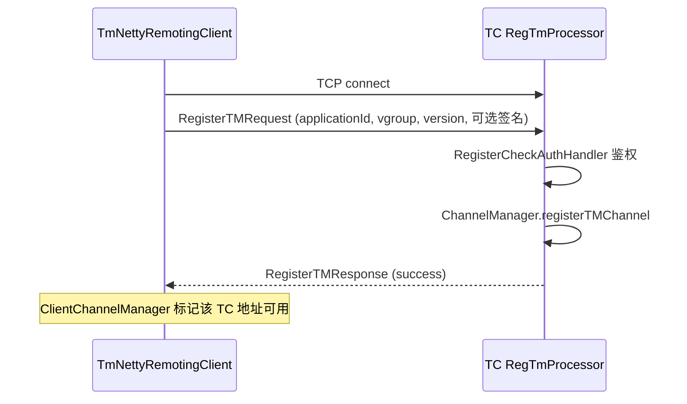
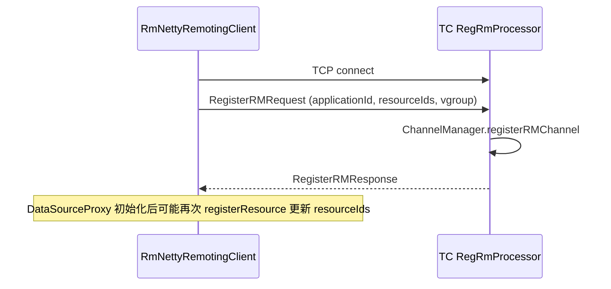
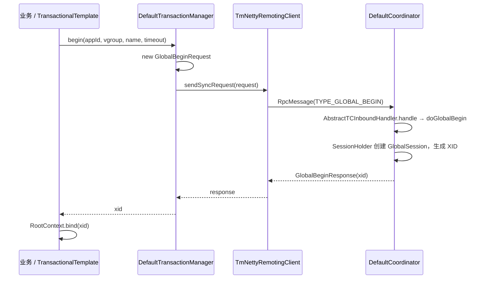
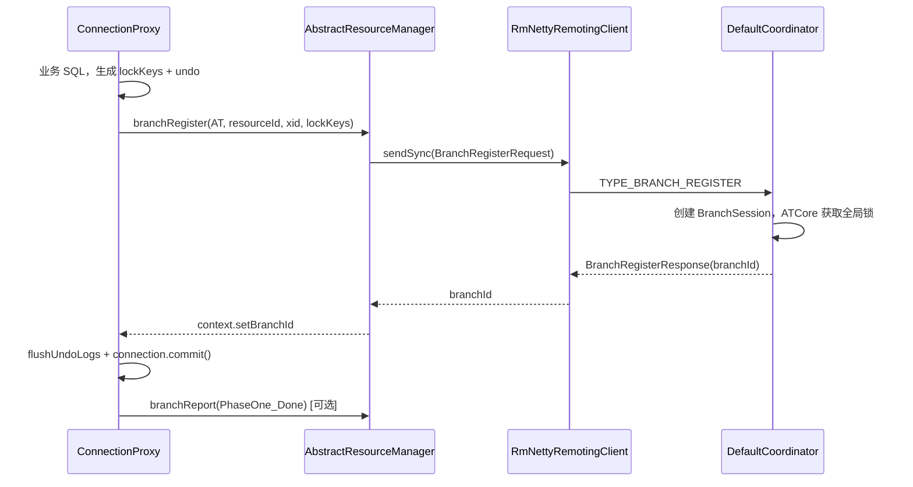
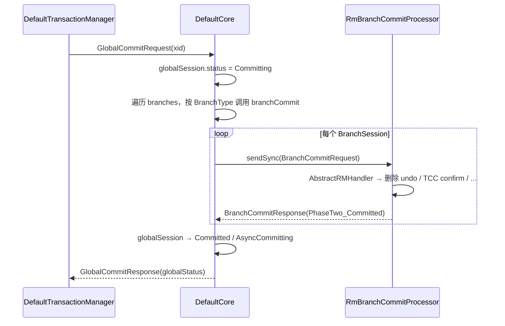

# Apache Seata RPC 通信机制与各角色交互详解

> 本文聚焦 Seata **TC / TM / RM** 之间的 **Netty TCP RPC**，说明协议格式、消息类型、处理器模型、同步/异步语义，以及完整通信时序。  
> 配套阅读：[SEATA_ARCHITECTURE_ANALYSIS.md](./SEATA_ARCHITECTURE_ANALYSIS.md)

---

## 目录

1. [通信总览](#1-通信总览)
2. [传输层与 Netty 管道](#2-传输层与-netty-管道)
3. [二进制协议（V0 / V1 / V2）](#3-二进制协议v0--v1--v2)
4. [RpcMessage 与消息分类](#4-rpcmessage-与消息分类)
5. [RPC 调用语义](#5-rpc-调用语义)
6. [处理器（Processor）模型](#6-处理器processor模型)
7. [通道管理与路由](#7-通道管理与路由)
8. [连接建立与注册](#8-连接建立与注册)
9. [合并消息（Merge）与批量响应](#9-合并消息merge与批量响应)
10. [心跳与连接保活](#10-心跳与连接保活)
11. [各角色通信过程（完整时序）](#11-各角色通信过程完整时序)
12. [关键配置项](#12-关键配置项)
13. [类与源码索引](#13-类与源码索引)
14. [消息请求/响应字段详解](#14-消息请求响应字段详解)
14. [消息请求/响应字段详解](#14-消息请求响应字段详解)

---

## 1. 通信总览

### 1.1 拓扑关系

Seata 的 TC（Server）作为 **中心节点**，TM 与 RM 均以 **客户端** 身份主动连接 TC，维持长连接：

```text
                    ┌─────────────────────────┐
                    │   TC (Netty Server)      │
                    │   NettyRemotingServer    │
                    │   DefaultCoordinator     │
                    └───────────┬─────────────┘
                                │ TCP (默认 8091)
              ┌─────────────────┼─────────────────┐
              │                 │                 │
    ┌─────────▼────────┐ ┌──────▼──────┐ ┌───────▼────────┐
    │ TmNettyRemoting   │ │ RmNetty     │ │ RmNetty        │
    │ Client (每应用)    │ │ Remoting    │ │ Remoting       │
    │                   │ │ Client      │ │ Client         │
    └─────────┬─────────┘ └──────┬──────┘ └───────┬────────┘
              │                  │                 │
         TM 角色            RM 角色 A          RM 角色 B
    (全局事务边界)         (DataSourceProxy)   (其它资源)
```

**重要结论**：

- **TM ↔ TC**：TM 发起全局事务相关请求；TC **不主动**向 TM 推送二阶段指令（TM 侧无 `BranchCommit` 处理器）。
- **RM ↔ TC**：RM 注册分支、上报状态；TC 在二阶段 **主动** 向 RM 发送 `BranchCommit` / `BranchRollback` / `UndoLogDelete`。
- **TM 与 RM 之间**：**没有** Seata 专用 RPC；二者通过业务 RPC（Dubbo/HTTP 等）传递 **XID**（`RootContext`），不经过 TC 转发业务调用。

### 1.2 核心模块

| 模块 | 职责 |
|------|------|
| `core` | 协议、`RpcMessage`、Netty 客户端/服务端、Processor |
| `serializer` | body 序列化（Seata/Kryo/Protobuf…） |
| `compressor` | body 压缩 |
| `tm` | `DefaultTransactionManager` → `TmNettyRemotingClient` |
| `rm` | `AbstractResourceManager` → `RmNettyRemotingClient` |
| `server` | `DefaultCoordinator` 作为 TC 的 `TransactionMessageHandler` |

---

## 2. 传输层与 Netty 管道

### 2.1 服务端（TC）

- 入口类：`NettyRemotingServer`（`AbstractNettyRemotingServer`）
- 启动：`Server.start()` 中创建线程池 `ServerHandlerThread`，绑定端口（默认 **8091**）
- 入站：`ServerHandler` 收到解码后的 `RpcMessage`，按 **body 的业务类型码**（`AbstractMessage.getTypeCode()`）分发到 `processorTable`

### 2.2 客户端（TM / RM）

- TM：`TmNettyRemotingClient`（单例，`TransactionRole.TMROLE`）
- RM：`RmNettyRemotingClient`（单例，`TransactionRole.RMROLE`）
- 入站：`ClientHandler` 处理 TC 下发的请求与响应
- 连接池：`ClientChannelManager` 按 **事务分组（transactionServiceGroup）** 从注册中心拿到 TC 地址列表，支持重连、多 TC 实例

### 2.3 协议版本探测

`MultiProtocolDecoder` 根据帧头 **magic + version** 选择解码器：

| 版本常量 | 解码器 |
|----------|--------|
| `ProtocolConstants.VERSION_0` | `ProtocolDecoderV0` |
| `VERSION_1` | `ProtocolDecoderV1` |
| `VERSION_2` | `ProtocolDecoderV2`（继承 V1） |

当前默认发送版本：`ProtocolConstants.VERSION = VERSION_2`。  
客户端首次建连使用 `MultiProtocolDecoder`，兼容老版本 TC。

### 2.4 Pipeline 示意

```text
[Socket]
  → ProtocolDetectHandler / MultiProtocolDecoder  (拆帧 + 解码为 RpcMessage)
  → ServerHandler / ClientHandler                 (按 messageType 分发 Processor)
  → (出站) ProtocolEncoderVx                       (编码 RpcMessage)
```

---

## 3. 二进制协议（V0 / V1 / V2）

### 3.1 V1 帧结构（最常用，源码注释）

`ProtocolDecoderV1` 定义的 V1 头部布局（单位：字节）：

```text
 0     1     2     3     4     5     6     7     8     9    10    11    12    13    14    15    16
+-----+-----+-----+-----+-----+-----+-----+-----+-----+-----+-----+-----+-----+-----+-----+-----+
| magic(2) | ver |     fullLength(4)     | headLen(2)|msgTp|codec|comp |  requestId(4)       |
+-----------+-----------+-----------+-----------+-----------+-----------+-----------+-----------+
|                        Head Map [可选，KV 序列化]                                      |
+---------------------------------------------------------------------------------------+
|                        Body（Serializer 反序列化 + 可选 Compressor）                    |
+---------------------------------------------------------------------------------------+
```

| 字段 | 说明 |
|------|------|
| **magic** | 固定 `0xDA 0xDA`（`MAGIC_CODE_BYTES`） |
| **version** | 协议版本 0/1/2 |
| **fullLength** | 整帧长度（含头+体） |
| **headLength** | 从 magic 到 head map 结束的长度 |
| **msgTp** | 传输层消息类型：同步请求/响应/单向/心跳（见下节） |
| **codec** | 序列化类型（默认 Seata Serializer） |
| **comp** | 压缩类型（默认 NONE，可配置 `compressor_for_rpc`） |
| **requestId** | 与 `RpcMessage.id` 对应，用于 `MessageFuture` 匹配 |
| **body** | 业务消息对象序列化后的字节 |

### 3.2 传输层 messageType（ProtocolConstants）

与业务 `MessageType.TYPE_*` 不同，这是 **RPC 帧级别** 的类型：

| 值 | 常量 | 含义 |
|----|------|------|
| 0 | `MSGTYPE_RESQUEST_SYNC` | 同步请求，需要响应 |
| 1 | `MSGTYPE_RESPONSE` | 响应 |
| 2 | `MSGTYPE_RESQUEST_ONEWAY` | 单向，不等待响应 |
| 3 | `MSGTYPE_HEARTBEAT_REQUEST` | 心跳 PING |
| 4 | `MSGTYPE_HEARTBEAT_RESPONSE` | 心跳 PONG |

构建方式：`AbstractNettyRemoting.buildRequestMessage(msg, messageType)`。

---

## 4. RpcMessage 与消息分类

### 4.1 RpcMessage 信封

```java
// org.apache.seata.core.protocol.RpcMessage
int id;                      // 请求 ID，客户端 sendSync 前分配
byte messageType;            // 传输层：sync / response / oneway / heartbeat
byte codec;                  // 序列化器
byte compressor;             // 压缩器
Map<String, String> headMap; // 扩展头
Object body;                 // AbstractMessage 子类
String otherSideVersion;     // 对端版本协商
```

### 4.2 业务消息类型（MessageType）

业务类型在 **body** 的 `AbstractMessage.getTypeCode()` 中，Processor 按此注册。

#### 4.2.1 全局事务（TM → TC）

| typeCode | 请求 | 响应 | 方向 |
|----------|------|------|------|
| 1 | `GlobalBeginRequest` | `GlobalBeginResponse` | TM → TC |
| 7 | `GlobalCommitRequest` | `GlobalCommitResponse` | TM → TC |
| 9 | `GlobalRollbackRequest` | `GlobalRollbackResponse` | TM → TC |
| 15 | `GlobalStatusRequest` | `GlobalStatusResponse` | TM → TC |
| 17 | `GlobalReportRequest` | `GlobalReportResponse` | TM → TC |

#### 4.2.2 分支事务（RM → TC）

| typeCode | 请求 | 响应 | 方向 |
|----------|------|------|------|
| 11 | `BranchRegisterRequest` | `BranchRegisterResponse` | RM → TC |
| 13 | `BranchReportRequest` | `BranchReportResponse` | RM → TC |
| 21 | `GlobalLockQueryRequest` | `GlobalLockQueryResponse` | RM → TC |

#### 4.2.3 二阶段与维护（TC → RM）

| typeCode | 请求 | 响应 | 方向 |
|----------|------|------|------|
| 3 | `BranchCommitRequest` | `BranchCommitResponse` | TC → RM |
| 5 | `BranchRollbackRequest` | `BranchRollbackResponse` | TC → RM |
| 111 | `UndoLogDeleteRequest` | （单向处理） | TC → RM |

#### 4.2.4 注册与心跳

| typeCode | 请求 | 响应 | 方向 |
|----------|------|------|------|
| 101 | `RegisterTMRequest` | `RegisterTMResponse` | TM → TC |
| 103 | `RegisterRMRequest` | `RegisterRMResponse` | RM → TC |
| 105 | `UnregisterRMRequest` | `UnregisterRMResponse` | RM → TC |
| 120 | `HeartbeatMessage` (PING) | PONG | 双向 |

#### 4.2.5 合并与批量

| typeCode | 说明 |
|----------|------|
| 59 | `MergedWarpMessage`：多条业务请求打包 |
| 60 | `MergeResultMessage`：多条响应打包 |
| 121 | `BatchResultMessage`：TC 批量响应（≥1.5.0） |

### 4.3 消息方向总表（谁主动发）

| 通信对 | 主动方 | 典型消息 |
|--------|--------|----------|
| TM → TC | TM | RegisterTM、GlobalBegin/Commit/Rollback、Merge |
| TC → TM | TC | 仅 **Response**（含 MergeResult） |
| RM → TC | RM | RegisterRM、BranchRegister/Report、Merge |
| TC → RM | TC | BranchCommit/Rollback、UndoLogDelete |
| RM → TC | RM | BranchCommitResponse 等（作为 sync 响应） |

---

## 5. RPC 调用语义

### 5.1 同步调用 sendSync

**客户端（TM/RM）向 TC 发请求**：

```text
1. buildRequestMessage(body, MSGTYPE_RESQUEST_SYNC)
2. id = getNextMessageId()
3. futures.put(id, MessageFuture)
4. channel.writeAndFlush(rpcMessage)
5. messageFuture.get(timeout) 阻塞等待
6. ClientOnResponseProcessor 收到响应后 future.setResultMessage(body)
```

核心代码：`AbstractNettyRemoting.sendSync()`。

**TC 向 RM 发二阶段**：

```text
Channel channel = ChannelManager.getChannel(resourceId, clientId, tryOtherApp)
sendSync(channel, BranchCommitRequest, timeout)
```

核心代码：`AbstractNettyRemotingServer.sendSyncRequest(resourceId, clientId, msg, tryOtherApp)`。

### 5.2 异步响应 sendAsyncResponse

处理方在处理完 **入站 sync 请求** 后，用 **相同 requestId** 回写 `MSGTYPE_RESPONSE`：

```java
// buildResponseMessage: id 与请求一致
rpcMsg.setId(rpcMessage.getId());
```

TC 侧：`ServerOnRequestProcessor` → `remotingServer.sendAsyncResponse()`  
RM 侧：`RmBranchCommitProcessor` → `remotingClient.sendAsyncResponse()`

### 5.3 单向发送 sendAsync（Oneway）

TC 对部分场景使用 `MSGTYPE_RESQUEST_ONEWAY`（不注册 Future），例如部分通知类消息。  
RM 处理完后仍可能通过 **另一条 sync 响应通道** 回传结果——二阶段实际走 **TC 发 sync 请求，RM 回 response**。

### 5.4 超时与可写性

- 定时任务每 **3s** 扫描 `futures`，移除超时 `MessageFuture`（`AbstractNettyRemoting.init()`）
- `channelWritableCheck`：通道不可写时短暂等待，避免 OOM
- TM 默认超时：`NettyClientConfig.getRpcTmRequestTimeout()`
- TC 调用 RM 超时：`NettyServerConfig.getRpcRequestTimeout()`

### 5.5 RpcHook

`AbstractNettyRemoting` 通过 `EnhancedServiceLoader.loadAll(RpcHook.class)` 加载钩子，在 `doBeforeRpcHooks` / `doAfterRpcHooks` 埋点（监控、鉴权扩展等）。

---

## 6. 处理器（Processor）模型

### 6.1 分发机制

```java
// AbstractNettyRemoting
HashMap<Integer, Pair<RemotingProcessor, ExecutorService>> processorTable;
// key = body.getTypeCode() 即 MessageType.TYPE_*
```

收到 `RpcMessage` 后，根据 **body 类型** 查找 Processor，在对应线程池中执行 `process(ctx, rpcMessage)`。

### 6.2 TC 端 Processor 注册（NettyRemotingServer）

| MessageType | Processor | 线程池 |
|-------------|-----------|--------|
| TYPE_GLOBAL_BEGIN / COMMIT / ROLLBACK / STATUS / REPORT | `ServerOnRequestProcessor` | messageExecutor |
| TYPE_BRANCH_REGISTER / BRANCH_STATUS_REPORT | `ServerOnRequestProcessor` | messageExecutor |
| TYPE_GLOBAL_LOCK_QUERY | `ServerOnRequestProcessor` | messageExecutor |
| TYPE_SEATA_MERGE | `ServerOnRequestProcessor` | messageExecutor |
| TYPE_BRANCH_COMMIT_RESULT / BRANCH_ROLLBACK_RESULT | `ServerOnResponseProcessor` | branchResultMessageExecutor |
| TYPE_REG_RM | `RegRmProcessor` | messageExecutor |
| TYPE_UNREG_RM | `UnregRmProcessor` | messageExecutor |
| TYPE_REG_CLT | `RegTmProcessor` | null（同步处理） |
| TYPE_HEARTBEAT_MSG | `ServerHeartbeatProcessor` | null |

`ServerOnRequestProcessor` 将 body 交给 `TransactionMessageHandler`（实现类 **`DefaultCoordinator`** → `AbstractTCInboundHandler`）。

**安全策略**：未注册 Channel 的请求会被直接断开（`ChannelManager.isRegistered`）。

### 6.3 RM 端 Processor 注册

| MessageType | Processor |
|-------------|-----------|
| TYPE_BRANCH_COMMIT | `RmBranchCommitProcessor` |
| TYPE_BRANCH_ROLLBACK | `RmBranchRollbackProcessor` |
| TYPE_RM_DELETE_UNDOLOG | `RmUndoLogProcessor` |
| TYPE_*_RESULT / MERGE_RESULT / BATCH | `ClientOnResponseProcessor` |
| TYPE_HEARTBEAT_MSG | `ClientHeartbeatProcessor` |

`RmBranchCommitProcessor` 调用 `TransactionMessageHandler.onRequest()` → `AbstractRMHandler` → 具体 `ResourceManager`。

### 6.4 TM 端 Processor 注册

TM 仅处理 **来自 TC 的响应**（无 BranchCommit 入站）：

- `ClientOnResponseProcessor`：GlobalBeginResponse、MergeResultMessage 等
- `ClientHeartbeatProcessor`

---

## 7. 通道管理与路由

### 7.1 ChannelManager 数据结构

```text
IDENTIFIED_CHANNELS: Channel → RpcContext

TM_CHANNELS:  applicationId+ip → port → RpcContext

RM_CHANNELS:  resourceId → applicationId → ip → port → RpcContext
```

`RpcContext` 保存：clientRole、version、applicationId、transactionServiceGroup、resourceIds、Netty Channel。

### 7.2 TC 查找 RM 通道

二阶段提交时：

```java
ChannelManager.getChannel(resourceId, clientId, tryOtherApp)
```

- `resourceId`：如 `jdbc:mysql://host:3306/db`
- `clientId`：分支注册时记录的 RM 实例标识（`applicationId@ip:port`）
- `tryOtherApp`：AT 模式下若指定 client 不在线，可尝试同 resource 的其它 RM 实例

找不到 Channel 时抛出 `IOException: rm client is not connected`。

### 7.3 版本协商

- 注册时：`RegisterTMRequest/RegisterRMRequest` 携带客户端 `Version`
- `Version.putChannelVersion(channel, version)` 写入 Channel 属性
- `MsgVersionHelper.versionNotSupport` 可跳过不兼容消息
- Merge 批量响应需 **服务端版本 ≥ 1.5.0**（`Version.isAboveOrEqualVersion150`）

---

## 8. 连接建立与注册

### 8.1 启动顺序（Spring 场景）

```text
GlobalTransactionScanner 初始化
  → TMClient.init()  → TmNettyRemotingClient.init()
  → RMClient.init()  → RmNettyRemotingClient.init()
  → 从 Registry 拉取 TC 地址
  → 建立 TCP 连接
  → 发送 RegisterTM / RegisterRM
```

### 8.2 TM 注册时序



- 处理器：`RegTmProcessor`
- 鉴权 SPI：`RegisterCheckAuthHandler`（可插拔）
- 注册成功前：**事务类请求会被 ServerOnRequestProcessor 拒绝**（关闭未识别连接）

### 8.3 RM 注册时序



RM 在 `DataSourceProxy.init()` 后向 `DefaultResourceManager` 注册资源，触发向 TC 声明 **resourceId 列表**，以便 TC 二阶段能路由到正确实例。

---

## 9. 合并消息（Merge）与批量响应

### 9.1 为什么需要 Merge

高并发下，TM/RM 会频繁发送 `BranchRegister`、`BranchReport` 等短请求。  
**合并发送**可减少 TCP 包数量与系统调用，降低 RTT。

### 9.2 客户端合并发送流程

配置项（独立开关）：

- `enableTmClientBatchSendRequest`
- `enableRmClientBatchSendRequest` / `enableClientBatchSendRequest`

流程（`AbstractNettyRemotingClient.MergedSendRunnable`）：

```text
1. sendSyncRequest 时若开启 batch：
   - 为每个子消息分配 msgId，放入 futures
   - 子消息进入 basketMap（按 TC 地址分桶）
   - 唤醒 MergedSendRunnable（最多等待 MAX_MERGE_SEND_MILLS）
2. 后台线程聚合为 MergedWarpMessage { msgs[], msgIds[] }
3. sendAsyncRequest(mergeMessage)  // 合并包本身一个 parentId
4. mergeMsgMap 记录 parentId → MergedWarpMessage
```

### 9.3 TC 处理 Merge 请求

`ServerOnRequestProcessor`：

- **版本 < 1.5.0**：拆包后顺序/并行执行，组装 `MergeResultMessage` 一次返回
- **版本 ≥ 1.5.0 且开启 batchResponse**：每条子消息独立响应，由 `BatchResponseRunnable` 在 1ms 窗口内聚合为 `BatchResultMessage`

子消息处理仍调用 `transactionMessageHandler.onRequest()`，与单条请求相同。

### 9.4 客户端解析响应

`ClientOnResponseProcessor`：

- 收到 `MergeResultMessage`：按 `msgIds` 依次 `futures.get(msgId).setResultMessage`
- 收到 `BatchResultMessage`：同上，兼容新服务端

---

## 10. 心跳与连接保活

| 项目 | 说明 |
|------|------|
| 消息 | `HeartbeatMessage.PING` / `PONG`，typeCode = `TYPE_HEARTBEAT_MSG` |
| 服务端 | `ServerHeartbeatProcessor` 收到 PING 后 `sendAsyncResponse(PONG)` |
| 客户端 | `ClientHeartbeatProcessor` |
| 目的 | 检测死连接、配合 Netty idle 事件（`ChannelEventListener` 打日志） |

心跳帧在 V1 协议中 **无 body 序列化**，解码器直接设 `HeartbeatMessage.PING/PONG`。

---

## 11. 各角色通信过程（完整时序）

### 11.1 全局事务：开启（TM → TC）



**要点**：XID 在 TC 生成（`ip:port:tranId`），通过响应返回 TM，再绑定线程上下文。

### 11.2 分支注册（RM → TC）



分支注册发生在 **本地事务提交前**，保证 TC 先持有锁信息再允许一阶段提交完成。

### 11.3 全局提交（TM → TC → RM）



TC 调用链：

```text
DefaultCoordinator.doGlobalCommit
  → DefaultCore.branchCommit
  → ATCore / TccCore / ...
  → AbstractCore.branchCommitSend
  → remotingServer.sendSyncRequest(resourceId, clientId, BranchCommitRequest)
```

### 11.4 全局回滚（TM → TC → RM）

与提交对称：

```text
GlobalRollbackRequest
  → DefaultCore.branchRollback
  → BranchRollbackRequest
  → RM: RmBranchRollbackProcessor
  → UndoLogManager.undo() / TCC cancel / Saga compensate
  → BranchRollbackResponse
```

### 11.5 分支状态上报（RM → TC）

一阶段完成后 RM 可调用 `branchReport`（`BranchReportRequest`），上报 `PhaseOne_Done` 或失败状态，供 TC 判断全局能否进入二阶段。

### 11.6 Undo 日志清理（TC → RM）

TC 定时任务 `undoLogDelete`（`DefaultCoordinator`）向 RM 发送 **`UndoLogDeleteRequest`**（单向/异步处理），`RmUndoLogProcessor` 按保留天数删除 `undo_log` 表历史数据。

### 11.7 典型 AT 模式端到端消息清单

| 顺序 | 方向 | 消息 |
|------|------|------|
| 1 | TM→TC | RegisterTM |
| 2 | RM→TC | RegisterRM |
| 3 | TM→TC | GlobalBegin |
| 4 | RM→TC | BranchRegister（每库每分支） |
| 5 | RM→TC | BranchReport（可选） |
| 6 | TM→TC | GlobalCommit 或 GlobalRollback |
| 7 | TC→RM | BranchCommit 或 BranchRollback（每分支） |
| 8 | TC→RM | UndoLogDelete（周期） |

### 11.8 与业务 RPC 的关系（XID 传播）

```text
服务 A (TM+RM)                    服务 B (RM)
    |                                  |
    |  @GlobalTransactional            |
    |  GlobalBegin → TC                |
    |  RootContext.bind(xid)           |
    |  Dubbo/HTTP 携带 XID header ---->|
    |                                  | RootContext.bind(xid)
    |                                  | BranchRegister → TC
    |  GlobalCommit → TC               |
    |                                  |
    TC ──BranchCommit──> 服务 A RM      |
    TC ──BranchCommit──> 服务 B RM      |
```

Seata RPC **只连接业务 JVM 与 TC**；服务间调用仍用原有 RPC 框架，仅透传 XID。

---

## 12. 关键配置项

| 配置键（示例） | 作用 |
|----------------|------|
| `transport.type` | TCP（默认）等 |
| `transport.server` / `port` | TC 监听（默认 8091） |
| `client.rm.async.commit.buffer.limit` | AT 异步提交相关 |
| `enableTmClientBatchSendRequest` | TM 合并发送 |
| `enableRmClientBatchSendRequest` | RM 合并发送 |
| `enableClientBatchSendRequest` | RM 默认继承 |
| `transport.enableTcServerBatchSendResponse` | TC 批量响应 |
| `transport.enableParallelRequestHandle` | TC 并行处理 Merge 子请求 |
| `serializer` / `compressor_for_rpc` | 序列化与压缩 |
| `service.vgroupMapping.my_test_tx_group` | 事务分组 → TC 集群 |
| `registry.type` / `config.type` | 发现 TC 与拉取配置 |

超时类：`client.tm.rpcRequestTimeout`、`transport.rpcRmRequestTimeout` 等（以 `NettyClientConfig` / `NettyServerConfig` 为准）。

---

## 13. 类与源码索引

### 13.1 协议与编解码

| 类 | 路径 |
|----|------|
| `RpcMessage` | `core/.../protocol/RpcMessage.java` |
| `MessageType` | `core/.../protocol/MessageType.java` |
| `ProtocolConstants` | `core/.../protocol/ProtocolConstants.java` |
| `ProtocolDecoderV1` | `core/.../rpc/netty/v1/ProtocolDecoderV1.java` |
| `MergedWarpMessage` | `core/.../protocol/MergedWarpMessage.java` |
| `MergeResultMessage` | `core/.../protocol/MergeResultMessage.java` |

### 13.2 Remoting 核心

| 类 | 路径 |
|----|------|
| `AbstractNettyRemoting` | `core/.../rpc/netty/AbstractNettyRemoting.java` |
| `AbstractNettyRemotingClient` | `core/.../rpc/netty/AbstractNettyRemotingClient.java` |
| `AbstractNettyRemotingServer` | `core/.../rpc/netty/AbstractNettyRemotingServer.java` |
| `NettyRemotingServer` | `core/.../rpc/netty/NettyRemotingServer.java` |
| `TmNettyRemotingClient` | `core/.../rpc/netty/TmNettyRemotingClient.java` |
| `RmNettyRemotingClient` | `core/.../rpc/netty/RmNettyRemotingClient.java` |
| `ChannelManager` | `core/.../rpc/netty/ChannelManager.java` |
| `MessageFuture` | `core/.../protocol/MessageFuture.java` |

### 13.3 Processor

| 类 | 路径 |
|----|------|
| `ServerOnRequestProcessor` | `core/.../processor/server/ServerOnRequestProcessor.java` |
| `ServerOnResponseProcessor` | `core/.../processor/server/ServerOnResponseProcessor.java` |
| `RegTmProcessor` / `RegRmProcessor` | `core/.../processor/server/` |
| `ClientOnResponseProcessor` | `core/.../processor/client/ClientOnResponseProcessor.java` |
| `RmBranchCommitProcessor` | `core/.../processor/client/RmBranchCommitProcessor.java` |

### 13.4 业务入口

| 类 | 路径 |
|----|------|
| `DefaultTransactionManager` | `tm/.../DefaultTransactionManager.java` |
| `AbstractResourceManager` | `rm/.../AbstractResourceManager.java` |
| `AbstractTCInboundHandler` | `server/.../AbstractTCInboundHandler.java` |
| `DefaultCoordinator` | `server/.../coordinator/DefaultCoordinator.java` |
| `AbstractCore` | `server/.../coordinator/AbstractCore.java` |

### 13.5 协议消息目录

所有事务报文：`core/src/main/java/org/apache/seata/core/protocol/transaction/`  
协议说明摘要：`core/src/main/java/org/apache/seata/core/README.md`

---

## 附录：Processor 与 MessageType 对照速查

### TC 服务端

```
TYPE_REG_CLT          → RegTmProcessor
TYPE_REG_RM           → RegRmProcessor
TYPE_UNREG_RM         → UnregRmProcessor
TYPE_HEARTBEAT_MSG    → ServerHeartbeatProcessor
TYPE_GLOBAL_*         → ServerOnRequestProcessor → DefaultCoordinator
TYPE_BRANCH_REGISTER  → ServerOnRequestProcessor
TYPE_BRANCH_*_REPORT  → ServerOnRequestProcessor
TYPE_SEATA_MERGE      → ServerOnRequestProcessor
TYPE_BRANCH_COMMIT_RESULT   → ServerOnResponseProcessor
TYPE_BRANCH_ROLLBACK_RESULT → ServerOnResponseProcessor
```

### RM 客户端

```
TYPE_BRANCH_COMMIT        → RmBranchCommitProcessor
TYPE_BRANCH_ROLLBACK      → RmBranchRollbackProcessor
TYPE_RM_DELETE_UNDOLOG    → RmUndoLogProcessor
TYPE_*_RESULT / MERGE     → ClientOnResponseProcessor
TYPE_HEARTBEAT_MSG        → ClientHeartbeatProcessor
```

### TM 客户端

```
TYPE_*_RESULT / MERGE / REG → ClientOnResponseProcessor
TYPE_HEARTBEAT_MSG          → ClientHeartbeatProcessor
```

---

## 14. 消息请求/响应字段详解

以下字段均指 **`RpcMessage.body`** 序列化后的 Java 对象属性（经 Serializer 编码进帧 body）。  
除非单独说明，**响应类**均继承公共结果字段；**发往 TC 的请求**在连接注册成功后携带对端 `RpcContext`（含 applicationId、version 等，非 body 字段）。

### 14.0 公共结构与枚举

#### 14.0.1 RpcMessage（传输信封，非业务 body）

| 字段 | 类型 | 说明 |
|------|------|------|
| `id` | int | 请求 ID，与帧头 `requestId` 一致；`sendSync` 时用于匹配 `MessageFuture` |
| `messageType` | byte | 传输层类型：`MSGTYPE_RESQUEST_SYNC`(0) / `MSGTYPE_RESPONSE`(1) / `MSGTYPE_RESQUEST_ONEWAY`(2) / 心跳 3/4 |
| `codec` | byte | 序列化器代码（默认 Seata） |
| `compressor` | byte | 压缩器代码（默认 NONE） |
| `headMap` | Map\<String,String\> | 扩展头（可选） |
| `body` | Object | 下文各 `*Request` / `*Response` |
| `otherSideVersion` | String | 对端协议/客户端版本（协商用） |

#### 14.0.2 AbstractResultMessage（多数 Response 基类）

| 字段 | 类型 | 说明 |
|------|------|------|
| `resultCode` | ResultCode | `Success` / `Failed` |
| `msg` | String | 失败时的可读错误信息 |

#### 14.0.3 AbstractTransactionResponse（事务类 Response 基类）

在 14.0.2 基础上增加：

| 字段 | 类型 | 说明 |
|------|------|------|
| `transactionExceptionCode` | TransactionExceptionCode | 失败时的异常码（如 `LockKeyConflict`、`BeginFailed` 等），默认 `Unknown` |

#### 14.0.4 AbstractIdentifyRequest / AbstractIdentifyResponse（注册类）

**请求（Identify Request）**

| 字段 | 类型 | 说明 |
|------|------|------|
| `version` | String | 客户端 Seata 版本，默认 `Version.getCurrent()` |
| `applicationId` | String | 应用名（`spring.application.name` 等） |
| `transactionServiceGroup` | String | 事务分组，映射 TC 集群（vgroup） |
| `extraData` | String | 扩展 KV 串，见下文注册消息 |

**响应（Identify Response）**

| 字段 | 类型 | 说明 |
|------|------|------|
| `version` | String | TC 返回的版本 |
| `extraData` | String | TC 扩展信息（可选） |
| `identified` | boolean | 是否注册成功（与 resultCode 一致） |
| `resultCode` / `msg` | — | 继承 14.0.2 |

#### 14.0.5 常用枚举（body 字段取值）

| 枚举 | 典型取值 | 含义 |
|------|----------|------|
| **BranchType** | `AT`, `TCC`, `SAGA`, `XA`, `SAGA_ANNOTATION` | 分支事务模式 |
| **BranchStatus** | `Registered`, `PhaseOne_Done`, `PhaseTwo_Committed`, `PhaseTwo_Rollbacked`, `PhaseTwo_*_Retryable`… | 分支生命周期状态 |
| **GlobalStatus** | `Begin`, `Committing`, `Committed`, `Rollbacking`, `Rollbacked`, `AsyncCommitting`… | 全局事务状态 |
| **ResultCode** | `Success`, `Failed` | RPC 业务成败 |

完整枚举定义见：`core/model/BranchType.java`、`BranchStatus.java`、`common/.../GlobalStatus.java`。

---

### 14.1 注册与注销

#### RegisterTMRequest → RegisterTMResponse

| 项目 | 值 |
|------|-----|
| **typeCode** | 101 → 102 |
| **方向** | TM → TC |
| **Processor** | `RegTmProcessor` |

**RegisterTMRequest 字段**

| 字段 | 类型 | 必填 | 说明 |
|------|------|------|------|
| `version` | String | 是 | 客户端版本 |
| `applicationId` | String | 是 | 应用标识 |
| `transactionServiceGroup` | String | 是 | 事务分组 |
| `extraData` | String | 否 | KV 串，分号分隔；构造时自动追加 `vgroup`、`ip`；若配置 AK/SK 则还有鉴权字段 |

**extraData 常见键**（`RegisterTMRequest` 常量）：

| 键 | 含义 |
|----|------|
| `vgroup` | 事务分组（与 `transactionServiceGroup` 一致） |
| `ip` | 客户端 IP |
| `ak` | AccessKey（云鉴权） |
| `digest` | 签名摘要 |
| `timestamp` | 签名时间戳 |
| `authVersion` | 签名算法版本 |

**RegisterTMResponse 字段**

| 字段 | 类型 | 说明 |
|------|------|------|
| `identified` | boolean | 注册是否成功 |
| `version` | String | 服务端版本 |
| `extraData` | String | 可选 |
| `resultCode` / `msg` | — | 失败时 `msg` 含原因（如鉴权失败） |

---

#### RegisterRMRequest → RegisterRMResponse

| 项目 | 值 |
|------|-----|
| **typeCode** | 103 → 104 |
| **方向** | RM → TC |

**RegisterRMRequest 额外字段**

| 字段 | 类型 | 必填 | 说明 |
|------|------|------|------|
| `resourceIds` | String | 否 | 本 RM 管理的资源 ID 列表，**逗号 `,` 分隔**（`Constants.DBKEYS_SPLIT_CHAR`），一般为 JDBC URL |

**RegisterRMResponse**：同 Identify Response，无额外字段。

---

#### UnregisterRMRequest → UnregisterRMResponse

| 项目 | 值 |
|------|-----|
| **typeCode** | 105 → 106 |
| **方向** | RM → TC |

| 字段 | 类型 | 说明 |
|------|------|------|
| `version` / `applicationId` / `transactionServiceGroup` / `extraData` | — | 同 Identify Request |
| `resourceIds` | String | 待注销的资源 ID 列表（逗号分隔） |

**UnregisterRMResponse**：同 Identify Response。

---

### 14.2 全局事务（TM → TC）

#### GlobalBeginRequest → GlobalBeginResponse

| 项目 | 值 |
|------|-----|
| **typeCode** | 1 → 2 |
| **方向** | TM → TC |

**GlobalBeginRequest**

| 字段 | 类型 | 默认值 | 说明 |
|------|------|--------|------|
| `transactionName` | String | — | 全局事务名称（`@GlobalTransactional` 的 name） |
| `timeout` | int | 60000 | 全局超时时间（毫秒） |

**GlobalBeginResponse**

| 字段 | 类型 | 说明 |
|------|------|------|
| `xid` | String | 全局事务 ID，格式 `ip:port:transactionId` |
| `extraData` | String | 扩展数据（可选） |
| `resultCode` / `msg` / `transactionExceptionCode` | — | 失败时不返回有效 xid |

---

#### GlobalCommitRequest → GlobalCommitResponse

| 项目 | 值 |
|------|-----|
| **typeCode** | 7 → 8 |
| **方向** | TM → TC |

**GlobalCommitRequest**（继承 `AbstractGlobalEndRequest`）

| 字段 | 类型 | 说明 |
|------|------|------|
| `xid` | String | 待提交的全局事务 ID |
| `extraData` | String | 扩展（可选） |

**GlobalCommitResponse**（继承 `AbstractGlobalEndResponse`）

| 字段 | 类型 | 说明 |
|------|------|------|
| `globalStatus` | GlobalStatus | 提交后的全局状态，如 `Committed`、`Committing`、`AsyncCommitting`、`CommitFailed` |
| `resultCode` / `msg` / `transactionExceptionCode` | — | 公共结果字段 |

---

#### GlobalRollbackRequest → GlobalRollbackResponse

| 项目 | 值 |
|------|-----|
| **typeCode** | 9 → 10 |
| **方向** | TM → TC |

**GlobalRollbackRequest**：字段同 GlobalCommitRequest（`xid`、`extraData`）。

**GlobalRollbackResponse**：字段同 GlobalCommitResponse（`globalStatus` 如 `Rollbacked`、`Rollbacking`）。

---

#### GlobalStatusRequest → GlobalStatusResponse

| 项目 | 值 |
|------|-----|
| **typeCode** | 15 → 16 |
| **方向** | TM → TC |

**GlobalStatusRequest**：`xid`、`extraData`。

**GlobalStatusResponse**：`globalStatus`（当前全局状态）+ 公共结果字段。

---

#### GlobalReportRequest → GlobalReportResponse

| 项目 | 值 |
|------|-----|
| **typeCode** | 17 → 18 |
| **方向** | TM → TC（多用于 Saga 等上报终态） |

**GlobalReportRequest**

| 字段 | 类型 | 说明 |
|------|------|------|
| `xid` | String | 全局事务 ID |
| `globalStatus` | GlobalStatus | 要上报的目标状态 |
| `extraData` | String | 可选 |

**GlobalReportResponse**：`globalStatus` + 公共结果字段。

---

### 14.3 分支事务（RM → TC）

#### BranchRegisterRequest → BranchRegisterResponse

| 项目 | 值 |
|------|-----|
| **typeCode** | 11 → 12 |
| **方向** | RM → TC |

**BranchRegisterRequest**

| 字段 | 类型 | 默认值 | 说明 |
|------|------|--------|------|
| `xid` | String | — | 所属全局事务 XID |
| `branchType` | BranchType | `AT` | 分支模式 |
| `resourceId` | String | — | 数据源资源 ID（如 JDBC URL） |
| `lockKey` | String | — | 全局锁键，多键常用 `;` 拼接表名与主键 |
| `applicationData` | String | — | JSON 扩展；AT 模式可含 `autoCommit`、`skipCheckLock` 等 |

**BranchRegisterResponse**

| 字段 | 类型 | 说明 |
|------|------|------|
| `branchId` | long | TC 分配的分支 ID，RM 写入 `ConnectionContext` |
| `resultCode` / `msg` / `transactionExceptionCode` | — | 锁冲突时 `Failed` + `LockKeyConflict` |

---

#### BranchReportRequest → BranchReportResponse

| 项目 | 值 |
|------|-----|
| **typeCode** | 13 → 14 |
| **方向** | RM → TC |

**BranchReportRequest**

| 字段 | 类型 | 说明 |
|------|------|------|
| `xid` | String | 全局事务 ID |
| `branchId` | long | 分支 ID |
| `resourceId` | String | 资源 ID |
| `status` | BranchStatus | 上报状态，如一阶段完成 `PhaseOne_Done`、失败 `PhaseOne_Failed` |
| `applicationData` | String | 可选扩展 |
| `branchType` | BranchType | 默认 `AT` |

**BranchReportResponse**：仅公共结果字段（`resultCode`、`msg`、`transactionExceptionCode`），无业务专有字段。

---

#### GlobalLockQueryRequest → GlobalLockQueryResponse

| 项目 | 值 |
|------|-----|
| **typeCode** | 21 → 22 |
| **方向** | RM → TC |
| **说明** | 继承 `BranchRegisterRequest`，字段完全相同，用于 `@GlobalLock` 提交前检查锁 |

**GlobalLockQueryRequest**：`xid`、`branchType`、`resourceId`、`lockKey`、`applicationData`（同分支注册）。

**GlobalLockQueryResponse**

| 字段 | 类型 | 默认值 | 说明 |
|------|------|--------|------|
| `lockable` | boolean | false | 当前 xid 是否可对给定 lockKey 加锁/持有锁 |
| `resultCode` / `msg` / `transactionExceptionCode` | — | 公共结果字段 |

---

### 14.4 二阶段（TC → RM）

#### BranchCommitRequest → BranchCommitResponse

| 项目 | 值 |
|------|-----|
| **typeCode** | 3 → 4 |
| **方向** | TC → RM（TC `sendSync`，RM `sendAsyncResponse` 回写） |

**BranchCommitRequest**（`AbstractBranchEndRequest`）

| 字段 | 类型 | 默认值 | 说明 |
|------|------|--------|------|
| `xid` | String | — | 全局事务 ID |
| `branchId` | long | — | 分支 ID |
| `branchType` | BranchType | `AT` | 决定 RM 处理逻辑（删 undo / TCC confirm 等） |
| `resourceId` | String | — | 资源 ID，用于定位 Channel |
| `applicationData` | String | — | 注册分支时保存的扩展数据（如 AT 的 autoCommit 标记） |

**BranchCommitResponse**（`AbstractBranchEndResponse`）

| 字段 | 类型 | 说明 |
|------|------|------|
| `xid` | String | 回显 |
| `branchId` | long | 回显 |
| `branchStatus` | BranchStatus | 二阶段结果，如 `PhaseTwo_Committed`、`PhaseTwo_CommitFailed_Retryable` |
| `resultCode` / `msg` / `transactionExceptionCode` | — | 公共结果字段 |

---

#### BranchRollbackRequest → BranchRollbackResponse

| 项目 | 值 |
|------|-----|
| **typeCode** | 5 → 6 |
| **方向** | TC → RM |

**BranchRollbackRequest**：字段同 `BranchCommitRequest`。

**BranchRollbackResponse**：字段同 `BranchCommitResponse`（`branchStatus` 如 `PhaseTwo_Rollbacked`）。

---

#### UndoLogDeleteRequest（无标准 Response body）

| 项目 | 值 |
|------|-----|
| **typeCode** | 111 |
| **方向** | TC → RM（多为 oneway/处理完不回传业务体） |
| **Processor** | `RmUndoLogProcessor` |

| 字段 | 类型 | 默认值 | 说明 |
|------|------|--------|------|
| `resourceId` | String | — | 要清理 undo 表的数据源 |
| `saveDays` | short | 7 | 保留天数，`DEFAULT_SAVE_DAYS` |
| `branchType` | BranchType | `AT` | 固定 AT |

`handle()` 返回 `null`，不构造 `UndoLogDeleteResponse`。

---

### 14.5 合并与批量消息

#### MergedWarpMessage → MergeResultMessage

| 项目 | 值 |
|------|-----|
| **typeCode** | 59 → 60 |
| **方向** | TM/RM → TC（请求）/ TC → TM/RM（响应） |

**MergedWarpMessage（请求批）**

| 字段 | 类型 | 说明 |
|------|------|------|
| `msgs` | List\<AbstractMessage\> | 多条子请求（如多个 `BranchRegisterRequest`） |
| `msgIds` | List\<Integer\> | 与子请求一一对应的客户端 requestId，用于拆响应 |

**MergeResultMessage（响应批，老版本 TC）**

| 字段 | 类型 | 说明 |
|------|------|------|
| `msgs` | AbstractResultMessage[] | 与子请求顺序一致的响应数组 |

#### BatchResultMessage（TC ≥ 1.5.0 批量响应）

| 项目 | 值 |
|------|-----|
| **typeCode** | 121 |
| **方向** | TC → TM/RM |

| 字段 | 类型 | 说明 |
|------|------|------|
| `resultMessages` | List\<AbstractResultMessage\> | 各子请求的响应 |
| `msgIds` | List\<Integer\> | 对应的 requestId |

---

### 14.6 心跳

#### HeartbeatMessage（PING / PONG）

| 项目 | 值 |
|------|-----|
| **typeCode** | 120 |
| **方向** | 双向 |

| 字段 | 类型 | 说明 |
|------|------|------|
| `ping` | boolean | `true` = PING，`false` = PONG；常用单例 `HeartbeatMessage.PING` / `PONG` |

传输层 `messageType` 为 `MSGTYPE_HEARTBEAT_REQUEST` / `MSGTYPE_HEARTBEAT_RESPONSE`，body 无额外业务字段。

---

### 14.7 按通信阶段的消息字段速查

| 阶段 | 请求类型 | 请求核心字段 | 响应核心字段 |
|------|----------|--------------|--------------|
| TM 注册 | RegisterTMRequest | applicationId, transactionServiceGroup, extraData | identified, resultCode |
| RM 注册 | RegisterRMRequest | + resourceIds | 同上 |
| 开启全局事务 | GlobalBeginRequest | transactionName, timeout | **xid**, resultCode |
| 注册分支 | BranchRegisterRequest | xid, resourceId, lockKey, branchType, applicationData | **branchId** |
| 上报分支 | BranchReportRequest | xid, branchId, status, resourceId | resultCode |
| 全局提交 | GlobalCommitRequest | xid | **globalStatus** |
| 全局回滚 | GlobalRollbackRequest | xid | **globalStatus** |
| 查询状态 | GlobalStatusRequest | xid | **globalStatus** |
| 全局上报 | GlobalReportRequest | xid, **globalStatus** | globalStatus |
| 查全局锁 | GlobalLockQueryRequest | 同 BranchRegister | **lockable** |
| 分支提交 | BranchCommitRequest | xid, branchId, resourceId, branchType | **branchStatus** |
| 分支回滚 | BranchRollbackRequest | 同上 | **branchStatus** |
| 清理 undo | UndoLogDeleteRequest | resourceId, saveDays | （无） |

---

### 14.8 applicationData 与 extraData 说明（AT 常见）

**BranchRegisterRequest.applicationData**（JSON 字符串，可选）：

| 键（常量） | 类型 | 说明 |
|------------|------|------|
| `autoCommit` | boolean | 是否自动提交语义，影响 TC 侧锁行为（`ATCore`） |
| `skipCheckLock` | boolean | 是否跳过锁冲突检查 |

**lockKey 格式示例**：`tableName:pk1,pk2;tableName2:pk3`（表级与主键组合，供 TC 全局锁存储）。

**GlobalBegin / GlobalEnd 的 extraData**：框架预留字符串，一般业务较少使用。

---

### 14.9 源码路径索引

| 消息 | 路径 |
|------|------|
| 全局事务 | `core/.../protocol/transaction/Global*.java` |
| 分支事务 | `core/.../protocol/transaction/Branch*.java` |
| 注册 | `core/.../protocol/Register*.java`, `UnregisterRM*.java` |
| 合并/批量 | `core/.../protocol/MergedWarpMessage.java`, `MergeResultMessage.java`, `BatchResultMessage.java` |
| 心跳 | `core/.../protocol/HeartbeatMessage.java` |
| 类型码 | `core/.../protocol/MessageType.java` |

---

*文档基于源码静态分析；协议与配置以实际运行版本为准。*
